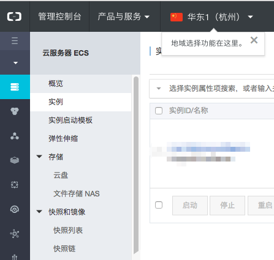
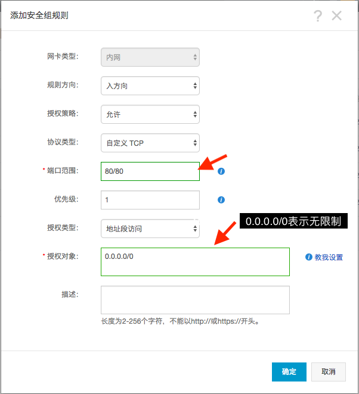
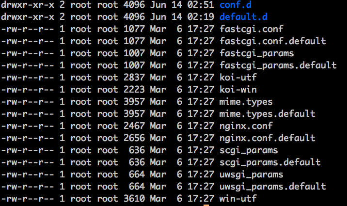
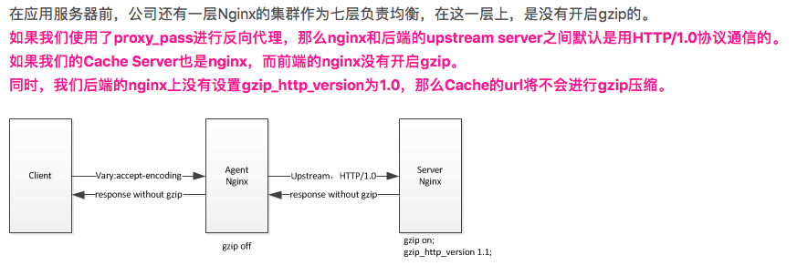
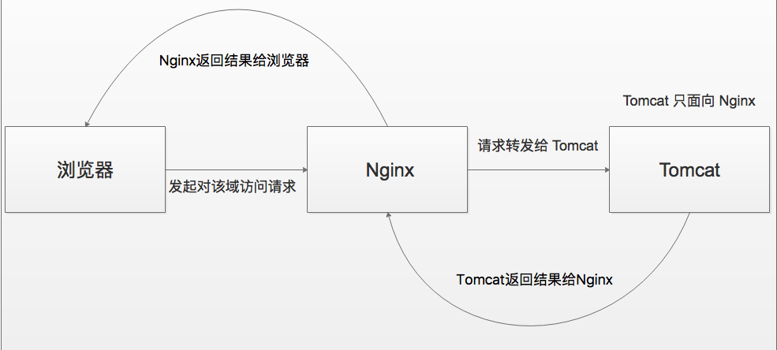

# 链接地址

[ECS 说明文档](https://help.aliyun.com/product/25365.html?spm=a2c4g.750001.2.1.7DGGfr)

[ECS每天一件事](https://www.cnblogs.com/bashenandi/p/3567549.html)

[Nginx中文文档](http://www.nginx.cn/doc/)

[W3C Nginx](https://www.w3cschool.cn/nginxsysc/gtxqwj.html)

[nginx 并发数问题思考：worker_connections,worker_processes与 max clients](http://blog.51cto.com/liuqunying/1420556)

[Nginx配置性能优化](https://blog.csdn.net/xifeijian/article/details/20956605)

[Nginx 开启 Gzip 详解](https://blog.csdn.net/zhuyiquan/article/details/52709864)

# 阿里云ECS简述

### 基础配置

CPU: 1 vCPU(1虚拟核心)

内存: 2GB(I/O优化)

实例类型: ecs.t5-lc1m2.small

硬盘: 40GSSD云磁盘(系统盘)

带宽: 1Mbps

网络: 私有网络

操作系统: CentOS-7.4 64位

### 登录要点

远程密码和login密码在个人账户控制台设置及修改,默认账户为root


### 端口要点

使用公网IP访问部署的Web项目

1. 进入控制台,找到左边栏"实例",点击马赛克处个人实例进入详情页

   

2. 找到左边栏"实例安全组",点击右方"配置规则"

   

3. 添加安全组规则,个人ECS默认出方向无限制,入方向需要配置WEB项目端口,如Nginx默认端口80,则

   

### 用户配置

1. 创建新用户

   ```shell
   useradd yourName
   #系统弹出密码设置,重复设置两次复杂度够高的密码完成账户密码创建(密码需要数字大写,小写,英文和特殊符号 四选三构成)
   passwd yourName 
   ```

   ​

2. 授权

   ```Shell
   #找到授权文件
   whereis sudoers 
   #查看权限 
   ls -l /etc/sudoers 
   #说明只读权限
   -r--r----- 1 root root 3938 time /etc/sudoers 
   #添加写权限
   chmod -v u+w /etc/sudoers 
   #说明修改成功
   mode of "/etc/sudoers" changed from 0440 (r--r-----) to 0640 (rw-r-----) 
   ```

   vim /etc/sudoers 添加新增用户

   ```Shell
   ## Allow root to run any commands anywher  
   root    ALL=(ALL)       ALL  
   yourName  ALL=(ALL)       ALL  #这个是新增的用户
   ```
   退出到控制台

   ```Shell
   #收回写权限
   chmod -v u-w /etc/sudoers 
   #切换到新用户
   su yourName 
   #提示输入密码,完成
   sudo cat /etc/passwd 
   ```


# SSH 配制记录

### 本地shell远程登录

基于 MAC 下 Iterm2+ZSH

1. 系统偏好设置-共享-远程登录 打开

2. ssh localhost 测试本地ssh

3. ssh root@ip 输入密码,本地shell远程登录服务器 

4. vim ~/.ssh/config 配置IP别名

   ```shell
   Host yourName
   HostName xxx.xxx.xxx.xxx  
   User root  
   IdentitiesOnly yes  
   ```

5. ssh root@yourName 输入密码,本地shell远程登录服务器

   ​


### sshd配置文件与秘钥

#### sshd文件

关闭了空密码链接,禁止常规的ssh用户名密码方式登录,只有在服务器上生成过key文件的用户方可访问,key文件+密钥,保护更完善一些;

```
#root账户通过ssh登录
PermitRootLogin yes/no

#禁止使用常规的用户名密码方式登录,此项慎用
#在没有生成好Key,并且成功使用之前,不要设置为no
PasswordAuthentication no

#禁止空密码登录
PermitEmptyPasswords no
```


#### ssh秘钥

1. ssh-keygen -t rsa (生成秘钥)

2. 根据提示输入密码

3. 当前目录下生成 id_rsa 和 id_ras.pub (前者是私钥不能外泄,后者是公钥)

4. ssh-copy-id -i /root/.ssh/id_rsa.pub root@需要登录的服务器ip地址 (ssh-copy-id默认端口是22,如果SSH端口不是22,也就是远程服务器端口修改成其他的了,就不能用这个命令)

5. 在/root/.ssh 目录下执行 ls 寻找authorized_keys文件,没有就执行创建touch authorized_keys  

6. chmod 600 /root/.ssh/authorized_keys  (赋予600权限)

7. cat /root/.ssh/id_rsa.pub >> /root/.ssh/authorized_keys  (将上面生成的公钥id_rsa.pub追加到authorized_keys文件中)

   注意: >符号表示将文件内容全部替换,>>符号表示向文件中追加内容

8. ssh root@需要登录的服务器ip地址 -i ./id_rsa  (秘钥登录)


#### ssh-keygen可用参数选项

1.  -a trials
   在使用 -T 对 DH-GEX 候选素数进行安全筛选时需要执行的基本测试数量

2.  -B      

   显示指定的公钥/私钥文件的 bubblebabble 摘要

3.  -b bits
   指定密钥长度;对于RSA密钥,最小要求768位,默认是2048位;DSA密钥必须恰好是1024位(FIPS 186-2 标准的要求);

4. -C comment
   提供一个新注释

5. -c 

   要求修改私钥和公钥文件中的注释;本选项只支持 RSA1 密钥;
   程序将提示输入私钥文件名、密语(如果存在)、新注释; 

6.  -D reader
   下载存储在智能卡 reader 里的 RSA 公钥;

7.  -e      

   读取OpenSSH的私钥或公钥文件,并以 RFC 4716 SSH 公钥文件格式在 stdout 上显示出来;
   该选项能够为多种商业版本的 SSH 输出密钥;

8.  -F hostname
   在 known_hosts 文件中搜索指定的 hostname ,并列出所有的匹配项;
   这个选项主要用于查找散列过的主机名/ip地址,还可以和 -H 选项联用打印找到的公钥的散列值;

9.  -f filename
   指定密钥文件名;

10.  -G output_file
   为 DH-GEX 产生候选素数;这些素数必须在使用之前使用 -T 选项进行安全筛选;

11.  -g      

    在使用 -r 打印指纹资源记录的时候使用通用的 DNS 格式;

12.  -H      

    对 known_hosts 文件进行散列计算;这将把文件中的所有主机名/ip地址替换为相应的散列值;原来文件的内容将会添加一个".old"后缀后保存;这些散列值只能被 ssh 和 sshd 使用;这个选项不会修改已经经过散列的主机名/ip地址,因此可以在部分公钥已经散列过的文件上安全使用;

13.  -i      

    读取未加密的SSH-2兼容的私钥/公钥文件,然后在 stdout 显示OpenSSH兼容的私钥/公钥;该选项主要用于从多种商业版本的SSH中导入密钥;

14.  -l      

    显示公钥文件的指纹数据;它也支持 RSA1 的私钥;对于RSA和DSA密钥,将会寻找对应的公钥文件,然后显示其指纹数据;

15.  -M memory
    指定在生成 DH-GEXS 候选素数的时候最大内存用量(MB);

16.  -N new_passphrase
    提供一个新的密语;

17.  -P passphrase
    提供(旧)密语;

18.  -p      

    要求改变某私钥文件的密语而不重建私钥;程序将提示输入私钥文件名、原来的密语、以及两次输入新密语;

19.  -q      

    安静模式;用于在 /etc/rc 中创建新密钥的时候;

20.  -R hostname
    从 known_hosts 文件中删除所有属于 hostname 的密钥;
    这个选项主要用于删除经过散列的主机(参见 -H 选项)的密钥;

21.  -r hostname
    打印名为 hostname 的公钥文件的 SSHFP 指纹资源记录;

22.  -S start
    指定在生成 DH-GEX 候选模数时的起始点(16进制);

23.  -T output_file
    测试 Diffie-Hellman group exchange 候选素数(由 -G 选项生成)的安全性;

24.  -t type
    指定要创建的密钥类型;可以使用："rsa1"(SSH-1) "rsa"(SSH-2) "dsa"(SSH-2)

25.  -U reader
    把现存的RSA私钥上传到智能卡 reader

26.  -v      

    详细模式;ssh-keygen 将会输出处理过程的详细调试信息;常用于调试模数的产生过程;重复使用多个 -v 选项将会增加信息的详细程度(最大3次);

27.  -W generator
    指定在为 DH-GEX 测试候选模数时想要使用的 generator

28.  -y      

    读取OpenSSH专有格式的公钥文件,并将OpenSSH公钥显示在 stdout 上;


#  Nginx 配置记录

### 基础安装

1. yum install nginx (yum安装下pcre, zlib自动装入了,前者为了重写rewrite，后者为了gzip压缩)

2. nginx -v (查看版本) 此处版本为1.12.2

3. service nginx status (查看服务状态) 

4. nginx -t (查看配置文件路径)

   ```shell
   #返回
   nginx: the configuration file /etc/nginx/nginx.conf syntax is ok
   nginx: configuration file /etc/nginx/nginx.conf test is successful
   ```

5. service nginx start/restart/stop (服务启动/重启/停止)

6. 浏览器打开 https://公网IP: nginx端口号(默认80),进入 nginx的 index 首页 (需要先配好公网IP访问WEB项目的设置,详情见端口要点)


### 配置文件

Nginx 配置文件在/etc/nginx下

启动脚本一般在/usr/sbin/nginx 脚本 

默认配置文件(一般会修改它)在 /etc/nginx/conf.d/default.conf 

自定义Nginx站点配置文件存放目录/etc/nginx/conf.d/ 

全局配置文件(一般不会去修改它)在 /etc/nginx/nginx.conf 网站默认站点配置 /etc/nginx/conf.d/default.conf



#### nginx.conf配置详解

```shell
# 运行用户
user nginx;

# worker_processes auto 定义了nginx对外提供web服务时的worker进程数;最优值取决于许多因素,包括但不限于CPU核的数量,存储数据的硬盘数量及负载模式;不能确定的时候,将其设置为可用的CPU内核数将是一个好的开始(设置为“auto”将尝试自动检测它)
worker_processes auto;

# worker_rlimit_nofile 更改worker进程的最大打开文件数限制;如果没设置的话,这个值为操作系统的限制;设置后你的操作系统和Nginx可以处理比“ulimit -a”更多的文件,所以把这个值设高,这样nginx就不会有“too many open files”问题了

# 全局错误日志及PID文件
error_log /var/log/nginx/error.log;
pid /run/nginx.pid;

# Load dynamic modules. See /usr/share/nginx/README.dynamic.
include /usr/share/nginx/modules/*.conf;

events {
	# 单个后台worker process进程的最大并发链接数
    # 并发总数是 worker_processes 和 worker_connections 的乘积即 max_clients = worker_processes * worker_connections
    # 在设置了反向代理的情况下,max_clients = worker_processes * worker_connections / 4 
    worker_connections 1024;
    
    # multi_accept 告诉nginx收到一个新连接通知后接受尽可能多的连接
    
    # use 设置用于复用客户端线程的轮询方法;如果你使用Linux 2.6+,你应该使用epoll;如果你使用*BSD,你应该使用kqueue
    use epoll;
}

# 设定http服务器，利用它的反向代理功能提供负载均衡支持
http {
	# 设定日志格式
    log_format  main  '$remote_addr - $remote_user [$time_local] "$request" '
                      '$status $body_bytes_sent "$http_referer" '
                      '"$http_user_agent" "$http_x_forwarded_for"';
	
	# main是全局设置
    access_log  /var/log/nginx/access.log  main;
    
    # sendfile 指令指定 nginx 是否调用 sendfile 函数(zero copy 方式)来输出文件,sendfile()可以在磁盘和TCP socket之间互相拷贝数据(或任意两个文件描述符)
    # 对于普通应用,必须设为 on
    # 如果用来进行下载等应用磁盘IO重负载应用,可设置为 off
    # 以平衡磁盘与网络I/O处理速度，降低系统的uptime.
    sendfile on;
    
    # 告诉nginx在一个数据包里发送所有头文件,而不一个接一个的发送
    tcp_nopush on;
    
    # 告诉nginx不要缓存数据,而是一段一段的发送--当需要及时发送数据时,就应该给应用设置这个属性,这样发送一小块数据信息时就不能立即得到返回值
    tcp_nodelay on;
    
    # 连接超时时间
    keepalive_timeout   65;
    types_hash_max_size 2048;
	
	# 设定mime类型,类型由mime.type文件定义
    include /etc/nginx/mime.types;
    default_type application/octet-stream;
	
	# 开启 gzip 压缩
	gzip  on;
    
	# 启用gzip压缩的最小文件，小于设置值的文件将不会压缩
    gzip_min_length 1k;

    # gzip 压缩级别,1-9,数字越大压缩的越好,也越占用CPU时间
    gzip_comp_level 1;

    # 进行压缩的文件类型,javascript有多种形式,其中的值可以在 mime.types 文件中找到。
    gzip_types text/plain application/javascript application/x-javascript text/css application/xml text/javascript application/x-httpd-php image/jpeg image/gif image/png application/vnd.ms-fontobject font/ttf font/opentype font/x-woff image/svg+xml;

    # 是否在http header中添加Vary: Accept-Encoding,建议开启
    gzip_vary on;

    # 禁用IE 6 gzip
    gzip_disable "MSIE [1-6]\.";

    # 设置压缩所需要的缓冲区大小,32 4K表示按照内存页大小以4K为单位（即一个系统中内存页为4K）,申请32倍的内存空间     
    gzip_buffers 32 4k;

    # 设置gzip压缩针对的HTTP协议版本
    gzip_http_version 1.0;
	
	#设定请求缓冲
    client_header_buffer_size    1k;
    large_client_header_buffers  4 4k;
	
    # Load modular configuration files from the /etc/nginx/conf.d directory.
    # See http://nginx.org/en/docs/ngx_core_module.html#include
    # for more information.
    include /etc/nginx/conf.d/*.conf;
    
    # 设定负载均衡的服务器列表
    upstream mysvr {
        #weigth参数表示权值，权值越高被分配到的几率越大
        server xxx.xxx.xxx.xxx:端口  weight=y;
        server xxx.xxx.xxx.xxx:端口  weight=y;
    }
    
    server {
    	# 监听80端口
    	# Ipv4 和Ipv6
        listen  80 default_server;
        listen  [::]:80 default_server;
        # 定义使用 www.xx.cn访问
        server_name  ;
        # 定义服务器的默认网站根目录位置
        root /usr/share/nginx/html;

        # Load configuration files for the default server block.
        include /etc/nginx/default.d/*.conf;
		
		
        location / {
        	proxy_pass http://xxx.xxx.xxx.xxx:端口;
        }
		
		# 定义错误提示页面
        error_page 404 /404.html;
            location = /40x.html {
        }
		# 定义错误提示页面
        error_page 500 502 503 504 /50x.html;
            location = /50x.html {
        }
    }
  }
```

#### Gzip 说明

Nginx实现资源压缩的原理是通过ngx_http_gzip_module模块拦截请求，并对需要做gzip的类型做gzip，ngx_http_gzip_module是Nginx默认集成的，不需要重新编译，直接开启即可;

gzip_http_version选项

用于识别http协议的版本，早期的浏览器不支持gzip压缩，用户会看到乱码，所以为了支持前期版本加了此选项。默认在http/1.0的协议下不开启gzip压缩;

资料看到的生产环境问题:




### 反向代理

 在很多情况下,可能只有一个公网IP地址,但是内部有多个服务需要映射出去且相关的服务不在同一台服务器上面的时候,那直接做端口映射就无法达到要求了;这时设置反向代理就可以很好的派上用场了,且可以达到负载均衡的效果




### 负载均衡

未完待续