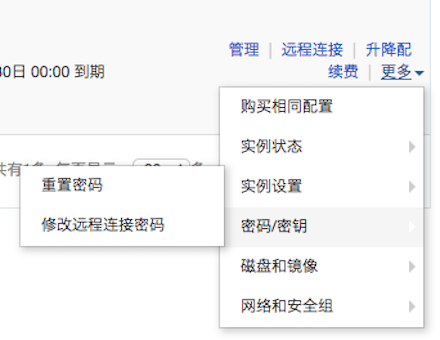

# 阿里云ECS简述

[ECS 说明文档](https://help.aliyun.com/product/25365.html?spm=a2c4g.750001.2.1.7DGGfr)

### 基础配置

CPU: 1 vCPU(1虚拟核心)

内存: 2GB(I/O优化)

实例类型: ecs.t5-lc1m2.small

硬盘: 40GSSD云磁盘(系统盘)

带宽: 1Mbps

网络: 私有网络

操作系统: CentOS-7.4 64位

### 登录要点

远程密码和login密码在个人账户控制台设置及修改,默认账户为root



### 端口要点

使用公网IP访问部署的Web项目

1. 进入控制台,找到左边栏"实例",点击马赛克处个人实例进入详情页

   

2. 找到左边栏"实例安全组",点击右方"配置规则"

   

3. 添加安全组规则,个人ECS默认出方向无限制,入方向需要配置WEB项目端口,如Nginx默认端口80,则

   

### 用户配置

1. 创建新用户

   - useradd yourName
   - passwd yourName 系统弹出密码设置,重复设置两次复杂度够高的密码完成账户密码创建
     (密码需要数字大写,小写,英文和特殊符号 四选三构成)

2. 授权

   - whereis sudoers 找到授权文件

   - ls -l /etc/sudoers 查看权限 

   - -r--r----- 1 root root 3938 time /etc/sudoers 说明只读权限

   - chmod -v u+w /etc/sudoers 添加写权限

   - mode of "/etc/sudoers" changed from 0440 (r--r-----) to 0640 (rw-r-----) 说明修改成功

   - vim /etc/sudoers 添加新增用户

     ```
     ## Allow root to run any commands anywher  
     root    ALL=(ALL)       ALL  
     yourName  ALL=(ALL)       ALL  #这个是新增的用户
     ```

   - chmod -v u-w /etc/sudoers 收回写权限

   - su yourName 切换到新用户

   - sudo cat /etc/passwd 提示输入密码,完成

# SSH 配制记录

### 本地shell远程登录

基于 MAC 下 Iterm2+ZSH

1. 系统偏好设置-共享-远程登录 打开

2. ssh localhost 测试本地ssh

3. ssh root@ip 输入密码,本地shell远程登录服务器 

4. vim ~/.ssh/config 配置IP别名

   ```
   Host yourName
   HostName xxx.xxx.xxx.xxx  
   User root  
   IdentitiesOnly yes  
   ```

5. ssh root@yourName 输入密码,本地shell远程登录服务器


#  Nginx 配置记录


