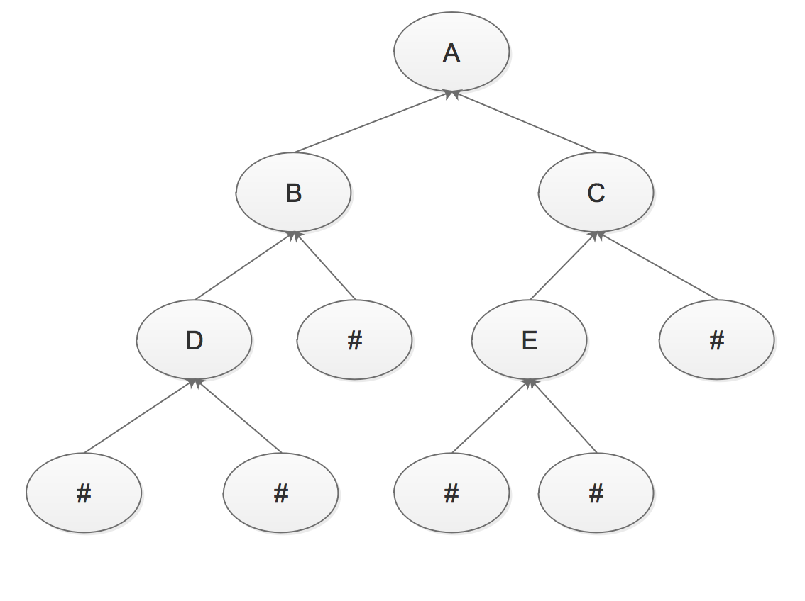

# 链接地址

(本文据网上资料与JDK源码整理为个人学习之用,JDK不同版本有所区别,有错漏之处敬请指出)

[五月的仓颉-博客园](http://www.cnblogs.com/xrq730/p/6757230.html)

# 集合框架


数组（可以存储基本数据类型）是用来存现对象的一种容器,但是数组的长度固定,不适合在对象数量未知的情况下使用;

集合（只能存储对象,对象类型可以不一样）的长度可变,可在多数情况下使用;

------

## 一. 重要接口

### A. Iterator 接口

所有的集合类,都实现了Iterator接口,这是一个用于遍历集合中元素的接口,主要包含以下三种方法:

1. hasNext()是否还有下一个元素;
2. next()返回下一个元素;
3. remove()删除当前元素;


### B. Collection 接口

集合类的根接口, 其被继承产生了两个接口 List 和 Set;

Java SDK不提供直接继承自Collection的类,Java SDK提供的类都是继承自Collection的“子接口”如List和Set;

**所有实现Collection接口的类都必须提供两个标准的构造函数:**

1. 无参数的构造函数用于创建一个空的Collection;
2. 有一个 Collection参数的构造函数用于创建一个新的Collection, 新的Collection与传入的Collection有相同的元素, 允许用户复制一个Collection; 

不论Collection的实际类型如何,它都支持一个iterator()的方法,该方法返回一个迭代子,使用该迭代子即可逐一访问Collection中每一个元素。典型的用法如下:

```java
　　　　Iterator it = collection.iterator(); // 获得一个迭代器
　　　　while(it.hasNext()) {
　　　　　　Object obj = it.next(); // 得到下一个元素
　　　　}
```


### C. List 接口

List里存放的对象是有序的,同时也是可以重复的;

List关注的是索引,拥有一系列和索引相关的方法,查询速度快;

因为往list集合里插入或删除数据时,会伴随着后面数据的移动,所有插入删除数据速度慢;


### D. Set 接口

Set里存放的对象是无序,不能重复的;

集合中的对象不按特定的方式排序,只是简单地把对象加入集合中;


### E. Map 接口

Java.util 包中的另一个接口,它和Collection接口没有关系,是相互独立的,都属于集合类的一部分;

Map内容为key-value对, 不能包含重复的key,可以包含相同的value;


------

## 二. 遍历方式

1. Iterator:迭代输出,是使用最多的输出方式;
2. ListIterator:是Iterator的子接口,专门用于输出List中的内容;
3. foreach输出:JDK1.5之后提供的新功能,可以输出数组或集合;
4. for循环;


------

## 三. List 实现类

### A. ArrayList

ArrayList是基于数组的一个实现,elementData就是底层的数组,默认初始值10;

| 关  注  点           | 结      论 |
| :---------------- | :------: |
| ArrayList是否允许空    |    允许    |
| ArrayList是否允许重复数据 |    允许    |
| ArrayList是否有序     |    有序    |
| ArrayList是否线程安全   |  非线程安全   |

ArrayList的底层是基于动态数组实现的原因,动态数组的意思就是指底层的数组大小并不是固定的,而是根据添加的元素大小进行一个判断,不够的话就动态扩容;

扩容扩多少,是JDK开发人员在时间,空间上做的一个权衡,提供出来的一个比较合理的数值; 最后调用到的是Arrays的copyOf方法,将元素组里面的内容复制到新的数组里面去;


#### 1. 插入及扩容

```java
public boolean add(E e) { 
  ensureCapacityInternal(size + 1);  // Increments modCount!!
  elementData[size++] = e;
  return true;
}

/*
插入的时候,按照指定位置,把从指定位置开始的所有元素利用System.arraycopy方法做一个整体的复制,向后移动一个位置;
当然先要用ensureCapacityInternal方法进行判断,加了一个元素之后数组会不会不够大）,然后指定位置的元素设置为需要插入的元素,完成了一次插入的操作
*/
public void add(int index, E element) {
  rangeCheckForAdd(index);

  ensureCapacityInternal(size + 1);  // Increments modCount!!
  System.arraycopy(elementData, index, elementData, index + 1,
                   size - index);
  elementData[index] = element;
  size++;
}

private void ensureCapacityInternal(int minCapacity) {
  if (elementData == DEFAULTCAPACITY_EMPTY_ELEMENTDATA) {
    minCapacity = Math.max(DEFAULT_CAPACITY, minCapacity);
  }
  ensureExplicitCapacity(minCapacity);
}

private void ensureExplicitCapacity(int minCapacity) {
  modCount++;
  // overflow-conscious code
  if (minCapacity - elementData.length > 0)
    grow(minCapacity);
}

private void grow(int minCapacity) {
  // overflow-conscious code
  int oldCapacity = elementData.length;
  int newCapacity = oldCapacity + (oldCapacity >> 1);
  if (newCapacity - minCapacity < 0)
    newCapacity = minCapacity;
  if (newCapacity - MAX_ARRAY_SIZE > 0)
    newCapacity = hugeCapacity(minCapacity);
  // minCapacity is usually close to size, so this is a win:
  elementData = Arrays.copyOf(elementData, newCapacity);
}

private static int hugeCapacity(int minCapacity) {
  if (minCapacity < 0) // overflow
    throw new OutOfMemoryError();
  return (minCapacity > MAX_ARRAY_SIZE) ?
    Integer.MAX_VALUE:
  MAX_ARRAY_SIZE;
}
```


#### 2. 删除方式

1. 按照下标删除;
2. 按照元素删除,这会删除ArrayList中与指定要删除的元素匹配的第一个元素;

```java
//1. 把指定元素后面位置的所有元素,利用System.arraycopy方法整体向前移动一个位置;
//2. 最后一个位置的元素指定为null,这样让gc可以去回收它;
public boolean remove(Object o) {
        if (o == null) {
            for (int index = 0; index < size; index++)
                if (elementData[index] == null) {
                    fastRemove(index);
                    return true;
                }
        } else {
            for (int index = 0; index < size; index++)
                if (o.equals(elementData[index])) {
                    fastRemove(index);
                    return true;
                }
        }
        return false;
    }
```


#### 3. ArrayList 优缺点

**优点:**

1. ArrayList底层以数组实现,是一种随机访问模式,再加上它实现了RandomAccess接口,因此查找也就是get的时候非常快;
2. ArrayList在顺序添加一个元素的时候非常方便,只是往数组里面添加了一个元素而已;

**缺点:**

1. 删除元素的时候,涉及到一次元素复制,如果要复制的元素很多,那么就会比较耗费性能;
2. 插入元素的时候,涉及到一次元素复制,如果要复制的元素很多,那么就会比较耗费性能;

因此,ArrayList比较适合顺序添加,随机访问的场景;

```Java
//ArrayList是可以被序列化的
public class ArrayList<E> extends AbstractList<E>
        implements List<E>, RandomAccess, Cloneable, java.io.Serializable

//为什么elementData是使用transient修饰?
//因为序列化ArrayList的时候,ArrayList里面的elementData未必是满的
private transient Object[] elementData

//ArrayList中重写了writeObject方法
private void writeObject(java.io.ObjectOutputStream s)
        throws java.io.IOException{
// Write out element count, and any hidden stuff
int expectedModCount = modCount;
s.defaultWriteObject();
        // Write out array length
       s.writeInt(elementData.length);
    // Write out all elements in the proper order.
for (int i=0; i<size; i++)
           s.writeObject(elementData[i]);
    if (modCount != expectedModCount) {
           throw new ConcurrentModificationException();
    }
}

/*
每次序列化的时候调用这个方法,先调用defaultWriteObject()方法序列化ArrayList中的非transient元素,elementData不去序列化它,然后遍历elementData,只序列化那些有的元素,这样:
1,加快了序列化的速度;
2,减小了序列化之后的文件大小;
*/
```


### B. Linkedlist

链表原先是C/C++的概念,是一种线性的存储结构,意思是将要存储的数据存在一个存储单元里面,这个存储单元里面除了存放有待存储的数据以外,还存储有其下一个存储单元的地址（下一个存储单元的地址是必要的,有些存储结构还存放有其前一个存储单元的地址）,每次查找数据的时候,通过某个存储单元中的下一个存储单元的地址寻找其后面的那个存储单元;

**LinkedList是基于链表实现的, 是一种双向链表:**

1. 链表中任意一个存储单元都可以通过向前或者向后寻址的方式获取到其前一个存储单元和其后一个存储单元;
2. 链表的尾节点的后一个节点是链表的头结点,链表的头结点的前一个节点是链表的尾节点;

**LinkedList的基本存储单元,它是LinkedList中的一个内部类:**

```Java
private static class Entry<E> {
E element; //真正存储的数据
Entry<E> next; //后一个存储单元的引用地址
Entry<E> previous; //前一个存储单元的引用地址
...
}
```

| 关注点                | 结论    |
| ------------------ | ----- |
| LinkedList是否允许空    | 允许    |
| LinkedList是否允许重复数据 | 允许    |
| LinkedList是否有序     | 有序    |
| LinkedList是否线程安全   | 非线程安全 |


#### 1. 添加元素

```java
public static void main(String[] args)
{
     List<String> list = new LinkedList<String>();
     list.add("111");
     list.add("222");
 }
```

```java
/*
执行List<String> list = new LinkedList<String>();
new了一个Entry出来名为header,Entry里面的previous,element,next都为null,执行构造函数的时候,将previous和next的值都设置为header的引用地址;
*/
public class LinkedList<E>
     extends AbstractSequentialList<E>
     implements List<E>, Deque<E>, Cloneable, java.io.Serializable
 {
     private transient Entry<E> header = new Entry<E>(null, null, null);
   	 private transient int size = 0;
      /**
      * Constructs an empty list.
      */
     public LinkedList() {
         header.next = header.previous = header;
     }
     ...
 }
/*
32位JDK的字长为4个字节,而目前64位的JDK一般采用的也是4字长,所以就以4个字长为单位;header引用地址的字长就是4个字节,假设是0x00000000,那么执行完"List<String> list = new LinkedList<String>()"之后可以这么表示:
*/
previous	element		next
0x00000000	 null		0x00000000
```

```Java
//执行list.add("111"),new了一个Entry出来;
public boolean add(E e) {
addBefore(e, header);
    return true; 
}
private Entry<E> addBefore(E e, Entry<E> entry) {
/*
根据Entry的构造函数
1,newEntry.element = e;
2,newEntry.next = header.next;
3,newEntry.previous = header.previous;
*/
Entry<E> newEntry = new Entry<E>(e, entry, entry.previous);
newEntry.previous.next = newEntry;
newEntry.next.previous = newEntry;
size++;
modCount++;
return newEntry;
}


0x00000000(header)
previous	element		next
0x00000001	 null		0x00000001

0x00000001
previous	element		next
0x00000000	  111		0x00000000
/*
1,新的entry的element赋值为111;

2,新的entry的next是header的next,header的next是0x00000000,所以新的entry的next即0x00000000;

3,新的entry的previous是header的previous,header的previous是0x00000000,所以新的entry的next即0x00000000;

4,"newEntry.previous.next = newEntry",首先是newEntry的previous,由于newEntry的previous为0x00000000,所以newEntry.previous表示的是header,header的next为newEntry,即header的next为0x00000001;

5,"newEntry.next.previous = newEntry",和4一样,把header的previous设置为0x00000001;
*/
```

```java
//执行list.add("222");

0x00000000(header)
previous	element		next
0x00000002	 null		0x00000001

0x00000001
previous	element		next
0x00000000	  111		0x00000002

0x00000002(tail)
previous	element		next
0x00000001	  222		0x00000000

/*
1. 中间的那个Entry,previous的值为0x00000000,即header；next的值为0x00000002,即tail,这就是任意一个Entry既可以向前查找Entry,也可以向后查找Entry;

2. 头Entry的previous的值为0x00000002,即tail,这就是双向链表中头Entry的previous指向的是尾Entry;

3. 尾Entry的next的值为0x00000000,即header,这就是双向链表中尾Entry的next指向的是头Entry;
*/
```


#### 2. 查看元素

```java
public E get(int index) {
    return entry(index).element;
}

//当index小于数组大小的一半的时候（size >> 1表示size / 2,使用移位运算提升代码运行效率）,向后查找；否则,向前查找
private Entry<E> entry(int index) {
     if (index < 0 || index >= size)
         throw new IndexOutOfBoundsException("Index: "+index+
                                             ", Size: "+size);
     Entry<E> e = header;
     if (index < (size >> 1)) {
         for (int i = 0; i <= index; i++)
             e = e.next;
     } else {
         for (int i = size; i > index; i--)
             e = e.previous;
     }
     return e;
 }
```

双向链表增加了一点点的空间消耗（每个Entry里面还要维护它的前置Entry的引用）,同时也增加了一定的编程复杂度,却大大提升了效率;


#### 3. 删除元素

```Java
public static void main(String[] args)
{     
      List<String> list = new LinkedList<String>();
      list.add("111");
      list.add("222");
      list.remove(0);
}

public E remove(int index) {
     return remove(entry(index));
}
private E remove(Entry<E> e) {
 if (e == header)
     throw new NoSuchElementException();
 
        E result = e.element;
        e.previous.next = e.next;
        e.next.previous = e.previous;
        e.next = e.previous = null;
        e.element = null;
 		size--;
		modCount++;
        return result;
 }
```

按照Java虚拟机HotSpot采用的垃圾回收检测算法----根节点搜索算法来说,即使previous,element,next不设置为null也是可以回收这个Entry的,因为此时这个Entry已经没有任何地方会指向它了,tail的previous与header的next都已经变掉了,所以这块Entry会被当做"垃圾"对待; 

之所以还要将previous,element,next设置为null,可能是为了兼容另外一种垃圾回收检测算法----引用计数法,这种垃圾回收检测算法,只要对象之间存在相互引用,那么这块内存就不会被当作"垃圾"对待;


### C. CopyOnWriteArrayList

CopyOnWriteArrayList位于java.util.concurrent包下, 顾名思义,Write的时候总是要Copy,也就是说对于CopyOnWriteArrayList,任何可变的操作（add,set,remove等等）都是伴随复制这个动作的

| 关注点                          | 结论   |
| ---------------------------- | ---- |
| CopyOnWriteArrayList是否允许空    | 允许   |
| CopyOnWriteArrayList是否允许重复数据 | 允许   |
| CopyOnWriteArrayList是否有序     | 有序   |
| CopyOnWriteArrayList是否线程安全   | 线程安全 |


#### 1. 增删改查

**对于CopyOnWriteArrayList来说,增加,删除,修改,插入的原理都是一样的**

```Java
 public static void main(String[] args)
 {
     List<Integer> list = new CopyOnWriteArrayList<Integer>();
     list.add(1);
     list.add(2);
 }
```

```Java
/*
List<Integer> list = new CopyOnWriteArrayList<Integer>() 实例化一个新的CopyOnWriteArrayList 
对于CopyOnWriteArrayList来说,底层就是一个Object[] array, Object array指向一个数组大小为0的数组
*/
public class CopyOnWriteArrayList<E>
    implements List<E>, RandomAccess, Cloneable, java.io.Serializable {
    private static final long serialVersionUID = 8673264195747942595L;

    /** The lock protecting all mutators */
    transient final ReentrantLock lock = new ReentrantLock();

    /** The array, accessed only via getArray/setArray. */
    private volatile transient Object[] array;
    ...
}
public CopyOnWriteArrayList() {
    setArray(new Object[0]);
}
final void setArray(Object[] a) {
    array = a;
}
```

```java
//list.add(1) 
public boolean add(E e) {
final ReentrantLock lock = this.lock;
lock.lock();
try {
    Object[] elements = getArray();
    int len = elements.length;
    Object[] newElements = Arrays.copyOf(elements, len + 1);
    newElements[len] = e;
    setArray(newElements);
    return true;
} finally {
    lock.unlock();
}
}
```

一次add大致经历了几个步骤:

1. 加锁
2. 拿到原数组,得到新数组的大小（原数组大小+1）,实例化出一个新的数组来
3. 把原数组的元素复制到新数组中去
4. 新数组最后一个位置设置为待添加的元素（因为新数组的大小是按照原数组大小+1来的）
5. 把Object array引用指向新数组
6. 解锁

**普通List的缺陷:**

```java
//ArrayList, LinkedList 场景: 两个线程操作了同一个List,分别对同一个List进行迭代和删除
Exception in thread "Thread-0" java.util.ConcurrentModificationException
//其实这个问题和线程安不安全没有关系,换成Vector看一下相同
```

Vector虽然是线程安全的,但是只是一种相对的线程安全而不是绝对的线程安全,它只能够保证增, 删, 改, 查的单个操作一定是原子的,不会被打断,但是如果组合起来用,并不能保证线程安全性;

比如线程1在遍历一个Vector中的元素, 线程2在删除一个Vector中的元素,势必产生并发修改异常,也就是fail-fast;


#### 2. CopyOnWriteArrayList的优劣

CopyOnWriteArrayList的缺点,就是修改代价十分昂贵,每次修改都伴随着一次的数组复制；但同时优点也十分明显,就是在并发下不会产生任何的线程安全问题,也就是绝对的线程安全,这也是为什么我们要使用CopyOnWriteArrayList的原因;

**CopyOnWriteArrayList这个并发组件,其实反映的是两个十分重要的分布式理念:**

1. 读写分离

我们读取CopyOnWriteArrayList的时候读取的是CopyOnWriteArrayList中的Object[] array,但是修改的时候,操作的是一个新的Object[] array,读和写操作的不是同一个对象,这就是读写分离;

这种技术数据库用的非常多,在高并发下为了缓解数据库的压力,即使做了缓存也要对数据库做读写分离,读的时候使用读库,写的时候使用写库,然后读库,写库之间进行一定的同步,这样就避免同一个库上读,写的IO操作太多;

2. 最终一致

对CopyOnWriteArrayList来说,线程1读取集合里面的数据,未必是最新的数据; 因为线程2, 线程3, 线程4四个线程都修改了CopyOnWriteArrayList里面的数据,但是线程1拿到的还是最老的那个Object[] array,新添加进去的数据并没有,所以线程1读取的内容未必准确;

不过这些数据虽然对于线程1是不一致的,但是对于之后的线程一定是一致的,它们拿到的Object[] array一定是三个线程都操作完毕之后的Object array[],这就是最终一致; 最终一致对于分布式系统也非常重要,它通过容忍一定时间的数据不一致,提升整个分布式系统的可用性与分区容错性; 当然,最终一致并不是任何场景都适用的,像火车站售票这种系统用户对于数据的实时性要求非常非常高,就必须做成强一致性的。

随着CopyOnWriteArrayList中元素的增加,CopyOnWriteArrayList的修改代价将越来越昂贵,因此,CopyOnWriteArrayList适用于读操作远多于修改操作的并发场景中;


------

## 四. Set 实现类

HashSet是通过HashMap来实现的而TreeSet是通过TreeMap来实现的,所以HashSet和TreeSet都没有自己的数据结构; 

1. Set集合中的元素不能重复,即元素唯一;
2. Set集合没有get方法,只能通过迭代器Iterator来遍历元素,不能随机访问;

### A. HashSet

| 关注点                  | 结论           |
| ----------------------- | -------------- |
| HashSet是否允许空       | 允许,唯一 null |
| HashMap是否允许重复数据 | 不允许         |
| HashMap是否有序         | 无序           |
| HashMap是否线程安全     | 非线程安全     |

```java
private transient HashMap<E,Object> map;

    // Dummy value to associate with an Object in the backing Map
    private static final Object PRESENT = new Object();

    /**
     * Constructs a new, empty set; the backing <tt>HashMap</tt> instance has
     * default initial capacity (16) and load factor (0.75).
     */
	//空的构造器,初始化一个空的HashMap
    public HashSet() {
        map = new HashMap<>();
    }
	
	//传集合的构造方法,使用了HashMap里指定初始化容量的构造方法,然后再调用addAll()
	public HashSet(Collection<? extends E> c) {
        map = new HashMap<>(Math.max((int) (c.size()/.75f) + 1, 16));
        addAll(c);
    }

	//初始化一个空的HashMap,并指定初始容量和加载因子
	public HashSet(int initialCapacity, float loadFactor) {
        map = new HashMap<>(initialCapacity, loadFactor);
    }

	//初始化一个空的HashMap,并指定初始容量
	public HashSet(int initialCapacity) {
        map = new HashMap<>(initialCapacity);
    }

	
```


### B. TreeSet

| 关注点                  | 结论       |
| ----------------------- | ---------- |
| TreeSet是否允许空       | 不允许     |
| TreeMap是否允许重复数据 | 不允许     |
| TreeMap是否有序         | 有序       |
| TreeMap是否线程安全     | 非线程安全 |

```Java
private transient NavigableMap<E,Object> m;

    // Dummy value to associate with an Object in the backing Map
    private static final Object PRESENT = new Object();

    /**
     * Constructs a set backed by the specified navigable map.
     */
    TreeSet(NavigableMap<E,Object> m) {
        this.m = m;
    }
	
	//空的构造器,初始化一个空的TreeMap,默认升序排列
	public TreeSet() {
        this(new TreeMap<E,Object>());
    }
	
	// 传入一个自定义的比较器,常常用于实现降序排列
	public TreeSet(Comparator<? super E> comparator) {
        this(new TreeMap<>(comparator));
    }

	public TreeSet(Collection<? extends E> c) {
        this();
        addAll(c);
    }

	public TreeSet(SortedSet<E> s) {
        this(s.comparator());
        addAll(s);
    }
```


------

## 五. Map 实现类

###  A. HashMap

HashMap是最常用的Map,它根据键的HashCode值存储数据;默认空构造将loadFactor设为默认的0.75,threshold设置为12,并创建一个大小为16的Entry对象数组;当HashMap中的元素个数超过数组大小*loadFactor时,就会进行数组扩容;

遍历时,取得数据的顺序是完全随机的;

键对象不可以重复,最多只允许一条记录的键为Null,允许多条记录的值为Null,是非同步的;

| 关注点             | 结论                                    |
| --------------- | ------------------------------------- |
| HashMap是否允许空    | Key和Value都允许为空                        |
| HashMap是否允许重复数据 | Key重复会覆盖、Value允许重复                    |
| HashMap是否有序     | 无序,这里指的是遍历HashMap的时候,值的顺序基本不可能是put的顺序 |
| HashMap是否线程安全   | 非线程安全                                 |


#### 1. 添加数据

HashMap的一个存储单元Entry

```Java
static class Entry<K,V> implements Map.Entry<K,V> {
    final K key;
    V value;
    Entry<K,V> next;
    int hash;
    ...
}
```

Entry组成的是一个单向链表,因为里面只有Entry的后继Entry,而没有Entry的前驱Entry

```Java
public static void main(String[] args)
{
	Map<String, String> map = new HashMap<String, String>();
    map.put("111", "111");
    map.put("222", "222");
}
```

```Java
//执行Map<String, String> map = new HashMap<String, String>();
public HashMap() {
     this.loadFactor = DEFAULT_LOAD_FACTOR;
   	 //DEFAULT_INITIAL_CAPACITY为16, HashMap在new的时候构造出了一个大小为16的Entry数组,Entry内所有数据都取默认值
     threshold = (int)(DEFAULT_INITIAL_CAPACITY * DEFAULT_LOAD_FACTOR);
     table = new Entry[DEFAULT_INITIAL_CAPACITY];
   	 //空方法,它是HashMap的子类比如LinkedHashMap构造的时候使用的
     init();
 }
```

```java
//执行map.put("111", "111"); 
public V put(K key, V value) {
      if (key == null)
          return putForNullKey(value);
  
  	  //拿到Key值的HashCode,由于HashCode是Object的方法,因此每个对象都有一个HashCode,对这个HashCode做一次hash计算; 
  	  //按照JDK源码注释的说法,这次hash的作用是根据给定的HashCode对它做一次打乱的操作,防止一些糟糕的Hash算法产生的糟糕的Hash值
      int hash = hash(key.hashCode());
  
  	  //根据重新计算的HashCode,对Entry数组的大小取模得到一个Entry数组的位置。看到这里使用了&,移位加快一点代码运行效率; 
  	  //这个取模操作的正确性依赖于length必须是2的N次幂,因此注意HashMap构造函数中,如果你指定HashMap初始数组的大小  initialCapacity不是2的N次幂,HashMap会算出大于initialCapacity的最小2的N次幂的值,作为Entry数组的初始化大小
      int i = indexFor(hash, table.length);
  	  
  
  	  //先判断一下原数据结构中是否存在相同的Key值,存在则覆盖并返回,不执行后面的代码; 注意一下recordAccess这个方法,它也是HashMap的子类比如LinkedHashMap用的,HashMap中这个方法为空;
  	  //对比Key是否相同,是先比HashCode是否相同,HashCode相同再判断equals是否为true,这样大大增加了HashMap的效率
      for (Entry<K,V> e = table[i]; e != null; e = e.next) {
         Object k;
          if (e.hash == hash && ((k = e.key) == key || key.equals(k))) {
             V oldValue = e.value;
             e.value = value;
             e.recordAccess(this);
             return oldValue;
         }
     }
  	 //modeCount++是用于fail-fast机制的,每次修改HashMap数据结构的时候都会自增一次这个值
     modCount++;
     addEntry(hash, key, value, i);
     return null;
 }

 static int hash(int h) {
     // This function ensures that hashCodes that differ only by
     // constant multiples at each bit position have a bounded
     // number of collisions (approximately 8 at default load factor).
     h ^= (h >>> 20) ^ (h >>> 12);
     return h ^ (h >>> 7) ^ (h >>> 4);
 }

 static int indexFor(int h, int length) {
     return h & (length-1);
 }

/*
假设new出来的Entry地址为0x00000001
那么,put("111", "111"):
	null	0x00000001		...		null
			key:111
			value:111
			next:null
			hash:46215
每一个新增的Entry都位于table[1]上,里面的hash是rehash之后的hash而不是Key最原始的hash; 看到table[1]上存放了111---->111这个键值对,它持有原table[1]的引用地址,因此可以寻址到原table[1],这就是单向链表;

继续,put("222", "222"):
	null	0x00000002		...		null
			key:222
			value:222
			next:null
			hash:52322
			
			0x00000001		
			key:111
			value:111
			next:null
			hash:46215
新的Entry再次占据table[1]的位置,并且持有原table[1],也就是111---->111这个键值对;			
*/
void addEntry(int hash, K key, V value, int bucketIndex) {
    Entry<K,V> e = table[bucketIndex];
    table[bucketIndex] = new Entry<K,V>(hash, key, value, e);
    //在每次放置完Entry之后都会判断是否需要扩容
    if (size++ >= threshold)
        resize(2 * table.length);
}

Entry(int h, K k, V v, Entry<K,V> n) {
    value = v;
    next = n;
    key = k;
    hash = h;
}
```


#### 2. 删除数据

```java
public static void main(String[] args)
{
	Map<String, String> map = new HashMap<String, String>();
    map.put("111", "111");
    map.put("222", "222");
  	map.remove("111");
}
```

```java
public V remove(Object key) {
     Entry<K,V> e = removeEntryForKey(key);
     return (e == null ? null : e.value);
}

final Entry<K,V> removeEntryForKey(Object key) {
     int hash = (key == null) ? 0 : hash(key.hashCode());
     int i = indexFor(hash, table.length);
     Entry<K,V> prev = table[i];
     Entry<K,V> e = prev;
 
     while (e != null) {
         Entry<K,V> next = e.next;
         Object k;
         if (e.hash == hash &&
             ((k = e.key) == key || (key != null && key.equals(k)))) {
             modCount++;
             size--;
             if (prev == e)
                 table[i] = next;
             else
                 prev.next = next;
             e.recordRemoval(this);
             return e;
         }
         prev = e;
         e = next;
     }
 
     return e;
 }
```

1. 根据key的hash找到待删除的键值对位于table的哪个位置上;
2. 记录一个prev表示待删除的Entry的前一个位置Entry,e可以认为是当前位置;
3. 从table[i]开始遍历链表,假如找到了匹配的Entry,要做一个判断,这个Entry是不是table[i]:
   1. 是的话,table[i]就直接是table[i]的下一个节点,后面的都不需要动;
   2. 不是的话,e的前一个Entry也就是prev,prev的next指向e的后一个节点,也就是next,这样,e所代表的Entry就被踢出了,e的前后Entry就连起来了;


#### 3. 修改数据

```Java
  public V put(K key, V value) {
      if (key == null)
          return putForNullKey(value);
      int hash = hash(key.hashCode());
      int i = indexFor(hash, table.length);
      for (Entry<K,V> e = table[i]; e != null; e = e.next) {
          Object k;
          if (e.hash == hash && ((k = e.key) == key || key.equals(k))) {
             V oldValue = e.value;
             e.value = value;
             e.recordAccess(this);
             return oldValue;
         }
     }
     modCount++;
     addEntry(hash, key, value, i);
     return null;
 }
```


#### 4. 插入数据

HashMap的顺序是基于HashCode,HashCode是一个随机性很强的数字,所以HashMap中的Entry完全是随机存放的;


#### 5. HashCode的重要性

HashMap中对Key的HashCode要做一次rehash,防止一些糟糕的Hash算法生成的糟糕的HashCode,那么为什么要防止糟糕的HashCode？

糟糕的HashCode意味着的是Hash冲突,即多个不同的Key可能得到的是同一个HashCode,糟糕的Hash算法意味着的就是Hash冲突的概率增大,这意味着HashMap的性能将下降,表现在两方面:

1. 有10个Key,可能6个Key的HashCode都相同,另外四个Key所在的Entry均匀分布在table的位置上,而某一个位置上却连接了6个Entry,这就失去了HashMap的意义;

   HashMap这种数据结构性高性能的前提是,Entry均匀地分布在table位置上,但现在确是1 1 1 1 6的分布。所以,我们要求HashCode有很强的随机性,这样就尽可能地可以保证了Entry分布的随机性,提升了HashMap的效率;


2. HashMap在一个某个table位置上遍历链表的时候的代码:

```Java
if (e.hash == hash && ((k = e.key) == key || key.equals(k)))
```

看到,由于采用了"&&"运算符,因此先比较HashCode,HashCode都不相同就直接pass了,不会再进行equals比较了;

HashCode因为是int值,比较速度非常快,而equals方法往往会对比一系列的内容,速度会慢一些;Hash冲突的概率大,意味着equals比较的次数势必增多,必然降低了HashMap的效率了;	


#### 6. HashMap的table是transient的

```Java
transient Entry[] table
```

因为HashMap是基于HashCode的,HashCode作为Object的方法,是native的:

```Java
public native int hashCode();
```

这意味着的是:HashCode和底层实现相关,不同的虚拟机可能有不同的HashCode算法,可能同一个Key在虚拟机A上的HashCode=1,在虚拟机B上的HashCode=2,在虚拟机C上的HashCode=3;

**如果table不被transient修饰,在虚拟机A上可以用的程序到虚拟机B上可以用的程序就不能用了,失去了跨平台性,因为:**

1. Key在虚拟机A上的HashCode=100,连在table[4]上;
2. Key在虚拟机B上的HashCode=101,这样,就去table[5]上找Key,明显找不到;

为了避免这一点,尽管使用的虚拟机大多数情况下都是HotSpot,为了保证跨平台性,Java采取了重写自己序列化table的方法,在writeObject选择将key和value追加到序列化的文件最后面:

```java
private void writeObject(java.io.ObjectOutputStream s)
        throws IOException
{
Iterator<Map.Entry<K,V>> i =
    (size > 0) ? entrySet0().iterator() : null;

// Write out the threshold, loadfactor, and any hidden stuff
s.defaultWriteObject();

// Write out number of buckets
s.writeInt(table.length);

// Write out size (number of Mappings)
s.writeInt(size);

    // Write out keys and values (alternating)
if (i != null) {
 while (i.hasNext()) {
    Map.Entry<K,V> e = i.next();
    s.writeObject(e.getKey());
    s.writeObject(e.getValue());
    }
    }
}
```

在readObject的时候重构HashMap数据结构

```Java
private void readObject(java.io.ObjectInputStream s)
         throws IOException, ClassNotFoundException
{
// Read in the threshold, loadfactor, and any hidden stuff
s.defaultReadObject();

// Read in number of buckets and allocate the bucket array;
int numBuckets = s.readInt();
table = new Entry[numBuckets];

    init();  // Give subclass a chance to do its thing.

// Read in size (number of Mappings)
int size = s.readInt();

// Read the keys and values, and put the mappings in the HashMap
for (int i=0; i<size; i++) {
    K key = (K) s.readObject();
    V value = (V) s.readObject();
    putForCreate(key, value);
}
}
```


#### 7. 不正确地使用HashMap引发死循环及元素丢失

```java
//给AtomicInteger不断自增并写入HashMap中,其中AtomicInteger和HashMap都是全局共享的
public class HashMapThread extends Thread
{
    private static AtomicInteger ai = new AtomicInteger(0);
    private static Map<Integer, Integer> map = new HashMap<Integer, Integer>(1);
    
    public void run()
    {
        while (ai.get() < 100000)
        {
            map.put(ai.get(), ai.get());
            ai.incrementAndGet();
        }
    }
}

//出现死循环,死循环问题的定位一般都是通过jps+jstack
public static void main(String[] args)
{
    HashMapThread hmt0 = new HashMapThread();
    HashMapThread hmt1 = new HashMapThread();
    HashMapThread hmt2 = new HashMapThread();
    HashMapThread hmt3 = new HashMapThread();
    HashMapThread hmt4 = new HashMapThread();
    hmt0.start();
    hmt1.start();
    hmt2.start();
    hmt3.start();
    hmt4.start();
}
```

多线程环境下代码会出现问题并不意味着多线程环境下一定会出现问题,但是只要出现了问题,或者是死锁,或者是死循环,那么你的项目除了重启就没有什么别的办法了;

**为什么会引起死循环?**

HashMap一次正常的扩容过程,假设我有三个经过了最终rehash得到的数字,分别是5 7 3,HashMap的table也只有2,那么HashMap把这三个数字put进数据结构了之后应该是这么一个样子的:

```
null
3 →	7 →	5
```


```Java
void addEntry(int hash, K key, V value, int bucketIndex) {
Entry<K,V> e = table[bucketIndex];
    table[bucketIndex] = new Entry<K,V>(hash, key, value, e);
    if (size++ >= threshold)
        resize(2 * table.length);
}

void resize(int newCapacity) {
    Entry[] oldTable = table;
    int oldCapacity = oldTable.length;
    if (oldCapacity == MAXIMUM_CAPACITY) {
        threshold = Integer.MAX_VALUE;
        return;
    }

    Entry[] newTable = new Entry[newCapacity];
    transfer(newTable);
    table = newTable;
    threshold = (int)(newCapacity * loadFactor);
}

void transfer(Entry[] newTable) {
    Entry[] src = table;
    int newCapacity = newTable.length;
    for (int j = 0; j < src.length; j++) {
        Entry<K,V> e = src[j];
        if (e != null) {
            src[j] = null;
            do {
                Entry<K,V> next = e.next;
                int i = indexFor(e.hash, newCapacity);
                e.next = newTable[i];
                newTable[i] = e;
                e = next;
            } while (e != null);
        }
    }
}
```

1. 取当前table的2倍作为新table的大小;
2. 根据算出的新table的大小new出一个新的Entry数组来,名为newTable;
3. 轮询原table的每一个位置,将每个位置上连接的Entry,算出在新table上的位置,并以链表形式连接;
4. 原table上的所有Entry全部轮询完毕之后,意味着原table上面的所有Entry已经移到了新的table上,HashMap中的table指向newTable;

```
正常扩容结果:
null
5
null
7 →	3
```

继续看扩容的代码,假定两个线程,线程A和线程B

```
线程 A : 执行到Entry<K,V> next = e.next; 切换线程 B
null
3(e) →	7(next) →	5
===========================================================
线程 B : 扩容代码执行完毕,形成
null
5
null
7 →	3
===========================================================
切换回线程 A,执行 do ... while 循环代码,首先放置3这个 entry:
null
null
null
3
由于线程B已经执行完毕,因此根据Java内存模型（JMM）,现在table里面所有的Entry都是最新的,也就是7的next是3,3的next是null

3放置到table[3]的位置上了,下面的步骤是：
a. e=next,即e=7;
b. 判断e不等于null,循环继续;
c. next=e.next,即next=7的next,也就是3;
d. 放置7这个Entry;

放置完7之后,继续运行代码：
a. e=next,也就是说e=3;
b. 判断e不等于null,循环继续;
c. next=e.next,即3的next,也就是null;
d. 放置3这个Entry
3移到table[3]上去了,3的next指向7,由于原先7的next指向3,这样就成了一个死循环
```


#### 8. 如何解决线程问题

把一个线程非安全的集合作为全局共享的,本身就是一种错误的做法,并发下一定会产生错误;

解决这个问题的办法有两种:

1. 使用Collections.synchronizedMap(Map<K,V> m)方法把HashMap变成一个线程安全的Map;
2. 使用Hashtable,ConcurrentHashMap这两个线程安全的Map;

不过,既然选择了线程安全的办法,那么必然要在性能上付出一定的代价;


### B. HashTable

Hashtable与HashMap类似,是HashMap的线程安全版,它支持线程的同步,即任一时刻只有一个线程能写Hashtable,因此Hashtale在写入时会比较慢;

它继承自Dictionary类,不同的是它不允许记录的键或者值为null,同时效率较低;


### C. ConcurrentHashMap

线程安全,并且锁分离;

ConcurrentHashMap 内部使用段 (Segment) 来表示这些不同的部分,每个段其实就是一个小的hash table,它们有自己的锁; 

只要多个修改操作发生在不同的段上,它们就可以并发进行;


### D. LinkedHashMap

通过维护一个运行于所有条目的双向链表,LinkedHashMap保证了元素迭代的顺序,但增加了时间和空间上的开销

| 关注点                    | 结论                 |
| ---------------------- | ------------------ |
| LinkedHashMap是否允许键值对为空 | Key和Value都允许空      |
| LinkedHashMap是否允许重复数据  | Key重复会覆盖、Value允许重复 |
| LinkedHashMap是否有序      | 有序                 |
| LinkedHashMap是否线程安全    | 非线程安全              |

1. LinkedHashMap可以认为是HashMap+LinkedList,它既使用HashMap操作数据结构,又使用LinkedList维护插入元素的先后顺序;


2. LinkedHashMap的基本实现思想就是多态;

```java
public class LinkedHashMap<K,V>
    extends HashMap<K,V>
    implements Map<K,V>
{
    ...
}
```

LinkedHashMap和HashMap的区别在于它们的基本数据结构上

```java
private static class Entry<K,V> extends HashMap.Entry<K,V> {
    // These fields comprise the doubly linked list used for iteration.
    Entry<K,V> before, after;

Entry(int hash, K key, V value, HashMap.Entry<K,V> next) {
        super(hash, key, value, next);
    }
    ...
}
/*
entry里的属性 K key
V value
Entry<K, V> next
int hash
Entry<K, V> before
Entry<K, V> after
next是用于维护HashMap指定table位置上连接的Entry的顺序的,before,After是用于维护Entry插入的先后顺序的
*/
```


#### 1. 初始化LinkedHashMap

```Java
public static void main(String[] args)
{
    LinkedHashMap<String, String> linkedHashMap =
            new LinkedHashMap<String, String>();
    linkedHashMap.put("111", "111");
    linkedHashMap.put("222", "222");
}

public LinkedHashMap() {
  	  super();
      accessOrder = false;
}

public HashMap() {
     this.loadFactor = DEFAULT_LOAD_FACTOR;
     threshold = (int)(DEFAULT_INITIAL_CAPACITY * DEFAULT_LOAD_FACTOR);
     table = new Entry[DEFAULT_INITIAL_CAPACITY];
     init();
}

void init() {
     header = new Entry<K,V>(-1, null, null, null);
     header.before = header.after = header;
}
/**
 * The head of the doubly linked list.
 */
private transient Entry<K,V> header;
```

第一个多态:init()方法; 尽管init()方法定义在HashMap中,但是由于:

1. LinkedHashMap重写了init方法;
2. 实例化出来的是LinkedHashMap;

因此实际调用的init方法是LinkedHashMap重写的init方法;


#### 2. 添加元素

``` java
//执行put("111","111")
public V put(K key, V value) {
    if (key == null)
        return putForNullKey(value);
    int hash = hash(key.hashCode());
    int i = indexFor(hash, table.length);
    for (Entry<K,V> e = table[i]; e != null; e = e.next) {
        Object k;
        if (e.hash == hash && ((k = e.key) == key || key.equals(k))) {
            V oldValue = e.value;
            e.value = value;
            e.recordAccess(this);
            return oldValue;
        }
    }
    modCount++;
    addEntry(hash, key, value, i);
    return null;
}

void addEntry(int hash, K key, V value, int bucketIndex) {
    createEntry(hash, key, value, bucketIndex);
    // Remove eldest entry if instructed, else grow capacity if appropriate
    Entry<K,V> eldest = header.after;
    if (removeEldestEntry(eldest)) {
        removeEntryForKey(eldest.key);
    } else {
        if (size >= threshold)
            resize(2 * table.length);
    }
}

void createEntry(int hash, K key, V value, int bucketIndex) {
    HashMap.Entry<K,V> old = table[bucketIndex];
    Entry<K,V> e = new Entry<K,V>(hash, key, value, old);
    table[bucketIndex] = e;
    e.addBefore(header);
    size++;
}

private void addBefore(Entry<K,V> existingEntry) {
    after  = existingEntry;
    before = existingEntry.before;
    before.after = this;
    after.before = this;
}
```

第二个多态:addEntry(hash, key, value, i); LinkedHashMap重写了addEntry方法,因此addEntry调用的是LinkedHashMap重写了的方法;

**existingEntry表示的是header:**

1. after=existingEntry,即新增的Entry的after=header地址,即after=0x00000000;
2. before=existingEntry.before,即新增的Entry的before是header的before的地址,header的before此时是0x00000000,因此新增的Entry的before=0x00000000;
3. before.after=this,新增的Entry的before此时为0x00000000即header,header的after=this,即header的after=0x00000001;
4. after.before=this,新增的Entry的after此时为0x00000000即header,header的before=this,即header的before=0x00000001;

这样,header与新增的Entry的一个双向链表就形成了;


#### 3. LinkedHashMap实现LRU算法缓存

```Java
public class LRUCache extends LinkedHashMap
{
    public LRUCache(int maxSize)
    {
        super(maxSize, 0.75F, true);
        maxElements = maxSize;
    }

    protected boolean removeEldestEntry(java.util.Map.Entry eldest)
    {
        return size() > maxElements;
    }

    private static final long serialVersionUID = 1L;
    protected int maxElements;
}
```

LRUCache就是基于LRU算法的Cache（缓存）,这个类继承自LinkedHashMap,而类中看到没有什么特别的方法,这说明LRUCache实现缓存LRU功能都是源自LinkedHashMap的;

**LinkedHashMap可以实现LRU算法的缓存基于两点:**

1. LinkedHashMap首先它是一个Map,Map是基于K-V的,和缓存一致;
2. LinkedHashMap提供了一个boolean值可以让用户指定是否实现LRU;

什么是LRU:"Least Recently Used"-最近最少使用; 当缓存满了,会优先淘汰那些最近最不常访问的数据; 数据a,1天前访问；数据b,2天前访问,缓存满了,优先会淘汰数据b;

**LinkedList带boolean型参数的构造方法:**

```java
public LinkedHashMap(int initialCapacity,
         float loadFactor,
                     boolean accessOrder) {
    super(initialCapacity, loadFactor);
    this.accessOrder = accessOrder;
}
/*
accessOrder,它表示:
1. false,所有的Entry按照插入的顺序排列;
2. true,所有的Entry按照访问的顺序排列;

如果有1 2 3这3个Entry,访问(put,get)了1,就把1移到尾部去,即2 3 1;
每次访问都把访问的那个数据移到双向队列的尾部去,每次要淘汰数据的时候,双向队列最头的那个数据就是最不常访问的那个数据;
*/
```


#### 4. LinkedHashMap的 put 和 get 方法

```java
//沿用父类 HashMap
public V put(K key, V value) {
    if (key == null)
        return putForNullKey(value);
    int hash = hash(key.hashCode());
    int i = indexFor(hash, table.length);
    for (Entry<K,V> e = table[i]; e != null; e = e.next) {
        Object k;
        if (e.hash == hash && ((k = e.key) == key || key.equals(k))) {
            V oldValue = e.value;
            e.value = value;
            e.recordAccess(this);
            return oldValue;
        }
    }

    modCount++;
    addEntry(hash, key, value, i);
    return null;
}

//被重写
public V get(Object key) {
    Entry<K,V> e = (Entry<K,V>)getEntry(key);
    if (e == null)
        return null;
    e.recordAccess(this);
    return e.value;
}
```

put 和 get 都调用了recordAccess方法,且这个方法是Entry中的方法,也就是说每次的recordAccess操作的都是某一个固定的Entry;

recordAccess:记录访问,也就是说你这次访问了双向链表,我就把你记录下来-把访问的Entry移到尾部去; 这个方法在HashMap中是一个空方法,就是用来给子类记录访问用的;

```Java
void recordAccess(HashMap<K,V> m) {
    LinkedHashMap<K,V> lm = (LinkedHashMap<K,V>)m;
    if (lm.accessOrder) {
        lm.modCount++;
        remove();
        addBefore(lm.header);
    }
}

private void remove() {
    before.after = after;
    after.before = before;
}

private void addBefore(Entry<K,V> existingEntry) {
    after  = existingEntry;
    before = existingEntry.before;
    before.after = this;
    after.before = this;
}
```

每次recordAccess的时候做了两件事情:

1. 把待移动的Entry的前后Entry相连;
2. 把待移动的Entry移动到尾部;


### E. TreeMap

TreeMap的Key按照自然顺序进行排序或者根据创建映射时提供的Comparator接口进行排序;

TreeMap为增,删,改,查这些操作提供了log(N)的时间开销,从存储角度而言,这比HashMap与LinkedHashMap的O(1)时间复杂度要差些；但是在统计性能上,TreeMap同样可以保证log(N)的时间开销,这又比HashMap与LinkedHashMap的O(N)时间复杂度好不少;

| 关注点              | 结论                                    |
| ---------------- | ------------------------------------- |
| TreeMap是否允许键值对为空 | Key不允许为空,Value允许为空                    |
| TreeMap是否允许重复数据  | Key重复会覆盖,Value允许重复                    |
| TreeMap是否有序      | 按照Key的自然顺序排序或者Comparator接口指定的排序算法进行排序 |
| TreeMap是否线程安全    | 非线程安全                                 |

TreeMap基于红黑树实现

```Java
static final class Entry<K,V> implements Map.Entry<K,V> {
        K key;
        V value;
        Entry<K,V> left = null;
        Entry<K,V> right = null;
        Entry<K,V> parent;
  		//黑色表示为true,红色为false
        boolean color = BLACK;
        ...
}
```


#### 1. 添加数据

```Java
public class MapTest {
    @Test
    public void testTreeMap() {
        TreeMap<Integer, String> treeMap = new TreeMap<Integer, String>();
        treeMap.put(10, "10");
        treeMap.put(85, "85");
        treeMap.put(15, "15");
        treeMap.put(70, "70");
        treeMap.put(20, "20");
        treeMap.put(60, "60");
        treeMap.put(30, "30");
        treeMap.put(50, "50");

        for (Map.Entry<Integer, String> entry : treeMap.entrySet()) {
            System.out.println(entry.getKey() + ":" + entry.getValue());
        }
    }    
}

public V put(K key, V value) {
    Entry<K,V> t = root;
    if (t == null) {
        compare(key, key); // type (and possibly null) check

        root = new Entry<>(key, value, null);
        size = 1;
        modCount++;
        return null;
    }
    int cmp;
    Entry<K,V> parent;
    // split comparator and comparable paths
    Comparator<? super K> cpr = comparator;
    if (cpr != null) {
        do {
            parent = t;
            cmp = cpr.compare(key, t.key);
            if (cmp < 0)
                t = t.left;
            else if (cmp > 0)
                t = t.right;
            else
                return t.setValue(value);
        } while (t != null);
    }
    else {
        if (key == null)
            throw new NullPointerException();
        Comparable<? super K> k = (Comparable<? super K>) key;
        do {
            parent = t;
            cmp = k.compareTo(t.key);
            if (cmp < 0)
                t = t.left;
            else if (cmp > 0)
                t = t.right;
            else
                return t.setValue(value);
        } while (t != null);
    }
    Entry<K,V> e = new Entry<>(key, value, parent);
    if (cmp < 0)
        parent.left = e;
    else
        parent.right = e;
    fixAfterInsertion(e);
    size++;
    modCount++;
    return null;
}
```

1. 获取根节点,根节点为空,产生一个根节点,将其着色为黑色,退出余下流程;
2. 获取比较器,如果传入的Comparator接口不为空,使用传入的Comparator接口实现类进行比较；如果传入的Comparator接口为空,将Key强转为Comparable接口进行比较;
3. 从根节点开始逐一依照规定的排序算法进行比较,取比较值cmp,如果cmp=0,表示插入的Key已存在；如果cmp>0,取当前节点的右子节点；如果cmp<0,取当前节点的左子节点;
4. 排除插入的Key已存在的情况,第3步的比较一直比较到当前节点t的左子节点或右子节点为null,此时t就是我们寻找到的节点,cmp>0则准备往t的右子节点插入新节点,cmp<0则准备往t的左子节点插入新节点;
5. new出一个新节点,默认为黑色,根据cmp的值向t的左边或者右边进行插入;
6. 插入之后进行修复,包括左旋,右旋,重新着色这些操作,让树保持平衡性;

红黑树最核心的应当是第6步插入数据之后进行的修复工作,对应的Java代码是TreeMap中的fixAfterInsertion方法

```Java
private void fixAfterInsertion(Entry<K,V> x) {
  	//新插入节点命名为x,将 x着色为红色
    x.color = RED;
	//x不是根节点且 x的父节点颜色为红色
    while (x != null && x != root && x.parent.color == RED) {
      	//x 是否为左节点插入
        if (parentOf(x) == leftOf(parentOf(parentOf(x)))) {
			//获取 x 的叔父节点
            Entry<K,V> y = rightOf(parentOf(parentOf(x)));
          	//x 的叔父节点是否为红色节点
            if (colorOf(y) == RED) {
              	//x 的父节点着色为黑色
                setColor(parentOf(x), BLACK);
              	//x 的叔父节点着色为黑色
                setColor(y, BLACK);
              	//x 的祖父节点着色为红色
                setColor(parentOf(parentOf(x)), RED);
              	//x赋值为其祖父节点用于 while条件重新判断,保证不会连续出现两个红色节点
                x = parentOf(parentOf(x));
            } else {
              	//x是否为左子树内侧插入
                if (x == rightOf(parentOf(x))) {
                    x = parentOf(x);
                  	//对 x的父节点进行一次左旋
                    rotateLeft(x);
                }
              	//x 的父节点着色为黑色
                setColor(parentOf(x), BLACK);
              	//x 的叔父节点着色为红色
                setColor(parentOf(parentOf(x)), RED);
				//对 x的祖父节点进行一次右旋
                rotateRight(parentOf(parentOf(x)));
            }
        }
      	else {
            Entry<K,V> y = leftOf(parentOf(parentOf(x)));
            if (colorOf(y) == RED) {
                setColor(parentOf(x), BLACK);
                setColor(y, BLACK);
                setColor(parentOf(parentOf(x)), RED);
                x = parentOf(parentOf(x));
            } else {
                if (x == leftOf(parentOf(x))) {
                    x = parentOf(x);
                    rotateRight(x);
                }
                setColor(parentOf(x), BLACK);
                setColor(parentOf(parentOf(x)), RED);
                rotateLeft(parentOf(parentOf(x)));
            }
        }
    }
    root.color = BLACK;
}
```


##### 左子树内侧插入与左子树点外侧插入


这两种插入方式的处理是不同的,区别是左子树内侧插入多一步左旋操作;


##### 红黑树旋转

旋转是红黑树中最难理解也是最核心的操作,右旋和左旋是对称的操作;

以右旋为例,对某个节点x进行右旋,其实质是:

1. 降低左子树的高度,增加右子树的高度;
2. 将x变为当前位置的右子节点;

```Java
private void rotateRight(Entry<K,V> p) {
  	//获取待右旋的节点p
    if (p != null) {
      	//获取 P的左子节点l
        Entry<K,V> l = p.left;
    	//P的左子节点指向 l 的右子节点  	
        p.left = l.right;
      	//l的右子节点不为空,l 的右子节点的父节点指向P,这样P 与 l的右子节点建立父子节点关系
        if (l.right != null) l.right.parent = p;
      	//l 的父节点指向P 的父节点,即l 取代了 p 的位置
        l.parent = p.parent;
      	//p 的父节点是否为空
        if (p.parent == null)
          //p 本身就是根节点,此时l 变为根节点
           root = l;
      		//P 是否为其父节点的右子节点
        else if (p.parent.right == p)
          	//P 是否为其父节点的右子节点指向 l
            p.parent.right = l;
      		//P 其父节点的左子节点指向 l
        else p.parent.left = l;
      	//l 的右子节点指向 P
        l.right = p;
      	//P 的父节点指向 l
        p.parent = l;
    }
}
```


旋转一定要说明是对哪个节点进行旋转;

**b有左右两个子节点分别为d和e,为什么右旋的时候要将右子节点e拿到a的左子节点而不是b的左子节点d？**

如果将b的左子节点d拿到a的左子节点,那么b右旋后右子节点指向a,b原来的右子节点e就成为了一个游离的节点,游离于整个数据结构之外;


#### 2. 删除数据

```java
public V remove(Object key) {
  	//获取待移除的节点Entry,拿key与当前节点按指定算法做一个比较获取cmp,cmp=0表示当前节点就是待移除的节点；cmp>0,取右子节点继续比较；cmp<0,取左子节点继续比较
    Entry<K,V> p = getEntry(key);
  	
    if (p == null)
        return null;
    V oldValue = p.value;
    deleteEntry(p);
    return oldValue;
}
```

```Java
private void deleteEntry(Entry<K,V> p) {
    modCount++;
    size--;

    // If strictly internal, copy successor's element to p and then make p
    // point to successor.
  	//P是否左右子节点都不为空
    if (p.left != null && p.right != null) {
      	//找一个待删除节点的继承者节点S
        Entry<K,V> s = successor(p);
      	//S的Key 赋值给 P的Key
        p.key = s.key;
      	//S的Value 赋值给 P的Value
        p.value = s.value;
      	//S的地址 赋值给 P的地址
        p = s;
    } // p has 2 children

    // Start fixup at replacement node, if it exists.
  	//P 的左子节点是否为空?替代节点选择为 P 的左/右节点
    Entry<K,V> replacement = (p.left != null ? p.left : p.right);
	//replacement是否不为空
    if (replacement != null) {
        // Link replacement to parent
      	//P的父节点地址 赋值给 replacement的父节点地址
        replacement.parent = p.parent;
      	//若 P 的父节点为空
        if (p.parent == null)
            root = replacement;
      	//若 P 为父节点的左子节点
        else if (p == p.parent.left)
            p.parent.left  = replacement;
        else
            p.parent.right = replacement;

        // Null out links so they are OK to use by fixAfterDeletion.
      	//P的左子节点,右子节点,父节点置为空
        p.left = p.right = p.parent = null;
		
        // Fix replacement
      	//是否为黑色节点
        if (p.color == BLACK)
          	//节点删除数据修正
            fixAfterDeletion(replacement);
    } else if (p.parent == null) { // return if we are the only node.
      //P 没有左右子节点,没有父节点,直接移除 
      root = null;
    } else { //  No children. Use self as phantom replacement and unlink.
      	//没有左右子节点,有父节点,表示 P 为叶子节点
      	//P 是否为黑色节点
        if (p.color == BLACK)
            fixAfterDeletion(p);
			
        if (p.parent != null) {
            if (p == p.parent.left)
                p.parent.left = null;
            else if (p == p.parent.right)
                p.parent.right = null;
            p.parent = null;
        }
    }
}
```


##### 红黑树删除根节点


1. 由于节点30的右子节点不为空,因此从节点70开始不断取左子节点直到取到叶子节点为止,最终取到的节点s为节点50;
2. p的key=s的key即50,p的value=s的value即50,由于此时p指向的是root节点,因此root节点的key和value变化,变为50—>50;
3. p=s,即p原来指向的是root节点,现在p指向s节点,p与s指向同一份内存空间,即节点50;
4. 接着选择replacement,由于p与s指向同一份内存空间,因此replacement判断的是s是否有左子节点,显然s没有,因此replacement为空;
5. replacement为空,但是p有父节点,因此可以判断出来p也就是节点50不是root节点;
6. 接着根据流程图可知,节点p是一个红色节点,这里不需要进行移除数据修正;
7. 最后节点p是其父节点的左子节点,因此节点p的左子节点置为null,再将p的父节点置为null,相当于把节点p移除;


##### 红黑树删除中间节点

若要移除中间节点70,与移除根节点唯一的区别是节点85是一个黑色节点,因此需要进行一次删除数据修正操作:

1. 节点70有左右子节点,因此还是选择继承者,由于节点70的右子节点85没有左子节点,因此选出来的继承者就是节点85;
2. p的key=s的key即85,p的value=s的value即85,此时p指向的是节点70,因此节点70的key与value都变为85;
3. key与value赋值完毕后执行p=s,此时p指向节点85;
4. 接着选择replacement,由于85没有左右子节点,因此replacement为null;
5. replacement为null且节点p即节点85有父节点,根据流程图可知,节点p是一个黑色节点,因此需要进行删除数据修正;
6. 最后节点p是其父节点的右子节点,因此节点p的右子节点置为null,再将p的父节点置为null,相当于把节点p移除;

```java
private void fixAfterDeletion(Entry<K,V> x) {
    while (x != root && colorOf(x) == BLACK) {
        if (x == leftOf(parentOf(x))) {
            Entry<K,V> sib = rightOf(parentOf(x));

            if (colorOf(sib) == RED) {
                setColor(sib, BLACK);
                setColor(parentOf(x), RED);
                rotateLeft(parentOf(x));
                sib = rightOf(parentOf(x));
            }

            if (colorOf(leftOf(sib))  == BLACK &&
                colorOf(rightOf(sib)) == BLACK) {
                setColor(sib, RED);
                x = parentOf(x);
            } else {
                if (colorOf(rightOf(sib)) == BLACK) {
                    setColor(leftOf(sib), BLACK);
                    setColor(sib, RED);
                    rotateRight(sib);
                    sib = rightOf(parentOf(x));
                }
                setColor(sib, colorOf(parentOf(x)));
                setColor(parentOf(x), BLACK);
                setColor(rightOf(sib), BLACK);
                rotateLeft(parentOf(x));
                x = root;
            }
        } else { // symmetric
            Entry<K,V> sib = leftOf(parentOf(x));

            if (colorOf(sib) == RED) {
                setColor(sib, BLACK);
                setColor(parentOf(x), RED);
                rotateRight(parentOf(x));
                sib = leftOf(parentOf(x));
            }

            if (colorOf(rightOf(sib)) == BLACK &&
                colorOf(leftOf(sib)) == BLACK) {
                setColor(sib, RED);
                x = parentOf(x);
            } else {
                if (colorOf(leftOf(sib)) == BLACK) {
                    setColor(rightOf(sib), BLACK);
                    setColor(sib, RED);
                    rotateLeft(sib);
                    sib = leftOf(parentOf(x));
                }
                setColor(sib, colorOf(parentOf(x)));
                setColor(parentOf(x), BLACK);
                setColor(leftOf(sib), BLACK);
                rotateRight(parentOf(x));
                x = root;
            }
        }
    }

    setColor(x, BLACK);
}
```


##### 红黑树移除节点最多需要三次旋转


P: 指向右下角的黑色节点85,对此节点进行修正;

Sib: 取父节点的左子节点即节点60,节点60是一个黑色节点,因此这里不需要进行一次旋转;

接着,sib的左右子节点不是黑色节点且sib的左子节点为红色节点,因此这里只需要进行一次旋转的流程:

1. 将sib着色为它父节点的颜色;
2. p的父节点着色为黑色;
3. sib的左子节点着色为黑色;
4. p的父节点右旋;
5. 在fixAfterDeletion方法的外层,节点85的父节点不为空,因此将节点85的父节点置空;


##### 红黑树删除叶子节点


P: 节点85;

Sib: 节点50;

节点p没有左右子节点,因此节点p不需要进行选择继承者的操作；同样的由于节点p没有左右子节点,因此选择出来的replacement为null;

接着由于replacement为null但是节点p是一个黑色节点,黑色节点需要进行删除修正流程：

1. sib是黑色的,因此不需要进行一次右旋;
2. sib的左子节点是红色的,因此这里需要进行的操作是将sib着色为p父节点的颜色红色,将p的父节点着色为黑色,将sib的左子节点着色为黑色,将p的父节点进行一次右旋;
3. 在fixAfterDeletion方法的外层,节点85的父节点不为空,因此将节点85的父节点置空;


------

## 六. 实现类区别

### A. Vector和ArrayList

1. Vector是线程同步的,所以它也是线程安全的,而Arraylist是线程异步的,是不安全的; 如果不考虑到线程的安全因素,一般用Arraylist效率比较高;
2. 如果集合中的元素的数目大于目前集合数组的长度时,Vector增长率为目前数组长度的100%,而Arraylist增长率为目前数组长度的50%; 如果在集合中使用数据量比较大的数据,用Vector有一定的优势。
3. 如果查找一个指定位置的数据,Vector和Arraylist使用的时间是相同的,如果频繁的访问数据,这个时候使用Vector和Arraylist都可以; 而如果移动一个指定位置会导致后面的元素都发生移动,这个时候就应该考虑到使用Linklist, 因为它移动一个指定位置的数据时其它元素不移动;

ArrayList 和 Vector 是采用数组方式存储数据,此数组元素数大于实际存储的数据以便增加和插入元素,都允许直接序号索引元素,但是插入数据要涉及到数组元素移动等内存操作,所以索引数据快,插入数据慢;

Vector由于使用了synchronized方法（线程安全）所以性能上比ArrayList要差,LinkedList使用双向链表实现存储,按序号索引数据需要进行向前或向后遍历,但是插入数据时只需要记录本项的前后项即可,所以插入数度较快;


### B. Linkedlist和Arraylist

1. 顺序插入速度ArrayList会比较快,因为ArrayList是基于数组实现的,数组是事先new好的,只要往指定位置塞一个数据就好了；LinkedList则不同,每次顺序插入的时候LinkedList将new一个对象出来,如果对象比较大,那么new的时间势必会长一点,再加上一些引用赋值的操作,所以顺序插入LinkedList必然慢于ArrayList;
2. 基于上一点,因为LinkedList里面不仅维护了待插入的元素,还维护了Entry的前置Entry和后继Entry,如果一个LinkedList中的Entry非常多,那么LinkedList将比ArrayList更耗费一些内存;
3. 数据遍历的速度,结论是:使用各自遍历效率最高的方式,ArrayList的遍历效率会比LinkedList的遍历效率高一些;
4. 有些说法认为LinkedList做插入和删除更快,这种说法其实是不准确的:

   1. LinkedList做插入,删除的时候,慢在寻址,快在只需要改变前后Entry的引用地址;
   2. ArrayList做插入,删除的时候,慢在数组元素的批量copy,快在寻址;

所以,如果待插入,删除的元素是在数据结构的前半段尤其是非常靠前的位置的时候,LinkedList的效率将大大快过ArrayList,因为ArrayList将批量copy大量的元素；越往后,对于LinkedList来说,因为它是双向链表,所以在第2个元素后面插入一个数据和在倒数第2个元素后面插入一个元素在效率上基本没有差别,但是ArrayList由于要批量copy的元素越来越少,操作速度必然追上乃至超过LinkedList;

从这个分析看出,如果你十分确定你插入,删除的元素是在前半段,那么就使用LinkedList；如果你十分确定你删除,删除的元素在比较靠后的位置,那么可以考虑使用ArrayList; 

如果你不能确定你要做的插入,删除是在哪儿呢？那还是建议你使用LinkedList吧,因为一来LinkedList整体插入,删除的执行效率比较稳定,没有ArrayList这种越往后越快的情况；二来插入元素的时候,弄得不好ArrayList就要进行一次扩容,ArrayList底层数组扩容是一个既消耗时间又消耗空间的操作;


### C. HashMap和TreeMap

1. HashMap通过hashcode对其内容进行快速查找,而TreeMap中所有的元素都保持着某种固定的顺序,如果你需要得到一个有序的结果你就应该使用TreeMap（HashMap中元素的排列顺序是不固定的;
2. 在Map中插入,删除和定位元素,HashMap是最好的选择; 但如果您要按自然顺序或自定义顺序遍历键,那么TreeMap会更好; 使用HashMap要求添加的键类明确定义了hashCode()和 equals()的实现;

两个Map中的元素一样,但顺序不一样,导致hashCode()不一样;
同样做测试:
在HashMap中,同样的值的map, 顺序不同,equals时,false;
在TreeMap中,同样的值的map, 顺序不同, equals时,true,说明: TreeMap在equals()时是整理了顺序了的;


### D. HashTable与HashMap

1. Hashtable是线程安全的,Hashtable所有对外提供的方法都使用了synchronized,也就是同步,而HashMap则是线程非安全的;
2. Hashtable不允许空的value,空的value将导致空指针异常,而HashMap则无所谓,没有这方面的限制;


------

## 七. 相关知识

### A. HashCode 作用

#### 1. 什么是Hash

Hash是散列的意思,就是把任意长度的输入,通过散列算法变换成固定长度的输出,该输出就是散列值; 关于散列值,有以下几个关键结论:

1. 如果散列表中存在和散列原始输入K相等的记录,那么K必定在f(K)的存储位置上;
2. 不同关键字经过散列算法变换后可能得到同一个散列地址,这种现象称为碰撞;
3. 如果两个Hash值不同（前提是同一Hash算法）,那么这两个Hash值对应的原始输入必定不同;


#### 2. 什么是HashCode

1. HashCode的存在主要是为了查找的快捷性,HashCode是用来在散列存储结构中确定对象的存储地址的;
2. 如果两个对象equals相等,那么这两个对象的HashCode一定也相同;
3. 如果对象的equals方法被重写,那么对象的HashCode方法也尽量重写;
4. 如果两个对象的HashCode相同,不代表两个对象就相同,只能说明这两个对象在散列存储结构中,存放于同一个位置;

**在重写Object的equals(Object obj)方法的时候,应该尽量重写hashCode()方法的原因:**

两个HashCodeClass类equals的前提是两个HashCodeClass的str0,dou0,int0分别相等, 那么这个类不重写hashCode()方法是有问题的;

```Java
public class HashCodeClass
{
    private String str0;
    private double dou0;
    private int       int0;
    
    public boolean equals(Object obj)
    {
        if (obj instanceof HashCodeClass)
        {
            HashCodeClass hcc = (HashCodeClass)obj;
            if (hcc.str0.equals(this.str0) && 
                hcc.dou0 == this.dou0 &&
                hcc.int0 == this.int0)
            {
                return true;
            }
            return false;
        }
        return false;
    }
}

public class TestMain
{
    public static void main(String[] args)
    {
        System.out.println(new HashCodeClass().hashCode());
        System.out.println(new HashCodeClass().hashCode());
        System.out.println(new HashCodeClass().hashCode());
        System.out.println(new HashCodeClass().hashCode());
        System.out.println(new HashCodeClass().hashCode());
        System.out.println(new HashCodeClass().hashCode());
      /*
      	结果:
        1901116749
        1807500377
        355165777
        1414159026
        1569228633
        778966024
      */
    }
}
```

HashCodeClass都没有赋初值,那么这6个HashCodeClass应该是全部equals的,如果以HashSet为例,HashSet内部的HashMap的table本身的大小是16,那么6个HashCode对16取模分别为13,9,1,2,9,8;

第一个放入table[13]的位置,第二个放入table[9]的位置,三个放入table[1]的位置,但是明明是全部equals的6个HashCodeClass,怎么能这么做呢?HashSet本身要求的就是equals的对象不重复,现在6个equals的对象在集合中却有5份(因为有两个计算出来的模都是9);

重写hashCode方法,根据str0,dou0,int0搞一个算法生成一个尽量唯一的hashCode,这样就保证了str0,dou0,int0都相等的两个HashCodeClass它们的HashCode是相等的,这就是重写equals方法必须尽量要重写hashCode方法的原因


#### 3. HashCode有什么用

1. 假设内存中有0 1 2 3 4 5 6 7 8这8个位置,如果有个字段叫做ID,那么要把这个字段存放在以上8个位置之一,如果不用HashCode而任意存放,那么当查找时就需要到8个位置中去挨个查找;

2. 使用HashCode则效率会快很多,把ID的HashCode%8,然后把ID存放在取得余数的那个位置,然后每次查找该类的时候都可以通过ID的HashCode%8求余数直接找到存放的位置了;

3. 如果ID的HashCode%8算出来的位置上本身已经有数据了怎么办？这就取决于算法的实现了,比如ThreadLocal中的做法就是从算出来的位置向后查找第一个为空的位置,放置数据；

   HashMap的做法就是通过链式结构连起来; 反正,只要保证放的时候和取的时候的算法一致就行了;

4. 如果ID的HashCode%8相等怎么办（这种对应的是第三点说的链式结构的场景）?

   这时候就需要定义equals了; 先通过HashCode%8来判断类在哪一个位置,再通过equals来在这个位置上寻找需要的类; 对比两个类的时候也差不多,先通过HashCode比较,假如HashCode相等再判断equals; 如果两个类的HashCode都不相同,那么这两个类必定是不同的;

**Set里面的元素是不可以重复的,那么如何做到 ?**

Set是根据equals()方法来判断两个元素是否相等的 : 比方说Set里面已经有1000个元素了,那么第1001个元素进来的时候,最多可能调用1000次equals方法,如果equals方法写得复杂,对比的东西特别多,那么效率会大大降低;

使用HashCode就不一样了,HashSet底层是基于HashMap实现的,先通过HashCode取一个模,这样一下子就固定到某个位置了,如果这个位置上没有元素,那么就可以肯定HashSet中必定没有和新添加的元素equals的元素,就可以直接存放了,都不需要比较；如果这个位置上有元素了,逐一比较,比较的时候先比较HashCode,HashCode都不同接下去都不用比了,肯定不一样,HashCode相等,再equals比较,没有相同的元素就存,有相同的元素就不存; 如果原来的Set里面有相同的元素,只要HashCode的生成方式定义得好（不重复）,不管Set里面原来有多少元素,只需要执行一次的equals就可以了; 这样一来,实际调用equals方法的次数大大降低,提高了效率;


### B. 树型结构

对大量的输入数据,链表的线性访问时间太慢,不宜使用;树这种数据结构,大部分时间可以保证操作的运行平均时间复杂度为O(logN);

树型结构的一般形态:


#### 1. 树的基本概念

1. 结点:树中的数据元素都称之为结点;
2. 根:最上面的结点称之为根,一颗树只有一个根且由根发展而来,从另外一个角度来说,每个结点都可以认为是其子树的根;
3. 父亲:结点的上层结点,如图中,结点K的父亲是E,结点L的父亲是G;
4. 兄弟:具有相同父亲的结点称为兄弟,图中F,G,H互为兄弟;
5. 结点的度:结点所拥有的子树的个数称之为结点的度,如结点B的度为3;
6. 树叶:度为0的结点,也叫作终端结点,图中D,K,F,L,H,I,J都是树叶;
7. 分支结点:度不为0的结点,也叫作非终端结点或内部结点,图中根,A,B,C,E,G都是分支结点;
8. 结点的层次:从根节点到树中某结点所经路径上的分支树称为该结点的层次,根节点的层次规定为1,其余结点的层次等于其父亲结点的层次+1;
9. 树的深度:树中结点的最大层次数,图中树的深度为4;


#### 2. 二叉树

二叉树是一棵树,其中每个结点都不能有多于两个子树;



二叉树的一个性质是一颗平均二叉树的深度要比及结点个数N小得多,尤其对于特殊类型的二叉树即二叉查找树而言,其深度的平均值是O(logN),这将大大降低查找时的时间复杂度;

二叉树在运用得不好的情况下的情况下是有严重的问题的,树的深度大到了N-1,这样的情况是绝对不允许的,这种树也被称为不平衡树;


#### 3. 二叉查找树

二叉树的一个重要应用是在它们查找中的使用;

假设树中的每个结点存储一项数据,使得二叉树成为二叉查找树的性质是:

对于树中的每个结点X,它的左子树中所有项的值小于X,而它的右子树中所有项的值大于X,这意味着该树所有的元素可以用某种一致的方式排序;


#### 4. AVL树

在生成二叉树/二叉查找树的时候是非常容易失衡的,造成的最坏的情况就是一边倒（只有左子树/右子树）

AVL树:一种带有平衡条件的二叉查找树,这种平衡条件必须要容易保持,而且它保证树的深度必须是O(logN);

它的平衡必须满足以下特征之一:

1. 空树;
2. 每个结点的左子树和右子树深度最多差1;


#### 5. 红黑树

红黑树是对AVL树的另一种变种,顾名思义就是结点是红色或者黑色的平衡二叉树,它通过颜色的约束来维持着二叉树的平衡;


对于一颗有效的红黑树而言必须增加如下约束:

1. 每个结点都只能是红色或者黑色;
2. 根节点是黑色;
3. 每片叶子都是黑色的;
4. 如果一个结点是红色的,则它的两个子节点都是黑色的,也就是说在一条路径上不能出现相邻的两个红色结点;
5. 从任意一个结点到其每个叶子的所有路径都包含着相同数目的黑色结点;

这些约束强制了红黑树的关键性质:

1. 根节点与叶节点都是黑色节点,其中叶节点为Null节点;
2. 每个红色节点的两个子节点都是黑色节点,也就是不能有连续两个红色节点;
3. 从根节点到所有叶子节点上的黑色节点数量是相同的;

从根到叶子的最长可能路径不多于最短可能路径的两倍长,理由是:

1. 红黑树中最短的可能路径是全部为黑色节点的路径;
2. 红黑树中最长的可能路径是红黑相间的路径;

TreeMap 和 TreeSet 是典型实现;

