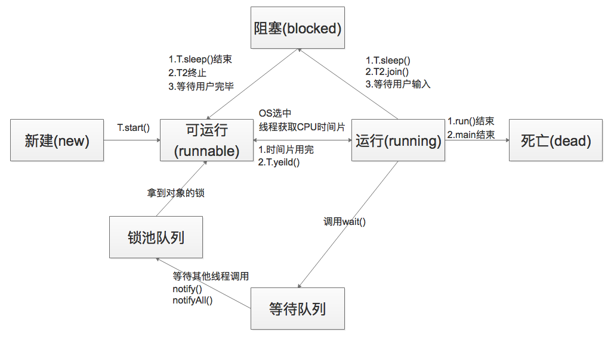
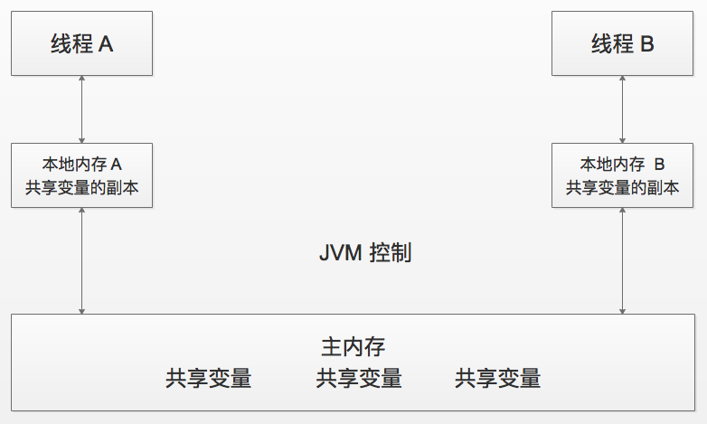

# 链接地址

[Hosee 的博客](https://my.oschina.net/hosee/blog?sort=time&catalog=3299741&p=4&temp=1520860454021)

[Java多线程与并发库高级应用](https://yq.aliyun.com/articles/65179)

# 多线程与并发

## 一, 并发概念

### A. 线程与进程

进程和线程都是一个时间段的描述,是CPU工作时间段的描述; 进程是cpu资源分配的最小单位,线程是cpu调度的最小单位;

进程是包换上下文切换的程序执行时间总和 = CPU加载上下文+CPU执行+CPU保存上下文;

线程是共享了进程的上下文环境,更为细小的CPU时间段;线程是进程内的执行单元;

一个进程管着多个线程,运行某个软件,相当于开了一个进程;在这个软件运行的过程里(在这个进程里),多个工作支撑的运行,那么这多个工作分别有一个线程;

### B. 同步与异步

同步调用会等待方法返回,异步调用会瞬间返回但另起线程继续执行工作;

同步:Java中的同步指的是通过人为的控制和调度,保证共享资源的多线程访问成为线程安全,来保证结果的准确;

### C. 并发与并行

串行: 食堂只开一个窗口,后面一堆排队的;
并行: 食堂开了好几个窗口,可以排成好几队;

并行是 N个任务同时处理,并发是 N个任务切换着执行;

多线程在多核上是并发还是并行?
对于单核,多线程的多任务是在单cpu交替执行,属于并发;对于多核,多线程的任务如果能够分布在各个cpu上(线程数少许核心数),那么就是并行;


### D. 临界区

表示一种公共资源或共享数据,可以被多个线程使用,但是每一次只能有一个线程使用它;


### E. 阻塞与非阻塞

阻塞和非阻塞通常形容多线程间的相互影响;

阻塞: 一个线程占用了临界区资源,那么其它所有需要这个资源的线程就必须在这个临界区中进行等待,等待会导致线程挂起;

非阻塞: 允许多个线程同时进入临界区;


### F. 死锁与活锁

死锁:指两个或两个以上的进程在执行过程中,由于竞争资源或者由于彼此通信而造成的一种阻塞的现象;若无外力作用,它们都将无法推进下去;

活锁:指事物1可以使用资源,但它让其他事物先使用资源;事物2可以使用资源,但它也让其他事物先使用资源,于是两者一直谦让,都无法使用资源;

饥饿:指某一个或者多个线程因为种种原因无法获得所需要的资源,导致一直无法执行;


### G. 并发级别

并发级别:阻塞和非阻塞(非阻塞分为无障碍,无锁,无等待);

#### 无障碍

1. 无障碍是一种最弱的非阻塞调度;
2. 自由出入临界区;
3. 无竞争时,有限步内完成操作;
4. 有竞争时,回滚数据;

当它发现一个进程在临界区内发生了数据竞争,产生了冲突,那么无障碍的调度方式则会回滚这条数据;无障碍的调度方式当中,所有的线程都相当于在拿去一个系统当前的一个快照;

#### 无锁

1. 是无障碍的;
2. 保证有一个线程可以胜出;

无锁增加了一个新的条件,保证每次竞争有一个线程可以胜出,则解决了无障碍的问题,至少保证了所有线程都顺利执行下去;

#### 无等待

1. 无锁的;
2. 要求所有的线程都必须在有限步内完成;
3. 无饥饿的;

无等待是并行的最高级别,它能使这个系统达到最优状态;

只有读线程,没有线线程,那么这个则必然是无等待的;

既有读线程又有写线程,而每个写线程之前,都把数据拷贝一份副本,然后修改这个副本,而不是修改原始数据,因为修改副本,则没有冲突,那么这个修改的过程也是无等待的;最后需要做同步的只是将写完的数据覆盖原始数据;


### H. 并行的两个重要定律

#### Amdahl定律

定义了串行系统并行化后的加速比的计算公式和理论上限,加速比=优化前系统耗时/优化后系统耗时;

### Gustafson定律

处理器个数,串行比例和加速比之间的关系:只要有足够的并行化,那么加速比和CPU个数成正比;


## 二, 多线程基础

### A. 线程的生命周期

1. 新建(new);

   ```Java
   Thread thread = new Thread();
   thread.run();
   //run()的两种实现方式 实现Runnable接口,直接覆盖run()
   class Ticket1 extends Thread{
       public Ticket1(String name)
       {
           super(name);
           }

       public void run() {
           
       }

   class Ticket2 extends Object implements Runnable{

       @Override
       public void run() {
          
       }

   }
   /*    
    * 使用继承方式,资源不能共享
    * 继承方式,继承了Thread类之后,就不能再继承其他类了
    *         
    * 从代码的简单性来性,来说继承方式简单些
    * 推荐使用接口方法,方便以后拓展,资源共享
    *          
   /
   ```

   ​

2. 可运行(runnable) 线程对象创建后,其他线程(比如main线程）调用了该对象的start()方法。该状态的线程位于可运行线程池中,等待被线程调度选中,获取cpu 的使用权;

3. 运行(running);

4. 阻塞(blocked):情况分三种

   1. 等待阻塞:运行(running)的线程执行wait()方法,JVM会把该线程放入等待队列(waitting queue)中;
   2. 同步阻塞:运行(running)的线程在获取对象的同步锁时,若该同步锁被别的线程占用,则JVM会把该线程放入锁池(lock pool)中;
   3. 其他阻塞:运行(running)的线程执行Thread.sleep(long ms)或join()方法,或者发出了I/O请求时,JVM会把该线程置为阻塞状态;当sleep()状态超时,join()等待线程终止或者超时,或者I/O处理完毕时,线程重新转入可运行(runnable)状态;

5. 死亡(dead);




### B. 线程的调度

调整线程优先级:Java线程有优先级,优先级高的线程会获得较多的运行机会;

Java线程的优先级用整数表示,取值范围是1~10,Thread类有以下三个静态常量:

static int MAX_PRIORITY:线程可以具有的最高优先级,取值为10;

static int MIN_PRIORITY:线程可以具有的最低优先级,取值为1;

static int NORM_PRIORITY:分配给线程的默认优先级,取值为5;

Thread类的setPriority()和getPriority()方法分别用来设置和获取线程的优先级;

1. 线程睡眠:Thread.sleep(long millis)方法,使线程转到阻塞状态; millis参数设定睡眠的时间,以毫秒为单位;当睡眠结束后,就转为就绪(Runnable)状态;sleep()平台移植性好;
2. 线程等待:Object类中的wait()方法,导致当前的线程等待,直到其他线程调用此对象的 notify() 方法或 notifyAll() 唤醒方法;这个两个唤醒方法也是Object类中的方法,行为等价于调用 wait(0) 一样;
3. 线程让步:Thread.yield() 方法,暂停当前正在执行的线程对象,把执行机会让给相同或者更高优先级的线程;
4. 线程加入:join()方法,等待其他线程终止;在当前线程中调用另一个线程的join()方法,则当前线程转入阻塞状态,直到另一个进程运行结束,当前线程再由阻塞转为就绪状态;
5. 线程唤醒:Object类中的notify()方法,唤醒在此对象监视器上等待的单个线程;如果所有线程都在此对象上等待,则会选择唤醒其中一个线程;选择是任意性的,并在对实现做出决定时发生;

为什么要用join()方法?

主线程需要等待子线程执行完成之后再结束,这个时候就要用到join()方法了;


### C. 线程分类

主线程:JVM调用程序main()所产生的线程;

当前线程:这个是容易混淆的概念;一般指通过Thread.currentThread()来获取的进程;

后台线程:指为其他线程提供服务的线程,也称为守护线程;JVM的垃圾回收线程就是一个后台线程;用户线程和守护线程的区别在于,是否等待主线程依赖于主线程结束而结束;


### D. 应用实例

#### 1. 多线程1分钟完成100万条数据插入

```java
package tenThreadInsert;
 
import java.sql.Connection;
import java.sql.DriverManager;
import java.sql.PreparedStatement;
import java.sql.SQLException;
import java.util.Date;
 
public class MyThread extends Thread{
                public void run() {
                     String url = "jdbc:mysql://127.0.0.1/teacher"; 
                     String name = "com.mysql.jdbc.Driver"; 
                     String user = "root"; 
                     String password = "123456"; 
                    Connection conn = null; 
                    try {
                        Class.forName(name);
                        conn = DriverManager.getConnection(url, user, password);//获取连接 
                        conn.setAutoCommit(false);//关闭自动提交,不然conn.commit()运行到这句会报错
                    } catch (ClassNotFoundException e1) {
                        e1.printStackTrace();
                    } catch (SQLException e) {
                        e.printStackTrace();
                    }
                // 开始时间
                Long begin = new Date().getTime();
                // sql前缀
                String prefix = "INSERT INTO test_teacher (t_name,t_password,sex,description,pic_url,school_name,regist_date,remark) VALUES ";	
                try {
                    // 保存sql后缀
                    StringBuffer suffix = new StringBuffer();
                    // 设置事务为非自动提交
                    conn.setAutoCommit(false);
                    // 比起st,pst会更好些
                    PreparedStatement  pst = (PreparedStatement) conn.prepareStatement("");//准备执行语句
                    // 外层循环,总提交事务次数
                    for (int i = 1; i <= 10; i++) {
                        suffix = new StringBuffer();
                        // 第j次提交步长
                        for (int j = 1; j <= 100000; j++) {
                            // 构建SQL后缀
                            suffix.append("('" +i*j+"','123456'"+ ",'男'"+",'教师'"+",'www.bbb.com'"+",'Java大学'"+",'"+"2016-08-16 14:43:26"+"','备注'" +"),");
                        }
                        // 构建完整SQL
                        String sql = prefix + suffix.substring(0, suffix.length() - 1);
                        // 添加执行SQL
                        pst.addBatch(sql);
                        // 执行操作
                        pst.executeBatch();
                        // 提交事务
                        conn.commit();
                        // 清空上一次添加的数据
                        suffix = new StringBuffer();
                    }
                    // 头等连接
                    pst.close();
                    conn.close();
                } catch (SQLException e) {
                    e.printStackTrace();
                }
                // 结束时间
                Long end = new Date().getTime();
                // 耗时
                System.out.println("100万条数据插入花费时间 : " + (end - begin) / 1000 + " s"+"  插入完成");
    }  
}

package tenThreadInsert;
 
public class Test {
    public static void main(String[] args) {
        for (int i = 1; i <=10; i++) {
              new MyThread().start();
            }
    }
}
```


#### 2. 多线程下的生产者与消费者

```Java
//创建共享资源的类 Person,它有两个方法,一个生产对象,一个消费对象
public class Person {
    private String name;
    private int age; 
    /**
     * 生产数据
     * @param name
     * @param age
     */
    public void push(String name,int age){
        this.name = name;
        try {
            //这段延时代码的作用是可能只生产了 name,age为null,消费者就拿去消费了
            Thread.sleep(10);
        } catch (InterruptedException e) {
            e.printStackTrace();
        }
        this.age = age;
    }
    /**
     * 取数据,消费数据
     * @return
     */
    public void pop(){
        try {
            Thread.sleep(10);
        } catch (InterruptedException e) {
            e.printStackTrace();
        }
        System.out.println(this.name+"---"+this.age);
    }
}

//创建生产者线程,并在 run() 方法中生产50个对象
public class Producer implements Runnable{
    //共享资源对象
    Person p = null;
    public Producer(Person p){
        this.p = p;
    }
    @Override
    public void run() {
        //生产对象
        for(int i = 0 ; i < 50 ; i++){
            //如果是偶数,那么生产对象 Tom--11;如果是奇数,则生产对象 Marry--21
            if(i%2==0){
                p.push("Tom", 11);
            }else{
                p.push("Marry", 21);
            }
        }
    }
}

//创建消费者线程,并在 run() 方法中消费50个对象
public class Consumer implements Runnable{
    //共享资源对象
    Person p = null;
    public Consumer(Person p) {
        this.p = p;
    }
     
    @Override
    public void run() {
        for(int i = 0 ; i < 50 ; i++){
            //消费对象
            p.pop();
        }
    }
}

//我们的模型是生产一个,马上消费一个,那期望的结果便是 Tom---11,Marry--21,Tom---11,Mary---21......   连续这样交替出现50次,但是最终结果如下
Marry---11
Tom---21
Marry---11
Tom---21
Marry---11
Tom---21
Marry---11
Tom---21
......
Tom---11
Tom---21
Marry---11
Tom---21
Marry---11
Marry---21
```

数据异常的原因:

1. 出现错乱数据,是因为先生产出Tom--11,但是消费者没有消费,然后生产者继续生产出name为Marry,但是age还没有生产,而消费者这个时候拿去消费了,那么便出现 Marry—11;同理也会出现 Tom—21;
2. 出现重复数据,是因为生产者生产一份数据了,消费者拿去消费了,但是第二次生产者生产数据了,但是消费者没有去消费；而第三次生产者继续生产数据,消费者才开始消费,这便会产生重复;

解决方法:

生产者生产name和age必须要是一个整体一起完成,即同步;生产者生产一次数据了,就暂停生产者线程,等待消费者消费;消费者消费完了,消费者线程暂停,等待生产者生产数据,这样来进行;

同步锁池:同步锁必须选择多个线程共同的资源对象,而一个线程获得锁的时候,别的线程都在同步锁池等待获取锁；当那个线程释放同步锁了,其他线程便开始由CPU调度分配锁;

1. wait():执行该方法的线程对象,释放同步锁,JVM会把该线程放到等待池中,等待其他线程唤醒该线程;
2. notify():执行该方法的线程唤醒在等待池中等待的任意一个线程,把线程转到锁池中等待(注意锁池和等待池的区别);
3. notifyAll():执行该方法的线程唤醒在等待池中等待的所有线程,把线程转到锁池中等待;

```Java
public class Person {
    private String name;
    private int age;
     
    //表示共享资源对象是否为空,如果为 true,表示需要生产,如果为 false,则有数据了,不要生产
    private boolean isEmpty = true;
    /**
     * 生产数据
     * @param name
     * @param age
     */
    public synchronized void push(String name,int age){
        try {
            //不能用 if,因为可能有多个线程
            while(!isEmpty){//进入到while语句内,说明 isEmpty==false,那么表示有数据了,不能生产,必须要等待消费者消费
                this.wait();//导致当前线程等待,进入等待池中,只能被其他线程唤醒
            }
             
            //-------生产数据开始-------
            this.name = name;
            //延时代码
            Thread.sleep(10);
            this.age = age;
            //-------生产数据结束-------
            isEmpty = false;//设置 isEmpty 为 false,表示已经有数据了
            this.notifyAll();//生产完毕,唤醒所有消费者
        } catch (Exception e) {
            e.printStackTrace();
        }
         
    }
    /**
     * 取数据,消费数据
     * @return
     */
    public synchronized void pop(){
        try {
            //不能用 if,因为可能有多个线程
            while(isEmpty){//进入 while 代码块,表示 isEmpty==true,表示为空,等待生产者生产数据,消费者要进入等待池中
                this.wait();//消费者线程等待
            }
            //-------消费开始-------
            Thread.sleep(10);
            System.out.println(this.name+"---"+this.age);
            //-------消费结束------
            isEmpty = true;//设置 isEmpty为true,表示需要生产者生产对象
            this.notifyAll();//消费完毕,唤醒所有生产者
        } catch (InterruptedException e) {
            e.printStackTrace();
        }
    }
}
```

##### 不能使用 if 的原因

因为当线程wait之后,又被唤醒的时候,是从wait后面开始执行,而不是又从头开始执行的,所以如果用if的话,被唤醒之后就不会在判断if中的条件,而是继续往下执行了;如果使用while的话,从wait下面继续执行,还会返回执行while的条件判断;


### E. Java内存模型和线程安全



1. 原子性

   原子性是指一个操作是不可中断的;即使是在多个线程一起执行的时候,一个操作一旦开始,就不会被其它线程干扰;

   i++这个操作不是原子操作,基本分为3个操作,读取i,进行+1,赋值给i。;

   假设有两个线程,当第一个线程读取i=1时,还没进行+1操作,切换到第二个线程,此时第二个线程也读取的是i=1;随后两个线程进行后续+1操作,再赋值回去以后,i不是3,而是2,显然数据出现了不一致性;

2. 有序性

3. 可见性

   可见性是指当一个线程修改了某一个共享变量的值,其他线程是否能够立即知道这个修改;


这些原则保证了重排的语义是一致的:

- 程序顺序原则:一个线程内保证语义的串行性;
- volatile规则:volatile变量的写,先发生于读,这保证了volatile变量的可见性;
- 锁规则:解锁(unlock)必然发生在随后的加锁(lock)前;
- 传递性:A先于B,B先于C,那么A必然先于C;
- 线程的start()方法先于它的每一个动作;
- 线程的所有操作先于线程的终结(Thread.join());
- 线程的中断(interrupt())先于被中断线程的代码;
- 对象的构造函数执行结束先于finalize()方法;


## 三, 无锁

### A. CAS

CAS算法:包含3个参数CAS(V,E,N);V表示要更新的变量,E表示预期值,N表示新值;

仅当V值等于E值时,才会将V的值设为N,如果V值和E值不同,则说明已经有其他线程做了更新,则当前线程什么都不做;最后,CAS返回当前V的真实值;

CAS操作是抱着乐观的态度进行的,它总是认为自己可以成功完成操作;CAS整一个操作过程是一个原子操作,它是由一条CPU指令完成的;


## 四, 并发包

### A. ReentrantLock

相比于synchronized,ReentrantLock在功能上更加丰富,它具有可重入,可中断,可限时,公平锁等特点;

```Java
public class Test implements Runnable
{
	public static ReentrantLock lock = new ReentrantLock();
	public static int i = 0;

	@Override
	public void run()
	{
		for (int j = 0; j < 10000000; j++)
		{
			lock.lock();
			try
			{
				i++;
			}
			finally
			{
				lock.unlock();
			}
		}
	}
```

ReentrantLock优点:

#### 1. 可重入

```java
lock.lock();
lock.lock();
try
{
	i++;
			
}			
finally
{
	lock.unlock();
	lock.unlock();
}
```

它有一个与锁相关的获取计数器,如果拥有锁的某个线程再次得到锁,那么获取计数器就加1,然后锁需要被释放两次才能获得真正释放(重入锁);synchronized也是重入锁;

#### 2. 可中断

与synchronized不同的是,lock.lockInterruptibly()能够响应中断;

#### 3. 可限时

超时不能获得锁,就返回false,不会永久等待构成死锁;使用lock.tryLock(long timeout, TimeUnit unit)来实现可限时锁,参数为时间和单位

#### 4. 公平锁

```Java
public ReentrantLock(boolean fair) 

public static ReentrantLock fairLock = new ReentrantLock(true);
```

这个锁能保证线程是先来的先得到锁;虽然公平锁不会产生饥饿现象,但是公平锁的性能会比非公平锁差很多;

#### 5. condition

condition.await()方法会使当前线程等待,同时释放当前锁,当其他线程中使用signal()时或者signalAll()方法时,线 程会重新获得锁并继续执行;

#### 6. Semaphore

于Semaphore来说,它允许多个线程同时进入临界区;可以认为它是一个共享锁,但是共享的额度是有限制的,额度用完了,其他没有拿到额度的线程还是要阻塞在临界区外;当额度为1时,就相等于lock;

```Java
public class Test implements Runnable
{
	final Semaphore semaphore = new Semaphore(5);
	@Override
	public void run()
	{
		try
		{
			semaphore.acquire();
			Thread.sleep(2000);
			System.out.println(Thread.currentThread().getId() + " done");
		}
		catch (Exception e)
		{
			e.printStackTrace();
		}finally {
			semaphore.release();
		}
	}
	
	public static void main(String[] args) throws InterruptedException
	{
		ExecutorService executorService = Executors.newFixedThreadPool(20);
		final Test t = new Test();
		for (int i = 0; i < 20; i++)
		{
			executorService.submit(t);
		}
	}

}
```


#### 7. ReadWriteLock

读和写是两种不同的功能,读-读不互斥,读-写互斥,写-写互斥;

```java
private static ReentrantReadWriteLock readWriteLock = 
new ReentrantReadWriteLock(); 
private static Lock readLock = readWriteLock.readLock(); 
private static Lock writeLock = readWriteLock.writeLock();
```


#### 8. CountDownLatch

```Java
static final CountDownLatch end = new CountDownLatch(10);
end.countDown(); 
end.await();
```

倒数计时器,典型的场景就是火箭发射;

```Java
public class Test implements Runnable
{
	static final CountDownLatch countDownLatch = new CountDownLatch(10);
	static final Test t = new Test();
	@Override
	public void run()
	{
		try
		{
			Thread.sleep(2000);
			System.out.println("complete");
			countDownLatch.countDown();
		}
		catch (Exception e)
		{
			e.printStackTrace();
		}
	}
	
	public static void main(String[] args) throws InterruptedException
	{
		ExecutorService executorService = Executors.newFixedThreadPool(10);
		for (int i = 0; i < 10; i++)
		{
			executorService.execute(t);
		}
		countDownLatch.await();
		System.out.println("end");
		executorService.shutdown();
	}
}
```


#### 9. CyclicBarrier

和CountDownLatch相似,也是等待某些线程都做完以后再执行;与CountDownLatch区别在于这个计数器可以反复使用;

```Java
public class Test implements Runnable
{
	private String soldier;
	private final CyclicBarrier cyclic;

	public Test(String soldier, CyclicBarrier cyclic)
	{
		this.soldier = soldier;
		this.cyclic = cyclic;
	}

	@Override
	public void run()
	{
		try
		{
			//等待所有士兵到齐
			cyclic.await();
			dowork();
			//等待所有士兵完成工作
			cyclic.await();
		}
		catch (Exception e)
		{
			// TODO Auto-generated catch block
			e.printStackTrace();
		}

	}

	private void dowork()
	{
		// TODO Auto-generated method stub
		try
		{
			Thread.sleep(3000);
		}
		catch (Exception e)
		{
			// TODO: handle exception
		}
		System.out.println(soldier + ": done");
	}

	public static class BarrierRun implements Runnable
	{

		boolean flag;
		int n;

		public BarrierRun(boolean flag, int n)
		{
			super();
			this.flag = flag;
			this.n = n;
		}

		@Override
		public void run()
		{
			if (flag)
			{
				System.out.println(n + "个任务完成");
			}
			else
			{
				System.out.println(n + "个集合完成");
				flag = true;
			}

		}

	}

	public static void main(String[] args)
	{
		final int n = 10;
		Thread[] threads = new Thread[n];
		boolean flag = false;
		CyclicBarrier barrier = new CyclicBarrier(n, new BarrierRun(flag, n));
		System.out.println("集合");
		for (int i = 0; i < n; i++)
		{
			System.out.println(i + "报道");
			threads[i] = new Thread(new Test("士兵" + i, barrier));
			threads[i].start();
		}
	}

}
```


## 五, 并发容器及典型源码分析

### A. ConcurrentHashMap 

```Java
public ConcurrentHashMap(int initialCapacity) {
        if (initialCapacity < 0)
            throw new IllegalArgumentException();
        int cap = ((initialCapacity >= (MAXIMUM_CAPACITY >>> 1)) ?
                   MAXIMUM_CAPACITY :
                   tableSizeFor(initialCapacity + (initialCapacity >>> 1) + 1));
        this.sizeCtl = cap;
    }
```

在 ConcurrentHashMap内部有一个Segment段,它将大的HashMap切分成若干个段（小的HashMap）,然后让数据在每一段上Hash,这样多个线程在不同段上的Hash操作一定是线程安全的,所以只需要同步同一个段上的线程就可以了,这样实现了锁的分离,大大增加了并发量;

### B. BlockingQueue

它是一个非常好的共享数据的容器,是典型的生产者和消费者的实现;


## 六, 线程池

### A. 线程池的种类

1. new FixedThreadPool 固定数量的线程池,线程池中的线程数量是固定的,不会改变;
2. new SingleThreadExecutor 单一线程池,线程池中只有一个线程;
3. new CachedThreadPool 缓存线程池,线程池中的线程数量不固定,会根据需求的大小进行改变;
4. new ScheduledThreadPool 计划任务调度的线程池,用于执行计划任务,比如每隔5分钟怎么样;


### B.  ThreadPoolExecutor构造函数中参数的含义

1. corePoolSize 线程池中核心线程数的数目;
2. maximumPoolSize 线程池中最多能容纳多少个线程;
3. keepAliveTime 当现在线程数目大于corePoolSize时,超过keepAliveTime时间后,多出corePoolSize的那些线程将被终结;
4. unit keepAliveTime的单位;
5. workQueue 当任务数量很大,线程池中线程无法满足时,提交的任务会被放到阻塞队列中,线程空闲下来则会不断从阻塞队列中取数据;

```Java
public ThreadPoolExecutor(int corePoolSize,
                              int maximumPoolSize,
                              long keepAliveTime,
                              TimeUnit unit,
                              BlockingQueue<Runnable> workQueue) {
        this(corePoolSize, maximumPoolSize, keepAliveTime, unit, workQueue,
             Executors.defaultThreadFactory(), defaultHandler);
}

public static ExecutorService newFixedThreadPool(int nThreads) {
        return new ThreadPoolExecutor(nThreads, nThreads,
                                      0L, TimeUnit.MILLISECONDS,
                                      new LinkedBlockingQueue<Runnable>());
}


public static ExecutorService newSingleThreadExecutor() {
        return new FinalizableDelegatedExecutorService
            (new ThreadPoolExecutor(1, 1,
                                    0L, TimeUnit.MILLISECONDS,
                                    new LinkedBlockingQueue<Runnable>()));
}


public static ExecutorService newCachedThreadPool() {
        return new ThreadPoolExecutor(0, Integer.MAX_VALUE,
                                      60L, TimeUnit.SECONDS,
                                      new SynchronousQueue<Runnable>());
}
```

FixedThreadPool:它的线程的核心数目和最大容纳数目都是一样的,以至于在工作期间,并不会创建和销毁线程;当任务数量很大,线程池中的线程无法满足时,任务将被保存到LinkedBlockingQueue中,而LinkedBlockingQueue的大小是Integer.MAX_VALUE;这就意味着,任务不断地添加,会使内存消耗越来越大;

CachedThreadPool则不同,它的核心线程数量是0,最大容纳数目是Integer.MAX_VALUE,它的阻塞队列是SynchronousQueue,这是一个特别的队列,它的大小是0;由于核心线程数量是0,所以必然要将任务添加到SynchronousQueue中,这个队列只有一个线程在从中添加数据,同时另一个线程在从中获取数据时,才能成功;独自往这个队列中添加数据会返回失败,当返回失败时,则线程池开始扩展线程,这就是为什么CachedThreadPool的线程数目是不固定的;当60s该线程仍未被使用时,线程则被销毁;

### C. 简单线程池

```Java
public class ThreadPoolDemo {
	public static class MyTask implements Runnable {
		@Override
		public void run() {
			System.out.println(System.currentTimeMillis() + "Thread ID:"
					+ Thread.currentThread().getId());
			try {
				Thread.sleep(1000);
			} catch (Exception e) {
				e.printStackTrace();
			}
		}
	}

	public static void main(String[] args) {
		MyTask myTask = new MyTask();
		ExecutorService es = Executors.newFixedThreadPool(5);
		for (int i = 0; i < 10; i++) {
			es.submit(myTask);
		}
	}
}
```


#### 1. ScheduledThreadPool

```Java
public class ThreadPoolDemo {
	public static void main(String[] args) {
		ScheduledExecutorService ses = Executors.newScheduledThreadPool(10);
		//如果前面的任务还未完成,则调度不会启动。
		ses.scheduleWithFixedDelay(new Runnable() {
			
			@Override
			public void run() {
				try {
					Thread.sleep(1000);
					System.out.println(System.currentTimeMillis()/1000);
				} catch (Exception e) {
					// TODO: handle exception
				}
				
			}
		}, 0, 2, TimeUnit.SECONDS);//启动0秒后执行,然后周期2秒执行一次
	}
}
```


#### 2. 回调接口

```java
ExecutorService es = new ThreadPoolExecutor(5, 5, 0L, TimeUnit.SECONDS,
				new LinkedBlockingQueue<Runnable>()){

					@Override
					protected void beforeExecute(Thread t, Runnable r) {
						System.out.println("准备执行");
					}

					@Override
					protected void afterExecute(Runnable r, Throwable t) {
						System.out.println("执行完成");
					}

					@Override
					protected void terminated() {
						System.out.println("线程池退出");
					}
			
		};
```


#### 3. 拒绝策略

```Java
public ThreadPoolExecutor(int corePoolSize,
                              int maximumPoolSize,
                              long keepAliveTime,
                              TimeUnit unit,
                              BlockingQueue<Runnable> workQueue,
                              ThreadFactory threadFactory,
                              RejectedExecutionHandler handler) {
        if (corePoolSize < 0 ||
            maximumPoolSize <= 0 ||
            maximumPoolSize < corePoolSize ||
            keepAliveTime < 0)
            throw new IllegalArgumentException();
        if (workQueue == null || threadFactory == null || handler == null)
            throw new NullPointerException();
        this.corePoolSize = corePoolSize;
        this.maximumPoolSize = maximumPoolSize;
        this.workQueue = workQueue;
        this.keepAliveTime = unit.toNanos(keepAliveTime);
        this.threadFactory = threadFactory;
        this.handler = handler;
    }
```

共有4种策略:

1. AbortPolicy:如果不能接受任务了,则抛出异常;
2. CallerRunsPolicy:如果不能接受任务了,则让调用的线程去完成;
3. DiscardOldestPolicy:如果不能接受任务了,则丢弃最老的一个任务,由一个队列来维护;
4. DiscardPolicy:如果不能接受任务了,则丢弃任务;


## 七, 并发设计模式

### A. 单例模式

#### 1. 最简单的实现

```java
public class Singleton {
    //由私有构造方法和static来确定唯一性,缺点:何时产生实例不好控制
	private Singleton() {
		System.out.println("Singleton is create");
	}
	private static Singleton instance = new Singleton();
	public static Singleton getInstance() {
		return instance;
	}
}
```


#### 2. 懒加载实现

```java
//让instance只有在调用getInstance()方式时被创建,并且通过synchronized来确保线程安全
public class Singleton {
	private Singleton() {
		System.out.println("Singleton is create");
	}
	private static Singleton instance = null;
	public static synchronized Singleton getInstance() {
		if (instance == null)
			instance = new Singleton();
		return instance;
	}
}
```


#### 3. 懒加载优化效率实现

```Java
//加载一个类时,其内部类不会被加载;这样保证了只有调用getInstance()时才会产生实例,控制了生成实例的时间,实现了延迟加载,用static来确保唯一性
public class StaticSingleton {
	private StaticSingleton(){  
		System.out.println("StaticSingleton is create");
	}
	private static class SingletonHolder {
		private static StaticSingleton instance = new StaticSingleton();
	}
	public static StaticSingleton getInstance() {
		return SingletonHolder.instance;
	}
}
```


### B. 不变模式

一个类的内部状态创建后,在整个生命期间都不会发生变化时,就是不变类;

```java
//以下均为不变类
java.lang.String 
java.lang.Boolean 
java.lang.Byte 
java.lang.Character 
java.lang.Double 
java.lang.Float 
java.lang.Integer 
java.lang.Long 
java.lang.Short  
public final class Product {
    // 确保无子类
    private final String no;
    // 私有属性,不会被其他对象获取
    private final String name;
    // final保证属性不会被2次赋值
    private final double price;

    public Product(String no, String name, double price) {
        // 在创建对象时,必须指定数据
        super();
        // 因为创建之后,无法进行修改
        this.no = no;
        this.name = name;
        this.price = price;
    }

    public String getNo() {
        return no;
    }

    public String getName() {
        return name;
    }

    public double getPrice() {
        return price;
    }
}
```


### C.  Future模式

#### Java原生Future模式

核心思想是异步调用 

```Java
package test;
import java.util.concurrent.Callable;
import java.util.concurrent.ExecutionException;
import java.util.concurrent.FutureTask;
public class FutureCook {
    public static void main(String[] args) throws InterruptedException, ExecutionException {
        long startTime = System.currentTimeMillis();
        // 第一步 网购厨具     
        Callable<Chuju> onlineShopping = new Callable<Chuju>() {
            @Override
            public Chuju call() throws Exception {
                System.out.println("第一步：下单");
                System.out.println("第一步：等待送货");
                Thread.sleep(5000);  // 模拟送货时间
                System.out.println("第一步：快递送到");
                return new Chuju();
            }           
        };
        FutureTask<Chuju> task = new FutureTask<Chuju>(onlineShopping);
        new Thread(task).start();
        // 第二步 去超市购买食材
        Thread.sleep(2000);  // 模拟购买食材时间
        Shicai shicai = new Shicai();
        System.out.println("第二步：食材到位");
        // 第三步 用厨具烹饪食材
        if (!task.isDone()) {  // 联系快递员,询问是否到货
            System.out.println("第三步：厨具还没到,心情好就等着（心情不好就调用cancel方法取消订单）");
        }
        Chuju chuju = task.get();
        System.out.println("第三步：厨具到位,开始展现厨艺");
        cook(chuju, shicai);
        
        System.out.println("总共用时" + (System.currentTimeMillis() - startTime) + "ms");
    }
    
    //  用厨具烹饪食材
    static void cook(Chuju chuju, Shicai shicai) {}  
    // 厨具类
    static class Chuju {}
    // 食材类
    static class Shicai {}

}
```


第一步把耗时的网购厨具逻辑,封装到了一个Callable的call方法里面,Callable接口可以看作是Runnable接口的补充,call方法带有返回值,并且可以抛出异常

```java
public interface Callable<V> {
    /**
     * Computes a result, or throws an exception if unable to do so
     * @return computed result
     * @throws Exception if unable to compute a result
     */
    V call() throws Exception;
}
```

```java
public class FutureTask<V> implements RunnableFuture<V>
public interface RunnableFuture<V> extends Runnable, Future<V>
public interface Future<V> {
    boolean cancel(boolean mayInterruptIfRunning);
    boolean isCancelled();
    boolean isDone();

    V get() throws InterruptedException, ExecutionException;
    V get(long timeout, TimeUnit unit)
        throws InterruptedException, ExecutionException, TimeoutException;
}
```

Future的核心思想是:一个方法f,计算过程可能非常耗时,等待f返回,显然不明智;可以在调用f的时候,立马返回一个Future,可以通过Future这个数据结构去控制方法f的计算过程

1. get方法:获取计算结果(如果还没计算完,也是必须等待的);
2. cancel方法:还没计算完,可以取消计算过程;
3. isDone方法:判断是否计算完;
4. isCancelled方法:判断计算是否被取消;

在第三步里面,调用了isDone方法查看状态,然后直接调用task.get方法获取厨具,不过这时还没送到,所以还是会等待3秒;

#### JDK1.8 FutureTask的实现

```java
public void run() {
        if (state != NEW ||
            !UNSAFE.compareAndSwapObject(this, runnerOffset,
                                         null, Thread.currentThread()))
            return;
        try {
            Callable<V> c = callable; //这里的callable是从构造方法里面传入的
            if (c != null && state == NEW) {
                V result;
                boolean ran;
                try {
                    result = c.call();
                    ran = true;
                } catch (Throwable ex) {
                    result = null;
                    ran = false;
                    setException(ex); //保存call方法抛出的异常
                }
                if (ran)
                    set(result); //保存call方法的执行结果
            }
        } finally {
            // runner must be non-null until state is settled to
            // prevent concurrent calls to run()
            runner = null;
            // state must be re-read after nulling runner to prevent
            // leaked interrupts
            int s = state;
            if (s >= INTERRUPTING)
                handlePossibleCancellationInterrupt(s);
        }
    }
```

run方法的主要逻辑就是运行Callable的call(),然后将保存结果或者异常(用的一个属性result)保存起来;


```java
* Possible state transitions:
     * NEW -> COMPLETING -> NORMAL
     * NEW -> COMPLETING -> EXCEPTIONAL
     * NEW -> CANCELLED
     * NEW -> INTERRUPTING -> INTERRUPTED
     */
    private volatile int state;
    private static final int NEW          = 0;
    private static final int COMPLETING   = 1;
    private static final int NORMAL       = 2;
    private static final int EXCEPTIONAL  = 3;
    private static final int CANCELLED    = 4;
    private static final int INTERRUPTING = 5;
    private static final int INTERRUPTED  = 6;
```

把FutureTask看作一个Future,那么它的作用就是控制Callable的call方法的执行过程:

1. 一个FutureTask新建出来,state就是NEW状态;COMPETING和INTERRUPTING用的进行时,表示瞬时状态,存在时间极短;NORMAL代表顺利完成;EXCEPTIONAL代表执行过程出现异常;CANCELED代表执行过程被取消;INTERRUPTED被中断;
2. 执行过程顺利完成：NEW -> COMPLETING -> NORMAL;
3. 执行过程出现异常：NEW -> COMPLETING -> EXCEPTIONAL;
4. 执行过程被取消：NEW -> CANCELLED;
5. 执行过程中,线程中断：NEW -> INTERRUPTING -> INTERRUPTED;


get方法的实现

```java
//果call方法的执行过程已完成,就把结果给出去；如果未完成,就将当前线程挂起等待
public V get() throws InterruptedException, ExecutionException {
        int s = state;
        if (s <= COMPLETING)
            s = awaitDone(false, 0L);
        return report(s);
    }
    
private int awaitDone(boolean timed, long nanos)
        throws InterruptedException {
        final long deadline = timed ? System.nanoTime() + nanos : 0L;
        WaitNode q = null;
        boolean queued = false;
        for (;;) {
            if (Thread.interrupted()) {
                removeWaiter(q);
                throw new InterruptedException();
            }

            int s = state;
            if (s > COMPLETING) {
                if (q != null)
                    q.thread = null;
                return s;
            }
            else if (s == COMPLETING) // cannot time out yet
                Thread.yield();
            else if (q == null)
                q = new WaitNode();
            else if (!queued)
                queued = UNSAFE.compareAndSwapObject(this, waitersOffset,
                                                     q.next = waiters, q);
            else if (timed) {
                nanos = deadline - System.nanoTime();
                if (nanos <= 0L) {
                    removeWaiter(q);
                    return state;
                }
                LockSupport.parkNanos(this, nanos);
            }
            else
                LockSupport.park(this);
        }
    }

private void finishCompletion() {
        // assert state > COMPLETING;
        for (WaitNode q; (q = waiters) != null;) {
            if (UNSAFE.compareAndSwapObject(this, waitersOffset, q, null)) {
                for (;;) {
                    Thread t = q.thread;
                    if (t != null) {
                        q.thread = null;
                        LockSupport.unpark(t); // 唤醒线程
                    }
                    WaitNode next = q.next;
                    if (next == null)
                        break;
                    q.next = null; // unlink to help gc
                    q = next;
                }
                break;
            }
        }

        done();

        callable = null;        // to reduce footprint
    }
```


## 八, NIO与AIO

NIO是New I/O的简称,与旧式的基于流的I/O方法相对,从名字看,它表示新的一套Java I/O标 准;

### A. NIO 特性

1. NIO是基于块(Block)的,它以块为基本单位处理数据 (硬盘上存储的单位也是按Block来存储,这样性能上比基于流的方式要好一些);
2. 为所有的原始类型提供(Buffer)缓存支持;
3. 增加通道(Channel)对象,作为新的原始 I/O 抽象;
4. 支持锁(我们在平时使用时经常能看到会出现一些.lock的文件,这说明有线程正在使用这把锁,当线程释放锁时,会把这个文件删除掉,这样其他线程才能继续拿到这把锁)和内存映射文件的文件访问接口;
5. 提供了基于Selector的异步网络I/O ;

所有的从通道中的读写操作,都要经过Buffer,而通道就是io的抽象,通道的另一端就是操纵的文件;


### B. Buffer

Buffer 基础

```Java
public class Test {
	public static void main(String[] args) throws Exception {
		FileInputStream fin = new FileInputStream(new File(
				"d:\\temp_buffer.tmp"));
		FileChannel fc = fin.getChannel();
		ByteBuffer byteBuffer = ByteBuffer.allocate(1024);
		fc.read(byteBuffer);
		fc.close();
		byteBuffer.flip();//读写转换
	}
}
```

1. 得到Channel;
2. 申请Buffer; 
3. 建立Channel和Buffer的读/写关系; 
4. 关闭;

#### NIO复制文件

```java
public static void nioCopyFile(String resource, String destination)
			throws IOException {
		FileInputStream fis = new FileInputStream(resource);
		FileOutputStream fos = new FileOutputStream(destination);
		FileChannel readChannel = fis.getChannel(); // 读文件通道
		FileChannel writeChannel = fos.getChannel(); // 写文件通道
		ByteBuffer buffer = ByteBuffer.allocate(1024); // 读入数据缓存
		while (true) {
			buffer.clear();
			int len = readChannel.read(buffer); // 读入数据
			if (len == -1) {
				break; // 读取完毕
			}
			buffer.flip();
			writeChannel.write(buffer); // 写入文件
		}
		readChannel.close();
		writeChannel.close();
	}
```


## 九, 锁优化

### A. 减少锁持有时间 

```Java
public synchronized void syncMethod(){  
		othercode1();  
		mutextMethod();  
		othercode2(); 
	}
	
//只用在有线程安全要求的程序上加锁
public void syncMethod(){  
		othercode1();  
		synchronized(this)
		{
			mutextMethod();  
		}
		othercode2(); 
	}
```


### B. 减小锁粒度

将大对象(这个对象可能会被很多线程访问),拆成小对象,大大增加并行度,降低锁竞争;降低了锁的竞争,偏向锁,轻量级锁成功率才会提高;最典型的减小锁粒度的案例就是ConcurrentHashMap;


### C. 锁分离

最常见的锁分离就是读写锁ReadWriteLock,根据功能进行分离成读锁和写锁,这样读读不互斥,读写互斥,写写互斥,即保证了线程安全,又提高了性能;


### D. 锁粗化

如果对同一个锁不停的进行请求,同步和释放,其本身也会消耗系统宝贵的资源,反而不利于性能的优化;

```java
public void demoMethod(){  
		synchronized(lock){   
			//do sth.  
		}  
		//做其他不需要的同步的工作,但能很快执行完毕  
		synchronized(lock){   
			//do sth.  
		} 
	}
	//根据锁粗化的思想,应该合并,前提就是中间的那些不需要同步的工作是很快执行完成的
	public void demoMethod(){  
		//整合成一次锁请求 
		synchronized(lock){   
			//do sth.   
			//做其他不需要的同步的工作,但能很快执行完毕  
		}
	}
```


### E. 锁消除

锁消除是在编译器级别的事情,开启锁消除是在JVM参数上设置的,并且要开启逃逸分析;逃逸分析的作用呢,就是看看变量是否有可能逃出作用域的范围;


### F. 虚拟机内的锁优化 


### H. 偏向锁


### I. 轻量级锁


### J.自旋锁