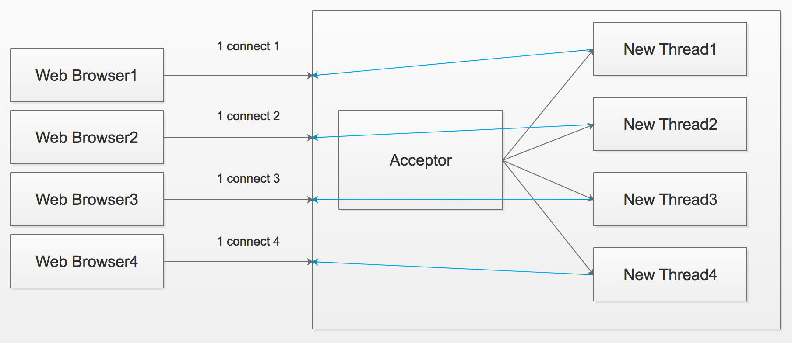
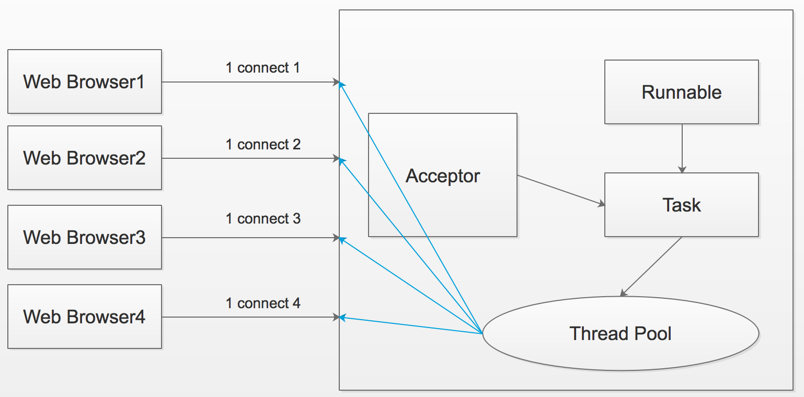
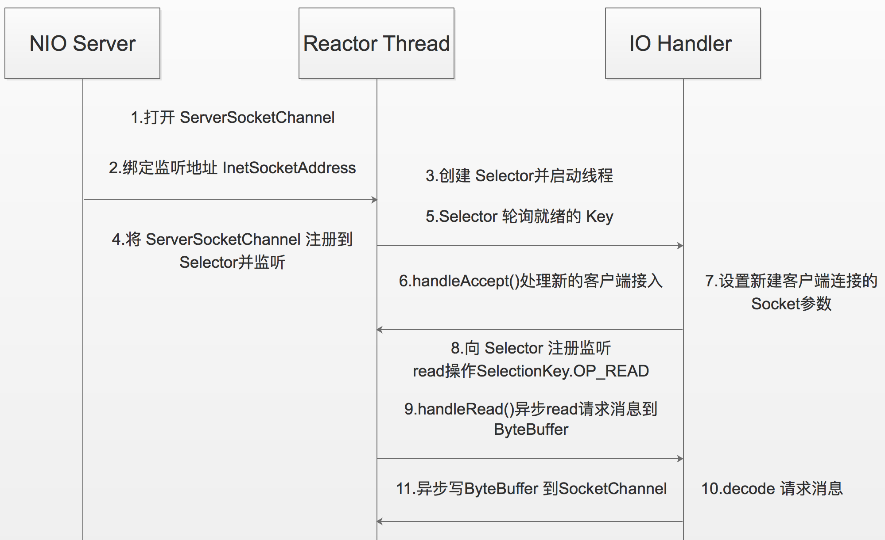
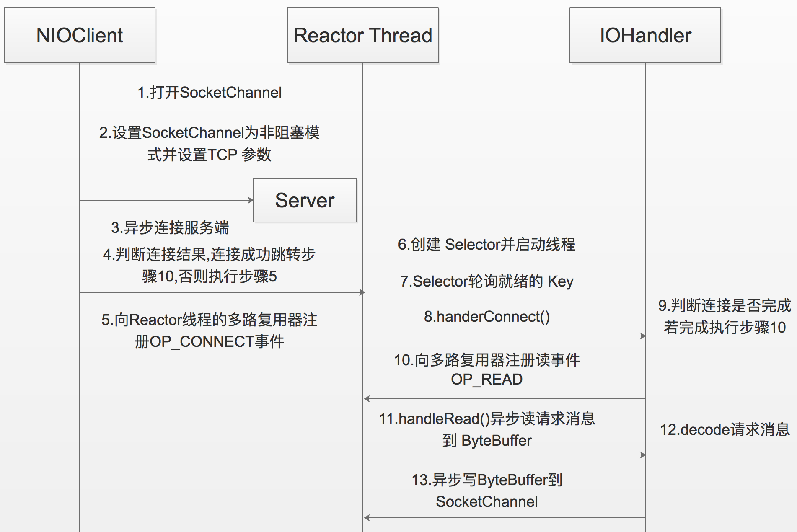
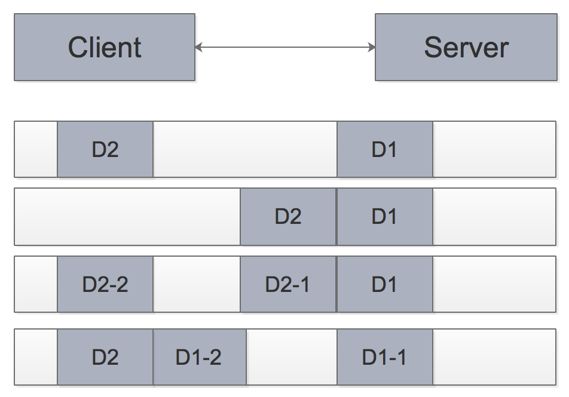

# 链接地址

[Java I/O 演变系列(作者Joanna.Yan)](http://www.cnblogs.com/Joanna-Yan/p/7419117.html)


# 一, Java I/O演变

系统运行的瓶颈一般在于IO操作,一般打开某个IO通道需要大量的时间,同时端口中不一定就有足够的数据,这样read方法就一直等待读取此端口的内容,从而浪费大量的系统资源;

Java New IO的非堵塞技术主要采用了Observer模式,就是有一个具体的观察者和＝监测IO端口,如果有数据进入就会立即通知相应的应用程序。这样我们就避免建立多个线程,同时也避免了read等待的时间;

JDK1.4推出 NIO 1.0 ,新增java.nio包,提供了很多进行异步I/O开发的API和类库:

- 进行异步I/O操作的缓冲区ByteBuffer等;
- 进行异步I/O操作的管道Pipe;
- 进行各种I/O操作(异步或者同步)的Channel,包括ServerSocketChannel和SocketChannel;
- 多种字符集的编码能力和解码能力;
- 实现非阻塞I/O操作的多路复用器selector;
- 基于流行的Perl实现的正则表达式类库;
- 文件通道FileChannel;

JDK1.7推出 NIO 2.0,改进如下:

- 提供能够批量获取文件属性的API,这些API具有平台无关性,不与特性的文件系统相耦合,另外它还提供了标准文件系统的SPI,供各个服务商扩展实现;
- 提供AIO功能,支持基于文件的异步I/O操作和针对网络套接字的异步操作;
- 完成JSR定义的通道功能,包括对配置和多播数据报的支持等;


# IO 分类

  Java IO一般包含两个部分:

1. java.io包中堵塞型IO;
2. java.nio包中的非堵塞型IO,通常称为New IO;

系统运行的瓶颈一般在于IO操作,一般打开某个IO通道需要大量的时间,同时端口中不一定就有足够的数据,这样read方法就一直等待读取此端口的内容,从而浪费大量的系统资源

NIO 的非堵塞技术主要采用了Observer模式,就是有一个具体的观察者和＝监测IO端口,如果有数据进入就会立即通知相应的应用程序;这样我们就避免建立多个线程,同时也避免了read等待的时间;


# 二, 传统的 BIO 编程

网络编程的基本模型是Client/Server(CS)模型,也就是两个进程之间进行相互通信,其中服务端提供位置信息(绑定的IP地址和监听端口),客户端通过连接操作向服务端监听的地址发起连接请求,通过三次握手建立连接,如果连接建立成功,双方就可以通过网络套接字(Socket)进行通信;

基于传统同步阻塞模型开发中,ServerSocket负责绑定IP地址,启动监听端口;Socket负责发起连接操作,连接成功之后,双方通过输入和输出流进行同步阻塞式通信;



采用BIO通信模型的服务端,通常由一个独立的Acceptor线程负责监听客户端的连接,它接收到客户端连接请求之后为每个客户端创建一个新的线程进行链路处理,处理完成之后,通过输出流返回应答给客户端,线程销毁;这就是典型的一请求一应答通信模型;

该模型最大的问题就是缺乏弹性伸缩能力,当客户端并发访问量增加后,服务端的线程个数和客户端并发访问数呈1:1 的正比关系;线程是Java虚拟机非常宝贵的系统资源,当线程数膨胀之后,系统的性能将急剧下降,随着并发访问量的继续增大,系统会发生线程堆栈溢出,创建新线程失败等问题,并最终导致进程宕机或者僵死,不能对外提供服务;


### 同步阻塞式I/O创建的TimeServer

```Java
public class TimeServer {
    public static void main(String[] args) {
        int port=9090;
        if(args!=null&&args.length>0){
            try {
                port=Integer.valueOf(args[0]);
            } catch (Exception e) {
                // 采用默认值
            }
        }
        
        ServerSocket server=null;        
        try {
            server=new ServerSocket(port);
            System.out.println("The time server is start in port:"+port);
            Socket socket=null;
            while(true){//通过一个无限循环来监听客户端的连接
                socket=server.accept();//如果没有客户端接入,则主线程阻塞在ServerSocket的accept操作上。
                new Thread(new TimeServerHandler(socket)).start();
            }
        } catch (IOException e) {
            e.printStackTrace();
        }finally{
            if(server!=null){
                System.out.println("The time server close");
                try {
                    server.close();
                    server=null;
                } catch (IOException e) {
                    e.printStackTrace();
                }
            }
        }
    }
}


public class TimeServerHandler implements Runnable{
    private Socket socket;    
    public TimeServerHandler(Socket socket) {
        this.socket = socket;
    }

    @Override
    public void run() {
        BufferedReader in=null;
        PrintWriter out=null;
        try {
            in=new BufferedReader(new InputStreamReader(this.socket.getInputStream()));
            out=new PrintWriter(this.socket.getOutputStream(), true);
            String currentTime=null;
            String body=null;
            while(true){
                body=in.readLine();
                if(body==null){
                    break;
                }
                System.out.println("The time server receive order:"+body);
                //如果请求消息为查询时间的指令"QUERY TIME ORDER"则获取当前最新的系统时间。
                currentTime="QUERY TIME ORDER".equalsIgnoreCase(body) ? 
                        new Date(System.currentTimeMillis()).toString() : "BAD ORDER";
                out.println(currentTime);
            }
        } catch (IOException e) {
            e.printStackTrace();
        }finally{
            if(in!=null){
                try {
                    in.close();
                } catch (IOException e) {
                    e.printStackTrace();
                }
            }
            if(out!=null){
                out.close();
                out=null;
            }
            if(this.socket!=null){
                try {
                    this.socket.close();
                    this.socket=null;
                } catch (IOException e) {
                    e.printStackTrace();
                }
            }
        }
    }
}
```


### 同步阻塞式I/O创建的TimeClient

```Java
public class TimeClient {
    public static void main(String[] args) {
        int port=9090;
        if(args!=null&&args.length>0){
            try {
                port=Integer.valueOf(args[0]);
            } catch (Exception e) {
                // 采用默认值
            }
        }
        
        Socket socket=null;
        BufferedReader in=null;
        PrintWriter out=null;
        
        try {
            socket=new Socket("127.0.0.1",port);
            in=new BufferedReader(new InputStreamReader(socket.getInputStream()));
            out=new PrintWriter(socket.getOutputStream(),true);
            out.println("QUERY TIME ORDER");
            System.out.println("Send order 2 server succeed.");
            String resp=in.readLine();
            System.out.println("Now is:"+resp);
            
        } catch (UnknownHostException e) {
            e.printStackTrace();
        } catch (IOException e) {
            e.printStackTrace();
        }finally{
            if(out!=null){
                out.close();
                out=null;
            }
            if(in!=null){
                try {
                    in.close();
                } catch (IOException e) {
                    e.printStackTrace();
                }
                in=null;
            }
            if(socket!=null){
                try {
                    socket.close();
                } catch (IOException e) {
                    e.printStackTrace();
                }
                socket=null;
            }
        }
    }
}
```

BIO主要的问题在于每当有一个新的客户端请求接入时,服务端必须创建一个新的线程处理新接入的客户端链路,一个线程只能吃力一个客户端连接。在高性能服务器应用领域,往往需要面向成千上万个客户端的并发连接,这种模型显然无法满足高性能,高并发接入的场景;


# 三, 伪异步IO 编程

为了解决同步阻塞I/O面临的一个链路需要一个线程处理的问题,有人对它的线程模型进行了优化(伪异步 I/O):

后端通过一个线程池来处理多个客户端的请求接入,形成客户端个数M,线程池最大线程数N的比例关系,其中M可以远远大于N,通过线程池可以灵活的调配线程资源,设置线程的最大值,防止由于海量并发接入导致线程耗尽;

**伪异步I/O实际上仅仅只是对之前I/O线程模型的一个简单优化,它无法从根本上解决同步I/O导致的通信线程阻塞问题**;如果通信对方返回应答时间过长,会引起的级联故障:

1. 服务端处理缓慢,返回应答消息耗费60s,平时只需要10ms;
2. 采用伪异步I/O的线程正在读取故障服务节点的响应,由于读取输入流是阻塞的,因此,它将会被同步阻塞60s;
3. 假如所有的可用线程都被故障服务器阻塞,那后续所有的I/O消息都将在队里中排队;
4. 由于线程池采用阻塞队列实现,当队列积满之后,后续入队的操作将被阻塞;
5. 由于前端只有一个Accptor线程接收客户端接入,它被阻塞在线程池的同步阻塞队列之后,新的客户端请求消息将被拒绝,客户端会发生大量的连接超时;
6. 由于几乎所有的连接都超时,调用者会认为系统已经崩溃,无法接收新的请求消息;



理论上:当有新的客户端接入的时候,将客户端的Socket封装成一个Task(该任务实现java.lang.Runnable接口)投递到后端的线程池中进行处理,JDK的线程池维护一个消息队列和N个活跃线程对消息队列中的任务进行处理;由于线程池可以设置消息队列的大小和最大线程数,它的资源占用是可控的,无论多少个客户端并发访问,都不会导致资源的耗尽和宕机;


### 伪异步式I/O创建的TimeServer

```java
public class TimeServer {
    public static void main(String[] args) {
        int port=9090;
        if(args!=null&&args.length>0){
            try {
                port=Integer.valueOf(args[0]);
            } catch (Exception e) {
                // 采用默认值
            }
        }
        
        ServerSocket server=null;
        try {
            server=new ServerSocket(port);
            System.out.println("The time server is start in port :"+ port);
            Socket socket=null;
            //创建一个时间服务器类的线程池
            TimeServerHandlerExecutePool singleExecutor=new 
                    TimeServerHandlerExecutePool(50, 10000);//创建I/O任务
            
            while(true){
                socket=server.accept();
                //当接收到新的客户端连接时,将请求Socket封装成一个Task,然后调用execute方法执行,从而避免了每个请求接入都创建一个新的线程
                singleExecutor.execute(new TimeServerHandler(socket));
            }
        } catch (IOException e) {
            e.printStackTrace();
        }finally{
            if(server!=null){
                try {
                    System.out.println("The time server close");
                    server=null;
                    server.close();
                } catch (IOException e) {
                    e.printStackTrace();
                }
            }
        }
    }
}


/**
 * 由于线程池和消息队列都是有界的,因此,无论客户端并发连接数多大,它都不会导致线程个数过于膨胀或者内存溢出,相比于传统的一连接一线程模型,是一种改良
 */
public class TimeServerHandlerExecutePool {
    private ExecutorService executor;
    
    public TimeServerHandlerExecutePool(int maxPoolSize,int queueSize){
        executor=new ThreadPoolExecutor(Runtime.getRuntime().availableProcessors(), 
                maxPoolSize, 120L, TimeUnit.SECONDS,
                new ArrayBlockingQueue<java.lang.Runnable>(queueSize));
        
    }
    
    public void execute(java.lang.Runnable task){
        executor.execute(task);;
    }
}


public class TimeServerHandler implements Runnable{
    private Socket socket;    
    public TimeServerHandler(Socket socket) {
        this.socket = socket;
    }

    @Override
    public void run() {
        BufferedReader in=null;
        PrintWriter out=null;
        
        try {
            in=new BufferedReader(new InputStreamReader(this.socket.getInputStream()));
            out=new PrintWriter(this.socket.getOutputStream(), true);
            String currentTime=null;
            String body=null;
            while(true){
                body=in.readLine();
                if(body==null){
                    break;
                }
                System.out.println("The time server receive order:"+body);
                //如果请求消息为查询时间的指令"QUERY TIME ORDER"则获取当前最新的系统时间。
                currentTime="QUERY TIME ORDER".equalsIgnoreCase(body) ? 
                        new Date(System.currentTimeMillis()).toString() : "BAD ORDER";
                out.println(currentTime);
            }
        } catch (IOException e) {
            e.printStackTrace();
        }finally{
            if(in!=null){
                try {
                    in.close();
                } catch (IOException e) {
                    e.printStackTrace();
                }
            }
            if(out!=null){
                out.close();
                out=null;
            }
            if(this.socket!=null){
                try {
                    this.socket.close();
                    this.socket=null;
                } catch (IOException e) {
                    e.printStackTrace();
                }
            }
        }
    }
}
```

伪异步I/O通信框架采用了线程池实现,因此避免了为每个请求都创建一个独立线程造成的线程资源耗尽问题,但是由于它底层的通信依然采用同步阻塞模型,因此无法从根本上解决问题;

#### Socket 输入流

当对Socket的输入流进行读取操作的时候,它会一直阻塞下去,直到发生如下事件:

1. 有数据可读;
2. 可用数据已经读取完毕;
3. 发生空指针或者I/O异常;

这意味着当对方发送请求或者应答消息比较缓慢或者网络传输较慢时,读取输入流一方的通信线程将被长时间阻塞,如果对方要60s才能够将数据发送完成,读取一方的I/O线程也将会被同步阻塞60s,在此期间,其他接入消息只能在消息队列中排队;

#### Socket 输出流

当调用OutputStream的write方法写输出流的时候,它将会被阻塞,直到要发送的字节全部写入完毕,或者发生异常;学习过TCP/IP相关知识的人都知道,当消息的接收方处理缓慢的时候,将不能及时地从TCP缓冲区读取数据,这将会导致发送方的TCP window size不断减小,直到为0,双方处于Keep-Alive状态,消息发送方将不能再向TCP缓冲区写入消息,这是如果采用的是同步阻塞I/O,write操作将会被无限期阻塞,直到TCP window size大于0或者发生I/O异常;


# 四, NIO 编程

与Socket类和ServerSocket类相对应,NIO也提供了SocketChannel和ServerSocketChannel两种不同的套接字通道实现。这两种新增的通道都支持阻塞和非阻塞两种模式。阻塞模式使用非常简单,但是性能和可靠性都不好,非阻塞则正好相反;开发人员一般可以根据自己的需要来选择合适的模式,一般来说,低负载,低并发的应用程序可以选择同步阻塞I/O以降低编程复杂度,但是对于高负载,高并发的网络应用,需要使用NIO的非阻塞模式进行开发;


## NIO 类库

### A. 缓冲区 Buffer

Buffer是一个对象,它包含一些要写入或者要读出的数据;在NIO类库中加入Buffer对象,体现了新库与原I/O的一个重要区别;在面向流的I/O中,可以将数据直接写入或者将数据直接读到Stream对象中;

在NIO库中,所有数据都是用缓冲区处理的;在读取数据时,它是直接读到缓冲区中的;在写入数据时,写入到缓冲区中;任何时候访问NIO中的数据,都是通过缓冲区进行操作;

缓冲区实质上是一个数组,通常它是一个字节数组(ByteBuffer),也可以使用其他种类的数组;但是缓冲区不仅仅是一个数组,缓冲区提供了对数据的结构化访问以及维护读写位置(limit)等信息;

**每一种Java基本类型(除了Boolean类型)都对应有一种缓冲区,最常用的缓冲区是ByteBuffer;**

每一个Buffer类都是Buffer接口的一个子实例;除了ByteBuffer,每一个Buffer类都有完全一样的操作,只是它们所处理的数据类型不一样;因为大多数标准I/O操作都是使用ByteBuffer,所以它除了具有一般缓冲区的操作之外还提供一些特有的操作,方便网络读写;


### B. 通道 Channel

Channel是一个通道,可以通过它读取和写入数据;通道与流的不同之处在于通道是双向的,流只是在一个方向上移动(一个流必须是InputStream或者OutputStream的子类),而且通道可以用于读,写或者同时读写;


### C. 多路复用器 Select

多路复用器Selector是Java NIO编程的基础,它提供选择已经就绪的任务的能力;Selector会不断地轮询注册在其上的Channel,如果某个Channel上面有新的TCP连接接入,读和写事件,这个Channel就处于就绪状态,会被Selector轮询出来,然后通过SelectionKey可以获取就绪Channel的集合,进行后续的I/O操作;

一个多路复用器Selector可以同时轮询多个Channel,由于JDK使用了epoll()代替传统的select实现,所以它并没有最大连接句柄1024/2048的限制;


### D. NIO 服务端序列




忽略掉一些在生产环境中部署所需要的一些特性和功能,NIO服务端的主要创建过程

```Java
//1.打开ServerSocketChannel,用于监听客户端的连接,它是所有客户端连接的父管道
ServerSocketChannel acceptorSvr = ServerSocketChannel.open();

//2.绑定监听端口,设置连接为非阻塞模式
acceptorSvr.socket().bind
(new InetSocketAddress(InetAddress.getByName("IP"),port));
acceptorSvr.configureBlocking(false);

//3.创建Reactor线程,创建多路复用器并启动线程
Selector selector = Selector.open();
New Thread(new ReactorTask()).start();

//4.将ServerSocketChannel注册到Reactor线程的多路复用器Selector上,监听ACCEPT事件
SelectionKey key = acceptorSvr.register(selector,SelectionKey.OP_ACCEPT,ioHandler);

//5.多路复用器在线程run方法的无线循环体内轮询准备就绪的Key
int num = selector.select();
Set selectedKeys = selector.selectedKeys();
Iterator it = selectedKeys.iterator();
while(it.hasNext()){
　　SelectionKey key = (SelectionKey )it.next();
　　//...deal with I/O event...
}

//6.多路复用器监听到有新的客户端接入,处理新的接入请求,完成TCP三次握手,建立物理链路
SocketChannel channel = svrChannel.accpet();

//7.设置客户端链路为非阻塞模式
channel.configureBlocking(false);
channel.socket().setReuseAddress(true);
......
    
//8.将新接入的客户端连接注册到Reactor线程的多路复用器,监听读操作,用来读取客户端发送的网络消息
SelectionKey key = socketChannel.register(selector,SelectionKey.OP_READ,ioHandler);

//9.异步读取客户端请求消息到缓冲区
int readNumber=channel.read(receivedBuffer);

//10.对ByteBuffer进行编解码,如果有半包消息指针reset,继续读取后续的报文,将解码成功的消息封装成Task,投递到业务线程池中,进行业务逻辑编排
Object message=null;
while(buffer.hasRemain()){
　　byteBuffer.mark();
　　Object message=decode(byteBuffer);
　　if(message==null){
　　　　byteBuffer.reset();
　　　　break;
　　}
　　messageList.add(message);
}
if(!byteBuffer.hasRemain()){
　　byteBuffer.clear();
}else{
　　byteBuffer.compact();
}
if(messageList!=null& !messageList.isEmpty()){
　　for(Object messageE: messageList){
　　　　handlerTask(messageE);
　　}
}

//11.将POJO对象encode成ByteBuffer,调用SocketChannel的异步write接口,将消息异步发送给客户端
socketChannel.write(buffer);

//如果发送区TCP缓冲区满,会导致写半包,此时,需要注册监听写操作位,循环写,直到整包消息写入TCP缓冲区  
```


### E. NIO 客户端序列




NIO客户端的主要创建过程

```java
//1.打开SocketChannel,绑定客户端本地地址(可选,默认系统会随机分配一个可用的本地地址)
SocketChannel clientChannel = SocketChannel.open();
//2.设置SocketChannel为非阻塞模式,同时设置客户端连接的TCP参数
clientChannel.configureBlocking(false);
socket.setReuseAddress(true);
socket.setReceiveBufferSize(BUFFER_SIZE);
socket.setSendBufferSize(BUFFER_SIZE);
//3.异步连接服务端
boolean connected = clientChannel.connect(new InetSocketAddress("ip",port));
//4.判断是否连接成功,如果连接成功,则直接注册读状态位到多路复用器中,如果当前没有连接成功（异步连接,返回false,说明客户端已经发送sync包,服务端没有返回ack包,物理链路还没有建立）
if(connected){
　　clientChannel.register(selector,SelectionKey.OP_READ,ioHandler);
}else{
　　clientChannel.register(selector,SelectionKey.OP_CONNECT,ioHandler);
}
//5.向Reactor线程的多路复用器注册OP_CONNECT状态位,监听服务端的TCP ACK应答
clientChannel.register(selector,SelectionKay.OP_CONNECT,ioHandler);
//6.创建Reactor线程,创建多路复用器并启动线程
Selector selector=Selector.open();
new Thread(new ReactorTask()).start();
//7.多路复用器在线程run方法的无限循环体内轮询准备就绪的key
int num=selector.select();
Set selectedKeys=selector.selectedKeys();
Iterator it=selectedKeys.iterator();
while(it.hasNext()){
　　SelectionKey key=(SelectionKey)it.next();
　　//...deal with I/O event...
}
//8.接收connect事件进行处理
if(key.isConnectable()){
　　//handlerConnect();
}
//9.判断连接结果,如果连接成功,注册读事件到多路复用器
if(channel.finishConnect()){
　　registerRead();
}
//10.注册读事件到多路复用器
clientChannel.register(selector,SelectionKey.OP_READ,ioHandler);
//11.异步读客户端请求消息到缓冲区
int readNumber=channel.read(receivedBuffer);
//12.对ByteBuffer进行编解码,如果有半包消息接收缓冲区Reset,继续读取后续的报文,将解码成功的消息封装成Task,投递到业务线程池中,进行业务逻辑编排
Object message=null;
while(buffer.hasRemain()){
　　byteBuffer.mark();
　　Object message=decode(byteBuffer);
　　if(message==null){
　　　　byteBuffer.reset();
　　　　break;
　　}
　　messageList.add(message);
}

if(!byteBuffer.hasRemain()){
　　byteBuffer.clear();
}else{
　　byteBuffer.compact();
}

if(messageList!=null & !messageList.isEmpty()){
　　for(Object messageE:messageList){
　　　　handlerTask(messageE);
　　}
}
//13.将POJO对象encode成ByteBuffer,调用SocketChannel的异步write接口,将消息异步发送给客户端
socketChannel.wirte(buffer);
```


### NIO创建的TimeServer

```java
public class TimeServer {
    public static void main(String[] args) {
        int port=9090;
        if(args!=null&&args.length>0){
            try {
                port=Integer.valueOf(args[0]);
            } catch (Exception e) {
                // 采用默认值
            }
        }
        
        MultiplexerTimeServer timeServer = new MultiplexerTimeServer(port);
        new Thread(timeServer, "NIO-MultiplexerTimeServer-001").start();
    }
}

public class MultiplexerTimeServer implements Runnable{
        private Selector selector;//多路复用器
        private ServerSocketChannel servChannel;
        private volatile boolean stop;
        
        /**
         * 初始化多路复用器,绑定监听端口
         * @param port
         */
        public MultiplexerTimeServer(int port){
            try {
                selector=Selector.open();
                servChannel=ServerSocketChannel.open();
                servChannel.configureBlocking(false);
                servChannel.socket().bind(new InetSocketAddress(port), 1024);
                servChannel.register(selector, SelectionKey.OP_ACCEPT);
                System.out.println("The time server is start in port: "+port);
                
            } catch (IOException e) {
                e.printStackTrace();
                System.exit(1);
            }
        }
　　　　public void stop(){
            this.stop=true;
      }

　　　　@Override
       public void run() {
            while(!stop){
                try {
                    //设置selector的休眠时间为1s,无论是否有读写等事件发生,selector每隔1s都被唤醒一次
                    selector.select(1000);
                    //当有处于就绪状态的Channel时,selector就返回就绪状态的Channel的SelectionKey集合
                    Set<SelectionKey> selectedKeys=selector.selectedKeys();
                    Iterator<SelectionKey> it=selectedKeys.iterator();
                    SelectionKey key=null;
                    //通过对就绪状态的Channel集合进行迭代,可以进行网络的异步读写操作
                    while(it.hasNext()){
                        key=it.next();
                        it.remove();
                        try {
                            handleInput(key);
                        } catch (Exception e) {
                            if(key!=null){
                                key.cancel();
                                if(key.channel()!=null){
                                    key.channel().close();
                                }
                            }
                        }
                    }
                } catch (IOException e) {
                    e.printStackTrace();
                }
            }
　　　　　　　/*
             * 多路复用器关闭后,所有注册在上面的Channel和Pipe等资源都会被自动去注册并关闭,所以不需要重复释放资源
             */
            if(selector!=null){
                try {
                    selector.close();
                } catch (IOException e) {
                    e.printStackTrace();
                }
            }
        }
　　　　private void handleInput(SelectionKey key) throws IOException{
            if(key.isValid()){
                //处理新接入的请求消息
                //通过SelectionKey的操作位进行判断即可获知网络事件类型
                if(key.isAcceptable()){
                    //Accept the new connection
                    ServerSocketChannel ssc=(ServerSocketChannel) key.channel();
                    SocketChannel sc=ssc.accept();
                    //-----以上操作相当于完成了TCP的三次握手,TCP物理链路正式建立------
                    
                    //将新创建的SocketChannel设置为异步非阻塞,同时也可以对其TCP参数进行设置,例如TCP接收和发送缓冲区的大小等
                    sc.configureBlocking(false);
                    //Add the new connection to the selector
                    sc.register(selector, SelectionKey.OP_READ);
                }
　　　　　　　　 if(key.isReadable()){
                    //Read the data
                    SocketChannel sc=(SocketChannel) key.channel();
                    //由于实现我们得知客户端发送的码流大小,作为例程,我们开辟一个1K的缓冲区
                    ByteBuffer readBuffer=ByteBuffer.allocate(1024);
                    //由于已经设置SocketChannel为异步非阻塞模式,因此它的read是非阻塞的。
                    int readBytes=sc.read(readBuffer);
                    /*
                     * readBytes>0  读到了字节,对字节进行编解码；
                     * readBytes=0  没有读取到字节,属于正常场景,忽略；
                     * readByte=-1 链路已经关闭,需要关闭SocketChannel,释放资源
                     */
　　　　　　　　　　　　if(readBytes>0){
                        //将缓冲区当前的limit设置为position,position设置为0,用于后续对缓冲区的读取操作。
                        readBuffer.flip();
                        //根据缓冲区可读的字节个数创建字节数组
                        byte[] bytes=new byte[readBuffer.remaining()];
                        //调用ByteBuffer的get操作将缓冲区可读的字节数组复制到新创建爱你的字节数组中
                        readBuffer.get(bytes);
                        String body=new String(bytes, "UTF-8");
                        System.out.println("The time server receive order: "+body);
                        //如果请求指令是"QUERY TIME ORDER"则把服务器的当前时间编码后返回给客户端
                        String currentTime="QUERY TIME ORDER".equalsIgnoreCase(body) ? new Date(
                                System.currentTimeMillis()).toString() : "BAD ORDER";
                        
                        doWrite(sc,currentTime);
                    }else if(readBytes<0){

   　　　　　　　　　　　　 //对端链路关闭
                        key.cancel();
                        sc.close();
                    }else{
                        //读到0字节,忽略
                    }
                }
            }
        }

　　　　private void doWrite(SocketChannel channel,String response) throws IOException{
            if(response!=null&& response.trim().length()>0){
                byte[] bytes=response.getBytes();
                ByteBuffer writeBuffer=ByteBuffer.allocate(bytes.length);
                //调用ByteBuffer的put操作将字节数组复制到缓冲区
                writeBuffer.put(bytes);
                writeBuffer.flip();
                channel.write(writeBuffer);
/*
需要指出的是,由于SocketChannel是异步非阻塞的,它并不保证一次性能够把需要发送的字节数组发送完
此时会出现“写半包”问题,我们需要注册写操作,不断轮询Selector,将没有发送完毕的ByteBuffer发送完毕
可以通过ByteBuffer的hasRemaining()方法判断消息是否发送完成
*/              
            }
        }
}
```


### NIO创建的TimeClient

```Java
public class TimeClient {
    public static void main(String[] args) {
        int port=9090;
        if(args!=null&&args.length>0){
            try {
                port=Integer.valueOf(args[0]);
            } catch (Exception e) {
                // 采用默认值
            }
        }
        
        new Thread(new TimeClientHandle("127.0.0.1", port),"TimClient-001").start();
    }
}

public class TimeClientHandle implements Runnable{
    private String host;
    private int port;
    private Selector selector;
    private SocketChannel socketChannel;
    private volatile boolean stop;
    
    /**
     * 初始化NIO的多路复用器和SocketChannel对象
     * @param host
     * @param port
     */
        public TimeClientHandle(String host,int port){
        this.host=host==null ? "127.0.0.1" : host;
        this.port=port;
        try {
            selector=Selector.open();
            socketChannel=SocketChannel.open();
            //设置为异步非阻塞模式,同时还可以设置SocketChannel的TCP参数。例如接收和发送的TCP缓冲区大小
            socketChannel.configureBlocking(false);
        } catch (IOException e) {
            e.printStackTrace();
            System.exit(1);
        }
    }

    @Override
    public void run() {
        try {
            doConnect();
        } catch (IOException e) {
            e.printStackTrace();
            System.exit(1);
        }
        while(!stop){
            try {
                selector.select(1000);
                Set<SelectionKey> selectedKeys=selector.selectedKeys();
                Iterator<SelectionKey> it=selectedKeys.iterator();
                SelectionKey key=null;
                while(it.hasNext()){//轮询多路复用器Selector,当有就绪的Channel时
                    key=it.next();
                    it.remove();
                    try {
                        handleInput(key);
                    } catch (Exception e) {
                        if(key!=null){
                            key.cancel();
                            if(key.channel()!=null){
                                key.channel().close();
                            }
                        }
                    }
                }
                
            } catch (IOException e) {
                e.printStackTrace();
                System.exit(1);
            }
        }
            //多路复用器关闭后,所有注册在上面的Channel和Pipe等资源都会被自动注册并关闭,所以不需要重复释放资源。
        /*
         * 由于多路复用器上可能注册成千上万的Channel或者pipe,如果一一对这些资源进行释放显然不合适。
         * 因此,JDK底层会自动释放所有跟此多路复用器关联的资源。
         */
        
        if(selector!=null){
            try {
                selector.close();
            } catch (IOException e) {
                e.printStackTrace();
            }
        }
    }

        //多路复用器关闭后,所有注册在上面的Channel和Pipe等资源都会被自动注册并关闭,所以不需要重复释放资源。
        /*
         * 由于多路复用器上可能注册成千上万的Channel或者pipe,如果一一对这些资源进行释放显然不合适。
         * 因此,JDK底层会自动释放所有跟此多路复用器关联的资源。
         */
        
        if(selector!=null){
            try {
                selector.close();
            } catch (IOException e) {
                e.printStackTrace();
            }
        }
    }
        private void handleInput(SelectionKey key) throws ClosedChannelException, IOException {
        if(key.isValid()){
            //判断是否连接成功
            SocketChannel sc=(SocketChannel) key.channel();
            if(key.isConnectable()){//处于连接状态,说明服务器已经返回ACK应答消息
                if(sc.finishConnect()){//对连接结果进行判断
                    /*
                     * 将SocketChannel注册到多路复用器上,注册SelectionKey.OP_READ操作位,
                     * 监听网络读操作,然后发送请求消息给服务端。
                     */
                    sc.register(selector, SelectionKey.OP_READ);
                    doWrite(sc);
                }else{
                    System.exit(1);//连接失败,进程退出
                }
            }
                        if(key.isReadable()){
                //开辟缓冲区
                ByteBuffer readBuffer=ByteBuffer.allocate(1024);
                //异步读取
                int readBytes=sc.read(readBuffer);
                if(readBytes>0){
                    readBuffer.flip();
                    byte[] bytes=new byte[readBuffer.remaining()];
                    readBuffer.get(bytes);
                    String body=new String(bytes, "UTF-8");
                    System.out.println("Now is: "+body);
                    this.stop=true;
                }else if(readBytes<0){
                    //对端链路关闭
                    key.cancel();
                    sc.close();
                }else{
                    //读到0字节,忽略
                }
            }
        }
    }
        private void doConnect() throws IOException {
        //如果直接连接成功,则将SocketChannel注册到多路复用器Selector上,发送请求消息,读应答
        if(socketChannel.connect(new InetSocketAddress(host, port))){
            socketChannel.register(selector, SelectionKey.OP_READ);
            doWrite(socketChannel);
        }else{
            /*
             * 如果没有直接连接成功,则说明服务端没有返回TCP握手应答信息,但这并不代表连接失败,
             * 我们需要将SocketChannel注册到多路复用器Selector上,注册SelectionKey.OP_CONNECT,
             * 当服务端返回TCP syn-ack消息后,Selector就能轮询到整个SocketChannel处于连接就绪状态。
             */
            socketChannel.register(selector, SelectionKey.OP_CONNECT);
        }
    }

        private void doWrite(SocketChannel sc) throws IOException {
        byte[] req="QUERY TIME ORDER".getBytes();
        ByteBuffer writeBuffer=ByteBuffer.allocate(req.length);
        //写入到发送缓冲区中
        writeBuffer.put(req);
        writeBuffer.flip();
        //由于发送是异步的,所以会存在"半包写"问题,此处不赘述
        sc.write(writeBuffer);
        if(!writeBuffer.hasRemaining()){//如果缓冲区中的消息全部发送完成
            System.out.println("Send order 2 server succeed.");
        }
    }
}
```


此处我们的NIO例程并没有考虑“半包读”和“半包写”,使用NIO编程的优点总结如下:

1. 客户端发起的连接操作是异步的,可以通过多路复用器注册OP_CONNECT等待后续结果,不需要像之前的客户端那样被同步阻塞;
2. SocketChannel的读写操作都是异步的,如果没有可读写的数据它不会同步等待,直接返回,这样I/O通信线程就可以处理其他的链路,不需要同步等待这个链路可用;
3. 线程模型的优化:由于JDK的Selector在Linux等主流操作系统上通过epoll实现,它没有连接句柄数的限制(只受限于操作系统的最大句柄数或者对单个进程的句柄限制),这意味着一个Selector线程可以同时处理成千上万个客户端连接,而且性能不会随着客户端的增加而线性下降,因此,它非常适合做高性能,高负载的网络服务器;


# 五, AIO 编程

NIO2.0引入了新的异步通道的概念,并提供了异步文件通道和异步套接字通道的实现;异步通道提供两种方式获取操作结果:

1. 通过java.util.concurrent.Future类来表示异步操作的结果;

2. 在执行异步操作的时候传入一个java.nio.channels;


CompletionHandler接口的实现类作为操作完成的回调;

NIO2.0的异步套接字通道是真正的异步非阻塞I/O,它对UNIX网络编程中的事件驱动I/O(AIO),它不需要通过多路复用器(Selector)对注册的通道进行轮询操作即可实现异步读写,从而简化了NIO的编程模型;


### AIO创建的TimeServer

```java
public class TimeServer {
    public static void main(String[] args) {
        int port=9090;
        if(args!=null&&args.length>0){
            try {
                port=Integer.valueOf(args[0]);
            } catch (Exception e) {
                // 采用默认值
            }
        }
        
        AsyncTimeServerHandler timeServer=new AsyncTimeServerHandler(port);
        new Thread(timeServer,"AIO-AsyncTimeServerHandler-001").start();
    }
}

public class AsyncTimeServerHandler implements Runnable{
    private int port;
    CountDownLatch latch;
    AsynchronousServerSocketChannel asynchronousServerSocketChannel;
    
    public AsyncTimeServerHandler(int port){
        this.port=port;
        try {
            //创建一个异步的服务端通道AsynchronousServerSocketChannel
            asynchronousServerSocketChannel=AsynchronousServerSocketChannel.open();
            asynchronousServerSocketChannel.bind(new InetSocketAddress(port));
            System.out.println("The time server is start in port: "+port);
        } catch (IOException e) {
            e.printStackTrace();
        }
    }

    @Override
    public void run() {
        /*
         *初始化CountDownLatch对象。 
         *它的作用是,在完成一组正在执行的操作之前,允许当前的线程一直阻塞。
         *在本例中,我们让线程在此阻塞,防止服务器执行完成退出。
         *在实际项目应用中,不需要启动独立的线程来处理AsynchronousServerSocketChannel,这里仅仅是个demo演示。
         */
        latch=new CountDownLatch(1);
        doAccept();
        try {
            latch.await();
        } catch (InterruptedException e) {
            e.printStackTrace();
        }
    }

    /**
     * 接收客户端的连接。
     * 由于这里是异步操作。我们可以传递一个CompletionHandler<AsynchronousSocketChannel,? super A>类型
     * 的handler实例接收accept操作成功的通知消息
     */
    public void doAccept() {
        asynchronousServerSocketChannel.accept(this, new AcceptCompletionHandler());
    }
}

/**
 * 接收accept操作成功的通知消息
 * @author Administrator
 *
 */
public class AcceptCompletionHandler implements CompletionHandler<AsynchronousSocketChannel,AsyncTimeServerHandler>{

    @Override
    public void completed(AsynchronousSocketChannel result,
            AsyncTimeServerHandler attachment) {
        /*
         * Q:既然已经接收客户端成功了,为什么还要再次调用accept方法呢?
         * A:当我们调用AsynchronousServerSocketChannel的accept方法后,如果有新的客户端连接接入,系统将回调我们传入的CompletionHandler实例的completed方法,表示新的客户端已经接入成功
         * 一个AsynchronousServerSocketChannel可以接收成千上万个客户端,所以我们需要继续调用它的accep方法,接收其他的客户端连接,最终形成一个循环
         * 每当接收一个客户读连接成功之后,再异步接收新的客户端连接
         */
        attachment.asynchronousServerSocketChannel.accept(attachment, this);
        ByteBuffer buffer=ByteBuffer.allocate(1024);
        /*
         * 参数一:接收缓冲区,用于从异步Channel中读取数据包;
         * 参数二:异步Channel携带的附件,通知回调的时候作为入参使用;
         * 参数三:接收通知回调的业务handler;
         */
        result.read(buffer, buffer, new ReadCompletionHandler(result));
    }

    @Override
    public void failed(Throwable exc, AsyncTimeServerHandler attachment) {
        exc.printStackTrace();
        attachment.latch.countDown();
    } 
}

/**
 * 主要用于读取半包消息和发送应答。
 * 本例不对半包读写进行具体说明,在后面的Netty半包处理中会介绍
 * @author Administrator
 *
 */
public class ReadCompletionHandler implements CompletionHandler<Integer, ByteBuffer>{    
    private AsynchronousSocketChannel channel;    
    public ReadCompletionHandler(AsynchronousSocketChannel channel){
        if(this.channel==null){
            this.channel=channel;
        }
    }

    @Override
    public void completed(Integer result, ByteBuffer attachment) {
        //为后续从缓冲区读取数据做准备
        attachment.flip();
        byte[] body=new byte[attachment.remaining()];
        attachment.get(body);
        
        try {
            String req=new String(body, "UTF-8");
            System.out.println("The time server receive order : "+req);
            String currentTime="QUERY TIME ORDER".equalsIgnoreCase(req) ? 
                    new Date(System.currentTimeMillis()).toString() : "BAD　ORDER";
            doWrite(currentTime);
        } catch (UnsupportedEncodingException e) {
            e.printStackTrace();
        }
    }

    /**
     * 发生异常的时候调用;
     * 对异常Throwable进行判断,如果是I/O异常,就关闭链路,释放资源;
     * 如果是其它异常,按照业务自己的逻辑进行处理;
     * 本例作为简单demo,没有对异常进行分类判断,只要发生了读写异常,就关闭链路,释放资源;
     */
    @Override
    public void failed(Throwable exc, ByteBuffer attachment) {
        try {
            this.channel.close();
        } catch (IOException e) {
            e.printStackTrace();
        }
    }
    
    private void doWrite(String currentTime) {
        if(currentTime!=null&&currentTime.trim().length()>0){
            byte[] bytes=currentTime.getBytes();
            ByteBuffer writeBuffer=ByteBuffer.allocate(bytes.length);
            writeBuffer.put(bytes);
            writeBuffer.flip();
            
            channel.write(writeBuffer, writeBuffer, new CompletionHandler<Integer, ByteBuffer>() {

                @Override
                public void completed(Integer result, ByteBuffer buffer) {
                    //如果没有发送完成,继续发送
                    if(buffer.hasRemaining()){
                        channel.write(buffer, buffer, this);
                    }
                }

                @Override
                public void failed(Throwable exc, ByteBuffer attachment) {
                    try {
                        channel.close();
                    } catch (IOException e) {
                        //ingnore on close
                    }
                }
            });
        }
    }
}
```


### AIO创建的TimeClient

```java
public class TimeClient {
    public static void main(String[] args) {
        int port=9090;
        if(args!=null&&args.length>0){
            try {
                port=Integer.valueOf(args[0]);
            } catch (Exception e) {
                // 采用默认值
            }
        }
        
        /*
         * 通过一个独立的I/O线程创建异步时间服务器客户端handler;
         * 在实际项目中,我们不需要独立的线程创建异步连接对象,因为底层都是通过JDK的系统回调实现的;
         */
        new Thread(new AsyncTimeClientHandler("127.0.0.1", port),"AIO-AsyncTimeClientHandle-001").start();
    
        /*
         * 正如之前的NIO例程,我们并没有完整的处理网络的半包读写,在对例程进行功能测试的是还没有问题,但是,如果对代码稍加改造,进行压力或者性能测试,就会发现输出结果存在问题;
         */
    }
}

public class AsyncTimeClientHandler implements CompletionHandler<Void, AsyncTimeClientHandler>,Runnable{  
    private AsynchronousSocketChannel client;
    private String host;
    private int port;
    private CountDownLatch latch;
    
    public AsyncTimeClientHandler(String host,int port){
        this.host=host;
        this.port=port;
        try {
            client=AsynchronousSocketChannel.open();
        } catch (IOException e) {
            e.printStackTrace();
        }
    }
    
    @Override
    public void completed(Void result, AsyncTimeClientHandler attachment) {
        byte[] req="QUERY TIME ORDER".getBytes();
        ByteBuffer writeBuffer=ByteBuffer.allocate(req.length);
        writeBuffer.put(req);
        writeBuffer.flip();
        client.write(writeBuffer, writeBuffer, new CompletionHandler<Integer, ByteBuffer>() {//用于写操作完成后的回调

            @Override
            public void completed(Integer result, ByteBuffer buffer) {
                if(buffer.hasRemaining()){
                    client.write(buffer, buffer, this);
                }else{
                    ByteBuffer readBuffer=ByteBuffer.allocate(1024);
                    client.read(readBuffer, readBuffer, new CompletionHandler<Integer, ByteBuffer>(){//当读取完成被JDK回调时,构造应答消息。

                        @Override
                        public void completed(Integer result,
                                ByteBuffer buffer) {
                            buffer.flip();
                            byte[] bytes=new byte[buffer.remaining()];
                            buffer.get(bytes);
                            String body;
                            try {
                                body=new String(bytes, "UTF-8");
                                System.out.println("Now is : "+body);
                                latch.countDown();
                            } catch (UnsupportedEncodingException e) {
                                e.printStackTrace();
                            }
                        }

                        @Override
                        public void failed(Throwable exc, ByteBuffer attachment) {
                            try {
                                client.close();
                                //让AsyncTimeClientHandler线程执行完毕,客户端退出执行
                                latch.countDown();
                            } catch (IOException e) {
                                //ingnore on close
                            }
                        }   
                    });
                }
            }

            @Override
            public void failed(Throwable exc, ByteBuffer attachment) {
                try {
                    client.close();
                    latch.countDown();
                } catch (IOException e) {
                    //ingnore on close
                }
            }
        });
    }

    @Override
    public void failed(Throwable exc, AsyncTimeClientHandler attachment) {
        exc.printStackTrace();
        try {
            client.close();
            latch.countDown();
        } catch (IOException e) {
            //ingnore on close
        }
    }

    @Override
    public void run() {
        //创建CountDownLatch进行等待,防止异步操作没有执行完成线程就退出;
        latch=new CountDownLatch(1);
        /*
         * 参数二:AsynchronousSocketChannel的附件,用于回调通知时作为入参被传递,调用者可以自定义
         * 参数三:异步参数回调通知接口,由调用者实现;
         */
        client.connect(new InetSocketAddress(host, port), this, this);
        try {
            latch.await();
        } catch (InterruptedException e) {
            e.printStackTrace();
        }
        try {
            client.close();
        } catch (IOException e) {
            e.printStackTrace();
        }
    }
}
```

异步SocketChannel是被动执行对象,不需要像NIO编程那样创建一个独立I/O线程来处理读写操作;对于AsynchronousServerSocketChannel和 AsynchronousSocketChannel,它们都由JDK底层的线程池负责回调并驱动读写操作;

正因为如此,基于NIO2.0新的异步非阻塞Channel进行编程比NIO编程更为简单;


# 六, IO对比 及 Netty介绍

### A. 概念描述

#### 异步非阻塞I/O

JDK1.4提供的NIO框架如果严格按照UNIX网络编程模型和JDK的实现进行区分,实际上它只能被称为非阻塞I/O,不能叫异步非阻塞I/O;在早期的JDK1.4和1.5 update10版本之前,JDK的Selector基于select/poll模型实现,它是基于I/O复用技术的非阻塞I/O,不是异步I/O;在JDK1.5 update10和Linux core2.6以上版本,Sun优化了Selector实现,它在底层使用epoll替换了select/poll,上层的API并没有变化,可以认为是JDK NIO的一次性能优化,但是它仍旧没有改变I/O的模型;

由JDK1.7提供的NIO 2.0,新增了异步的套接字通道,它是真正的异步I/O,在异步I/O操作的时候可以传递信号变量,当操作完成之后会回调相关的方法,异步I/O也被称为AIO;

IO类库支持非阻塞读和写操作,相比于之前的同步阻塞读和写,它是异步的,NIO类库支持非阻塞读和写操作,相比于之前的同步阻塞读和写,它是异步的,因此很多人习惯称NIO为异步非阻塞I/O;


#### 多路复用器Selector

Java NIO的实现关键是多路复用I/O技术,多路复用的核心就是通过Selector来轮询注册在其上的Channel,当发现某个或者多个Channel处于就绪状态后,从阻塞状态返回就绪的Channel的选择键集合,进行I/O操作


#### 伪异步I/O

伪异步的概念完全来源于实现,在JDK NIO编程没有流行之前,为了解决Tomcat通信线程同步I/O导致业务线程被挂住的问题,大家想到了一个办法:

在通信线程和业务线程之前做个缓冲区,这个缓冲区用于隔离I/O线程和业务线程间的直接访问,这样业务线程就不会被I/O线程阻塞。而对于后端的业务侧来说,将消息或者Task放到线程池后就返回了,它不再直接访问I/O线程或者进行I/O读写,这样就不会被同步阻塞。类似的设计还包括前端启动一组线程,将接收到的客户端封装成Task,放到后端的线程池执行,用于解决一连接一线程问题;

像这样通过线程池做缓冲区的做法,这里习惯于称它为伪异步I/O;


### B. IO 模型对比

|                    | 同步阻塞I/O(BIO) |   伪异步I/O    |          非阻塞I/O(NIO)           |             异步I/O(AIO)              |
| :----------------: | :--------------: | :------------: | :-------------------------------: | :-----------------------------------: |
| 客户端个数-I/0线程 |       1:01       | M:N(M可大于 N) | M:1(1个I/0线程处理多个客户端连接) | M:0(不需要启动额外的I/0线程,被动回调) |
|   I/0类型(阻塞)    |     阻塞I/0      |    阻塞I/0     |             非阻塞I/0             |               非阻塞I/0               |
|   I/0类型(同步)    |     同步I/0      |    同步I/0     |       同步I/0(I/0多路复用)        |                异步I/0                |
|    API 使用难度    |       简单       |      简单      |             非常复杂              |                 复杂                  |
|      调试难度      |       简单       |      简单      |               复杂                |                 复杂                  |
|       可靠性       |      非常差      |       差       |                高                 |                  高                   |
|    吞吐量吞吐量    |        低        |       中       |                高                 |                  高                   |


### C. Netty 介绍

#### 原生NIO编程的缺点

不建议开发者直接使用JDK的NIO类库进行开发,具体原因如下:

1. NIO的类库和API繁杂,使用麻烦,你需要熟练掌握Selector,ServerSocketChannel,SocketChannel,ByteBuffer等;
2. 需要具备其他的额外技能做铺垫,例如熟悉Java多线程编程。这是因为NIO编程设计到Reactor模式,你必须对多线程和网络编程非常熟悉,才能编写出高质量的NIO程序;
3. 可靠性能力补齐,工作量和难度都非常大。例如客户端面临断连重连,网络闪断,半包读写,失败缓存,网络拥塞和异常码流的处理等问题,NIO编程的特点是功能开发相对容易,但是可靠性能力补齐的工作量和难度都非常大;
4. JDK NIO的BUG,例如臭名昭著的epoll bug,它会导致Selector空轮询,最终导致CPU100%,官方声称在JDK1.6版本的update18修复了该问题,但是直到JDK1.7版本该问题仍旧存在,只不过该BUG发生频率降低了一些而已,它并没有被根本解决;


#### Netty 的优点

[nginx+tomcat与netty优缺点](https://www.oschina.net/question/1765708_158026)

1. API使用简单,开发门槛低;
2. 功能强大,预置了多种编解码功能,支持多种主流协议;
3. 定制能力强,可以通过ChannelHandler对通信框架进行灵活地扩展;
4. 性能高,通过与其他业界主流的NIO框架对比,Netty的综合性能最优;
5. 成熟,稳定,Netty修复了已经发现的所有JDK NIO BUG,业务开发人员不需要再为NIO的BUG而烦恼;
6. 社区活跃,版本迭代周期短,发现的BUG可以被及时修复,同时,更多的新功能会加入;
7. 经历了大规模的商业应用考验,质量得到验证。在互联网,大数据,网络游戏,企业应用,电信软件等众多行业得到成功商用,证明了它已经完全能够满足不同行业的商业应用了;


# 七, Netty

#### Netty创建的TimeServer

```Java
public class TimeServer {  
    public static void main(String[] args) throws Exception {
        int port=9090;
        if(args!=null&&args.length>0){
            try {
                port=Integer.valueOf(args[0]);
            } catch (Exception e) {
                // 采用默认值
            }
        }
        new TimeServer().bind(port);
    }
    
    public void bind(int port) throws Exception{
        /*
         * 配置服务端的NIO线程组,它包含了一组NIO线程,专门用于网络事件的处理,实际上它们就是Reactor线程组
         * 这里创建两个的原因:一个用于服务端接受客户端的连接
         * 另一个用于进行SocketChannel的网络读写
         */
        EventLoopGroup bossGroup=new NioEventLoopGroup();
        EventLoopGroup workerGroup=new NioEventLoopGroup();
        try {
            //ServerBootstrap对象,Netty用于启动NIO服务端的辅助启动类,目的是降低服务端的开发复杂度
            ServerBootstrap b=new ServerBootstrap();
            b.group(bossGroup, workerGroup)
             .channel(NioServerSocketChannel.class)
             .option(ChannelOption.SO_BACKLOG, 1024)
             /*
              * 绑定I/O事件的处理类ChildChannelHandler,它的作用类似于Reactor模式中的handler类,
              * 主要用于处理网络I/O事件,例如:记录日志、对消息进行编解码等
              */
             .childHandler(new ChildChannelHandler());
            /*
             * 绑定端口,同步等待成功(调用它的bind方法绑定监听端口,随后,调用它的同步阻塞方法sync等待绑定操作完成
             * 完成之后Netty会返回一个ChannelFuture,它的功能类似于JDK的java.util.concurrent.Future,
             * 主要用于异步操作的通知回调)
             */
            ChannelFuture f=b.bind(port).sync();
            
            //等待服务端监听端口关闭(使用f.channel().closeFuture().sync()方法进行阻塞,等待服务端链路关闭之后main函数才退出)
            f.channel().closeFuture().sync();
        }finally{
            //优雅退出,释放线程池资源
            bossGroup.shutdownGracefully();
            workerGroup.shutdownGracefully();
        }
    }
    
    private class ChildChannelHandler extends ChannelInitializer<SocketChannel>{
        @Override
        protected void initChannel(SocketChannel arg0) throws Exception {
            arg0.pipeline().addLast(new TimeServerHandler());
        }      
    }
}


public class TimeServerHandler extends ChannelInboundHandlerAdapter{
    @Override
    public void channelRead(ChannelHandlerContext ctx, Object msg)
            throws Exception {
        //ByteBuf类似于JDK中的java.nio.ByteBuffer对象,不过它提供了更加强大和灵活的功能
        ByteBuf buf=(ByteBuf) msg;
        byte[] req=new byte[buf.readableBytes()];
        buf.readBytes(req);
        String body=new String(req, "UTF-8");
        System.out.println("The time server receive order : "+body);
        String currentTime="QUERY TIME ORDER".equalsIgnoreCase(body) ? new 
                Date(System.currentTimeMillis()).toString() : "BAD ORDER";
        ByteBuf resp=Unpooled.copiedBuffer(currentTime.getBytes());
        ctx.write(resp);
    }

    @Override
    public void channelReadComplete(ChannelHandlerContext ctx) throws Exception {
        /*
         * ctx.flush();将消息发送队列中的消息写入到SocketChannel中发送给对方
         * 从性能角度考虑,为了防止频繁地唤醒Selector进行消息发送,Netty的write方法并不直接将消息写入SocketChannel中,
         * 调用write方法只是把待发送的消息放到发送缓冲数组中,再通过调用flush方法,将发送缓冲区中的消息全部写到SocketChannel中
         */
        ctx.flush();
    }

    @Override
    public void exceptionCaught(ChannelHandlerContext ctx, Throwable cause)
            throws Exception {
        ctx.close();
    }    
}
```


#### Netty创建的TimeClient

```Java
public class TimeClient {
    public static void main(String[] args) throws Exception {
        int port=9019;
        if(args!=null&&args.length>0){
            try {
                port=Integer.valueOf(args[0]);
            } catch (Exception e) {
                // 采用默认值
            }
        }
        new TimeClient().connect(port, "127.0.0.1");
    }
    
    public void connect(int port,String host) throws Exception{
        //配置客户端NIO线程组
        EventLoopGroup group=new NioEventLoopGroup();       
        try {
            Bootstrap b=new Bootstrap();
            b.group(group)
            .channel(NioSocketChannel.class)
            .option(ChannelOption.TCP_NODELAY, true)
            .handler(new ChannelInitializer<SocketChannel>() {

                @Override
                protected void initChannel(SocketChannel ch) throws Exception {
                    ch.pipeline().addLast(new TimeClientHandler());
                }
            });
            
            //发起异步连接操作
            ChannelFuture f=b.connect(host, port).sync();            
            //等待客户端链路关闭
            f.channel().closeFuture().sync();
        }finally{
            //优雅退出,释放NIO线程组
            group.shutdownGracefully();
        }
    }
}


public class TimeClientHandler extends ChannelInboundHandlerAdapter{
    private static final Logger logger=Logger.getLogger(TimeClientHandler.class.getName());
    private final ByteBuf firstMessage;
    
    public TimeClientHandler(){
        byte[] req="QUERY TIME ORDER".getBytes();
        firstMessage=Unpooled.buffer(req.length);
        firstMessage.writeBytes(req);
    }

    /**
     * 当客户端和服务端TCP链路建立成功之后,Netty的NIO线程会调用channelActive方法,
     * 发送查询时间的指令给服务端。
     */
    @Override
    public void channelActive(ChannelHandlerContext ctx) throws Exception {
        //将请求信息发送给服务端
        ctx.writeAndFlush(firstMessage);
    }

    /**
     * 当服务端返回应答消息时调用channelRead方法
     */
    @Override
    public void channelRead(ChannelHandlerContext ctx, Object msg)
            throws Exception {
        ByteBuf buf=(ByteBuf) msg;
        byte[] req=new byte[buf.readableBytes()];
        buf.readBytes(req);
        String body=new String(req, "UTF-8");
        System.out.println("Now is :"+body);
    }
    
    /**
     * 发生异常是,打印异常日志,释放客户端资源。
     */
    @Override
    public void exceptionCaught(ChannelHandlerContext ctx, Throwable cause)
            throws Exception {
        //释放资源
        logger.warning("Unexpected exception from downstream : "+cause.getMessage());
        ctx.close();
    }  
}


```

**ChannelInboundHandlerAdapter和SimpleChannelInboundHandler的使用区分**:

ChannelInboundHandlerAdapter是普通类,而SimpleChannelInboundHandler<T>是抽象类,继承SimpleChannelInboundHandler的类必须实现channelRead0方法；

SimpleChannelInboundHandler<T>有一个重要特性,就是消息被读取后,会自动释放资源,常见的IM聊天软件的机制就类似这种;而且SimpleChannelInboundHandler类是继承了ChannelInboundHandlerAdapter类,重写了channelRead()方法,并新增抽象类;绝大部分场景都可以用ChannelInboundHandlerAdapter来处理;


### A. 半包问题

#### 1.TCP粘包/拆包



假设客户端分别发送了两个数据包D1和D2给服务端,由于服务端一次读取到的字节数是不确定的,故可能存在以下四种情况:

1. 服务端分两次读取到了两个独立的数据包,分别是D1和D2,没有粘包和拆包;
2. 服务端一次接收到了两个数据包,D1和D2粘合在一起,被称为TCP粘包;
3. 服务端分两次读取到了两个数据包,第一次读取到了完整的D1包和D2包的部分内容,第二次读取到了D2包的剩余内容,这被称为TCP拆包;
4. 服务端分两次读取到了两个数据包,第一次读取到了D1包的部分内容D1_1,第二次读取到了D1包的剩余内容D1_2和D2包的整包;

如果此时服务端TCP接收滑窗非常小,而数据包D1和D2比较大,很可能会发生第五种可能,即服务端分多次才能将D1和D2包接收完全,期间发生多次拆包;


#### 2. 原因

1. 应用程序write写入的字节大小大于套接字发送缓存区大小;
2. 进行MSS大小的TCP分段;
3. 以太网帧的payload大于MTU进行IP分片;


#### 3. 解决策略

底层的TCP无法理解上层的业务数据,所以在底层是无法保证数据包不被拆分和重组的,这个问题只能通过上层的应用协议栈设计来解决,根据业界的主流协议的解决方案,可以归纳如下:

1. 消息定长,例如每个报文的大小和固定长度200字节,如果不够,空位补空格;
2. 在包尾增加回车换行符进行分割,例如FTP协议;
3. 将消息分为消息头和消息体,消息头中包含表示消息总长度（或者消息体长度）的字段,通常设计思路为消息头的第一个字段使用int32来表示消息的总长度;
4. 更复杂的应用层协议;


#### 4. TimeServer与 TimeClient 的优化

支持TCP粘包的TimeServer

```java
public class TimeServer {
    public static void main(String[] args) throws Exception {
        int port=9090;
        if(args!=null&&args.length>0){
            try {
                port=Integer.valueOf(args[0]);
            } catch (Exception e) {
                // 采用默认值
            }
        }
        new TimeServer().bind(port);
    }
    
    public void bind(int port) throws Exception{
        //配置服务端的NIO线程组
        EventLoopGroup bossGroup=new NioEventLoopGroup();
        EventLoopGroup workerGroup=new NioEventLoopGroup();
        try {
            ServerBootstrap b=new ServerBootstrap();
            b.group(bossGroup, workerGroup)
             .channel(NioServerSocketChannel.class)
             .option(ChannelOption.SO_BACKLOG, 1024)
             .childHandler(new ChildChannelHandler());
            
            //绑定端口,同步等待成功
            ChannelFuture f=b.bind(port).sync();
            
            //等待服务端监听端口关闭
            f.channel().closeFuture().sync();
            
        }finally{
            //优雅退出,释放线程池资源
            bossGroup.shutdownGracefully();
            workerGroup.shutdownGracefully();
        }
    }
    
    private class ChildChannelHandler extends ChannelInitializer<SocketChannel>{

        @Override
        protected void initChannel(SocketChannel arg0) throws Exception {
            arg0.pipeline().addLast(new LineBasedFrameDecoder(1024));
            arg0.pipeline().addLast(new StringDecoder());
            arg0.pipeline().addLast(new TimeServerHandler());
        }    
    }
}

public class TimeServerHandler extends ChannelInboundHandlerAdapter{
    private int counter;

    @Override
    public void channelRead(ChannelHandlerContext ctx, Object msg)
            throws Exception {
        String body=(String) msg;
        System.out.println("The time server receive order : "+body+" ;the counter is : "+ ++counter);
        String currentTime="QUERY TIME ORDER".equalsIgnoreCase(body) ? new 
                Date(System.currentTimeMillis()).toString() : "BAD ORDER";
        currentTime    =currentTime+System.getProperty("line.separator");    
        ByteBuf resp=Unpooled.copiedBuffer(currentTime.getBytes());
        ctx.writeAndFlush(resp);
    }

    @Override
    public void exceptionCaught(ChannelHandlerContext ctx, Throwable cause)
            throws Exception {
        ctx.close();
    }

}
```


支持TCP粘包的TimeClient

```Java
public class TimeClient { 
    public static void main(String[] args) throws Exception {
        int port=9090;
        if(args!=null&&args.length>0){
            try {
                port=Integer.valueOf(args[0]);
            } catch (Exception e) {
                // 采用默认值
            }
        }
        new TimeClient().connect(port, "127.0.0.1");
    }
    
    public void connect(int port,String host) throws Exception{
        //配置客户端NIO线程组
        EventLoopGroup group=new NioEventLoopGroup();
        
        try {
            Bootstrap b=new Bootstrap();
            b.group(group)
            .channel(NioSocketChannel.class)
            .option(ChannelOption.TCP_NODELAY, true)
            .handler(new ChannelInitializer<SocketChannel>() {

                @Override
                protected void initChannel(SocketChannel ch) throws Exception {
                    //直接在TimeClientHandler之前新增LineBasedFrameDecoder和StringDecoder解码器
                    ch.pipeline().addLast(new LineBasedFrameDecoder(1024));
                    ch.pipeline().addLast(new StringDecoder());
                    ch.pipeline().addLast(new TimeClientHandler());
                }
            });
            
            //发起异步连接操作
            ChannelFuture f=b.connect(host, port).sync();
            //等待客户端链路关闭
            f.channel().closeFuture().sync();
        }finally{
            //优雅退出,释放NIO线程组
            group.shutdownGracefully();
        }
    }
}

public class TimeClientHandler extends ChannelInboundHandlerAdapter{  
    private static final Logger logger=Logger.getLogger(TimeClientHandler.class.getName());
    private int counter;
    private byte[] req;
    
    public TimeClientHandler(){
        req=("QUERY TIME ORDER"+System.getProperty("line.separator")).getBytes();
    }
    
    @Override
    public void channelActive(ChannelHandlerContext ctx) throws Exception {
        ByteBuf message=null;
        for (int i = 0; i < 100; i++) {
            message=Unpooled.buffer(req.length);
            message.writeBytes(req);
            ctx.writeAndFlush(message);
        }
    }

    @Override
    public void channelRead(ChannelHandlerContext ctx, Object msg)
            throws Exception {
        //拿到的msg已经是解码成字符串之后的应答消息了,相比于之前的代码简洁明了很多。
        String body=(String) msg;
        System.out.println("Now is :"+body+" ;the counter is :" + ++counter);
    }

    @Override
    public void exceptionCaught(ChannelHandlerContext ctx, Throwable cause)
            throws Exception {
        //释放资源
        logger.warning("Unexpected exception from downstream : "+cause.getMessage());
        ctx.close();
    }
}
```


#### 5. LineBasedFrameDecoder和StringDecoder原理分析

　　LineBasedFrameDecoder的工作原理是它依次遍历ByteBuf中的可读字节,判断看是否有"\n"或者“\r\n”,如果有,就以此位置为结束位置,从可读索引到结束位置区间的字节就组成了一行。它是以换行符为结束标志的解码器,支持携带结束符或者不携带结束符两种解码方式,同时支持配置单行的最大长度;如果连续读取到的最大长度后仍没有发现换行符,就会抛出异常,同时忽略掉之前督导的异常码流;

　　StringDecoder的功能非常简单,就是将收到到的对象转换成字符串,然后继续调用后面的handler;LineBasedFrameDecoder+StringDecoder组合就是按行切换的文本解码器,它被设计用来支持TCP的粘包和拆包;