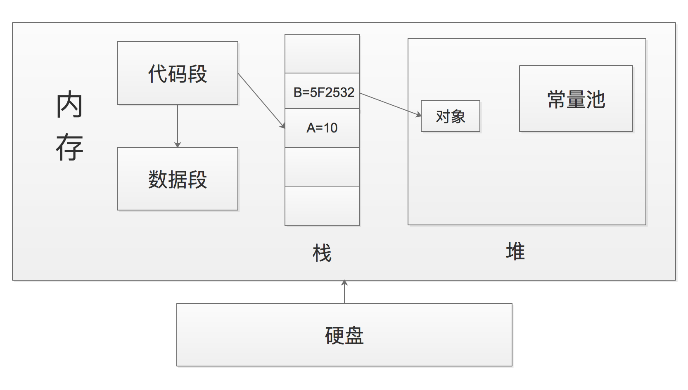
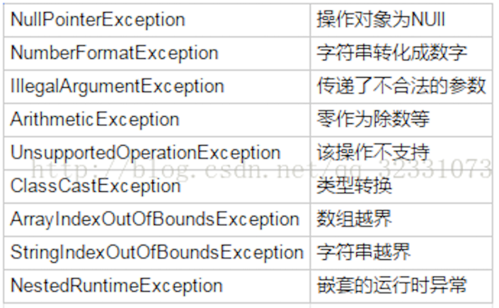
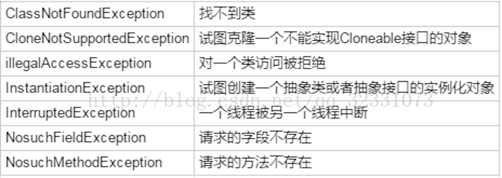

# 链接地址

(本文据网上资料与JDK源码整理为个人学习之用,JDK不同版本有所区别,有错漏之处敬请指出)

[成神之路](http://www.hollischuang.com/?s=成神之路)

[Spring 下异常事务回滚](https://blog.csdn.net/qq_32331073/article/details/76525372)

# 一,对象导论

## A. 抽象过程

面向对象三大基本特征:

1. 抽象; 通过合并特征和行为来创建新的数据类型;
2. 继承; 允许对象将对象视为它自己本身的类型或其基类型来加以处理;
3. 多态; 

纯粹的 OOP程序设计方式:

1. 万物皆为对象;
2. 程序是对象的集合,它们通过发送消息来告知彼此要做的;
3. 每个对象都有自己的由其他对象所构成的存储;
4. 每个对象都拥有其类型;
5. 某一特定类型的所有对象都可以接受同样的消息;

对象具有状态,行为和标识; 每一个对象都可以拥有内部数据(状态)和方法(行为),并且每一个对象都与其他对象有着唯一性区别;

每一个对象在内存中都有一个唯一的地址;


## B. 每个对象都有一个接口

接口确定了对某一特定对象所能发出的请求;

```java
Light it = new Light();
it.on();
```

1. 定义了Light 对象的引用 it;
2. 调用 new 方法来创建该类型的新对象;
3. 为了向对象发送消息,需要声明对象的名称,并以圆点符号连接一个消息请求;


## C. 每个对象都提供服务

程序设计的一个好方法:

将对象当做一个"服务提供者",程序本身向用户提供服务,它通过调用其他对象提供的服务来实现这一目的;

在良好的面向对象设计中,每个对象都可以很好地完成一个任务;


## D. 类的边界

| 关键字    | 边界                            |
| --------- | ------------------------------- |
| Public    | 任何人都可以访问                |
| Private   | 类本身及类内部方法能访问        |
| Protected | 类本身,继承类及类内部方法能访问 |
| 默认      | 包内可以访问                    |


## E. 继承

一个基类型包含其所导出类型所共享的特性和行为,所有能发送给基类的消息同时也能发送给导出类对象,也就意味着基类与导出类具有相同的类型;

使基类与导出类不同:

1. 直接在导出类添加新方法;
2. 覆盖(overriding);

重载(overload): 一个方法名,参数不同;

```Java
void foo(String str);
void foo(int number);
```

重载(overriding): 父类与子类有同样的方法名和参数;

```Java
class Parent {
    void foo() {
        System.out.println("Parent foo()");
    }
}
class Child extends Parent {
    void foo() {
        System.out.println("Child foo()");
    }
}
```


## F. 多态


面向对象语言使用后期绑定的概念,向对象发送消息时,被调用的代码知道运行时才能确定; 编译器确保被调用方法的存在,并对调用参数和返回值执行类型检查(强弱类语言的区别),但不知道将被执行的确切代码(不在编译时绑定函数,为此达到一定的灵活性); 在 Java 中,动态绑定是默认行为,不需要添加额外的关键字来实现多态;

向上转型: 把导出类看做它的基类,向继承结构的上层转换为更泛化的类型;

多态: 父类引用指向子类对象,调用方法时会调用子类的实现,而不是父类的实现;

```java
Parent instance = new Child();
instance.foo(); //==> Child foo()
```

多态的三个前提:

1. 存在继承关系;
2. 子类要重写父类的方法;
3. 父类数据类型的引用指向子类对象;

多态的弊端:

不能使用子类特有的成员属性和子类特有的成员方法;


| 访问     | 特点                                       |
| -------- | ------------------------------------------ |
| 成员变量 | 编译看左边(父类),运行看左边(父类)          |
| 成员方法 | 编译看左边(父类),运行看右边(子类),动态绑定 |
| 静态方法 | 编译看左边(父类),运行看左边(父类)          |


## G.单根继承结构

所有的类最终都继承自单一基类 Object,所以最终类型是相同的基本类型;

单继承的优点在于提高了生产效率,保证所有对象都具备某些功能,使得垃圾回收器的实现简单很多,但在最终灵活性上是逊色于C++的;


## H. 参数化类型

向下转型:向继承结构的下层转换为更具体的类型;

泛型: 参数化类型,包含类型信息;

```Java
ArrayList<int> number = new ArrayList<>;
```


## I. 对象的创建和生命周期

C++ 认为效率至上,所以提供了手动控制对象创建和销毁的权力; 为了追求最大的执行速度, 对象的存储空间和生命周期可以在编程时确定,通过将对象置于堆栈或限域变量或静态存储区域内来实现; 必须在编写程序时知道对象确切的数量,生命周期和类型;

Java 完全采用了动态内存分配方式,在堆的内存池中动态地创建对象,直到运行时才知道需要多少对象,它们的生命周期多长,具体类型是什么; Java 的垃圾回收器被设计用于处理内存释放问题;

### Java 对象的生命周期

#### 1. 创建阶段(Created)

1. 为对象分配存储空间;
2. 开始构造对象;
3. 从父类到子类对 static成员进行初始化;
4. 父类成员变量按顺序初始化,递归调用父类的构造方法;
5. 子类成员变量按顺序初始化,子类构造方法调用;

对象被创建,并被分派给某些变量赋值,这个对象的状态就切换到了应用阶段;

在创建对象时的几个关键应用规则:

1. 避免在循环体中创建对象,即使该对象占用内存空间不大;
2. 尽量及时使对象符合垃圾回收标准;
3. 不要采用过深的继承层次;
4. 访问本地变量优于访问类中的变量;
5. 不要对一个对象进行多次初始化,这同样会带来较大的内存开销,降低系统性能;


#### 2. 应用阶段(In Use)

1. 对象至少被一个强引用持有着;
2. 所有对该对象的引用全部是强引用(除非我们显式地使用了:软引用(Soft Reference),弱引用(Weak Reference)或虚引用(Phantom Reference));

对象创建后如果没有指向它的引用就不会进入inuse阶段,这种情况下对象会直接进入Unreachable状态;

Java 引用区别:

1. 强引用(Strong Reference)是指JVM内存管理器从根引用集合(Root Set)出发遍寻堆中所有到达对象的路径;当到达某对象的任意路径都不含有引用对象时,对这个对象的引用就被称为强引用;

2. 软引用(Soft Reference)的主要特点是具有较强的引用功能;

   只有当内存不够的时候,才回收这类内存,因此在内存足够的时候,它们通常不被回收;另外,这些引用对象还能保证在Java抛出OutOfMemory 异常之前,被设置为null;它可以用于实现一些常用资源的缓存,实现Cache的功能,保证最大限度的使用内存而不引起OutOfMemory;

   软可到达对象的所有软引用都要保证在虚拟机抛出`OutOfMemoryError`之前已经被清除;否则,清除软引用的时间或者清除不同对象的一组此类引用的顺序将不受任何约束;

   ```java
   … … 
   import Java.lang.ref.SoftReference; 
   … 
   A a = new A(); 
   … 
   // 使用 a 
   … 
   // 使用完了a,将它设置为soft 引用类型,并且释放强引用； 
   SoftReference sr = new SoftReference(a); 
   a = null; 
   … 
   // 下次使用时 
   if (sr!=null) { 
        a = sr.get(); 
   } 
   else{ 
        // GC由于内存资源不足,可能系统已回收了a的软引用, 
        // 因此需要重新装载。 
        a = new A(); 
        sr=new SoftReference(a); 
   } 
   … … 
   ```

3. 弱引用(Weak Reference)对象与Soft引用对象的最大不同就在于:GC在进行回收时,需要通过算法检查是否回收Soft引用对象,而对于Weak引用对象, GC总是进行回收;因此Weak引用对象会更容易,更快被GC回收;虽然GC在运行时一定回收Weak引用对象,但是复杂关系的Weak对象群常常需要好几次GC的运行才能完成;

   Weak引用对象常常用于Map数据结构中,引用占用内存空间较大的对象,一旦该对象的强引用为null时,对这个对象引用就不存在了,GC能够快速地回收该对象空间;

   ```Java
   … … 
   import Java.lang.ref.WeakReference; 
   … 
   A a = new A(); 
   … 
   // 使用 a 
   … 
   // 使用完了a,将它设置为weak 引用类型,并且释放强引用； 
   WeakReference wr = new WeakReference (a); 
   a = null; 
   … 
   // 下次使用时 
   if (wr!=null) { 
       a = wr.get(); 
   } 
   else{ 
       a = new A(); 
       wr = new WeakReference (a); 
   } 
   … … 
   ```

4. 虚引用(Phantom Reference)的用途较少,主要用于辅助finalize函数的使用;Phantom对象指一些执行完了finalize函数,并且为不可达对象,但是还没有被GC回收的对象;这种对象可以辅助finalize进行一些后期的回收工作,我们通过覆盖Reference的clear()方法,增强资源回收机制的灵活性;


#### 3. 不可见阶段(Invisible)

虽然这些引用仍然是存在着的,但程序本身不再持有该对象的任何强引用,即程序的执行已经超出了该对象的作用域;不可见阶段的对象会引起内存冗余,影响系统性能;


#### 4. 不可达阶段(Unreachable)

对象不再被任何强引用所持有;

这种情况下,对象仍可能被JVM等系统下的某些已装载的静态变量或线程或JNI等强引用持有着,这些特殊的强引用被称为"GC root";存在着这些GC root会导致对象的内存泄露情况,无法被回收;


#### 5. 收集阶段(Collected)

1. 垃圾回收器发现该对象已经处于"不可达阶段",进入"收集阶段";


2. 如果该对象重写了finalize()方法,则会去执行该方法的终端操作,执行完毕进入"收集阶段";


3. 垃圾回收器已经对该对象的内存空间重新分配做好准备时,则对象进入了"收集阶段";

重载finazlie()方法会导致的问题:

1. 会影响JVM的对象分配与回收速度;

   在分配该对象时,JVM需要在垃圾回收器上注册该对象,以便在回收时能够执行该重载方法；在该方法的执行时需要消耗CPU时间且在执行完该方法后才会重新执行回收操作,即至少需要垃圾回收器对该对象执行两次GC;

2. 可能造成该对象的再次"复活";

   在finalize()方法中,如果有其它的强引用再次持有该对象,则会导致对象的状态由“收集阶段”又重新变为"应用阶段";

   ​

1.      终结阶段(Finalized):

        当对象执行完finalize()方法后仍然处于不可达状态时,则该对象进入终结阶段;在该阶段是等待垃圾回收器对该对象空间进行回收;	

        ​

2.      对象空间重分配阶段(De-allocated):

        垃圾回收器对该对象的所占用的内存空间进行回收或者再分配了,则该对象彻底消失了;


### Java 类的生命周期

Java类的生命周期就是指一个class文件从加载到卸载的全过程;编写一个Java的源文件后,经过编译会生成一个后缀名为class的文件,这种文件叫做字节码文件,只有这种字节码文件才能够在Java虚拟机中运行;

#### 1. 加载

类的加载方式:

1. 根据类的全路径名找到相应的class文件,然后从class文件中读取文件内容;
2. 从jar文件中读取;
3. 从网络中获取:比如10年前十分流行的Applet;
4. 根据一定的规则实时生成,动态代理模式是根据相应的类自动生成它的代理类;
5. 从非class文件中获取,其实这与直接从class文件中获取的方式本质上是一样的,这些非class文件在jvm中运行之前会被转换为可被jvm所识别的字节码文件;

对于加载的时机有一个原则,就是jvm预期一个类将要被使用时,就会在使用它之前对这个类进行加载;常用的hotspot虚拟机是在真正用到一个类的时候才对它进行加载;

#### 2. 连接

连接阶段并不会等加载阶段完全完成之后才开始,而是交叉进行,可能一个类只加载了一部分之后,连接阶段就已经开始了;但是这两个阶段总的开始时间和完成时间总是固定的:加载阶段总是在连接阶段之前开始,连接阶段总是在加载阶段完成之后完成;

1. 验证:

   当一个类被加载之后,必须要验证一下这个类是否合法,如类是不是符合字节码的格式,变量与方法是不是有重复,数据类型是不是有效,继承与实现是否合乎标准等;

2. 准备:

   给类的静态变量分配内存并设为jvm默认的初值;对于非静态的变量,则不会为它们分配内存;静态变量的初值为jvm默认的初值,而不是我们在程序中设定的初值;jvm默认的初值是这样的:

   - 基本类型(int,long,short,char,byte,boolean,float,double)的默认值为0;

   - 引用类型的默认值为null;
   - 常量的默认值为我们程序中设定的值,比如我们在程序中定义final static int a = 100,则准备阶段中a的初值就是100;

3. 解析:在解析阶段,jvm会将所有的类或接口名、字段名、方法名转换为具体的内存地址;

#### 3. 初始化

一个类被直接引用,就会触发类的初始化;

Java中,直接引用的情况有:

1. 通过new关键字实例化对象,读取或设置类的静态变量,调用类的静态方法;
2. 初始化子类的时候,会触发父类的初始化;
3. 作为程序入口直接运行时(也就是直接调用main方法);
4. 通过反射方式执行以上三种行为;

除了以上四种情况,其他使用类的方式叫做被动引用,而被动引用不会触发类的初始化;

初始化是按照顺序自上而下运行类中的变量赋值语句和静态语句,如果有父类,则首先按照顺序运行父类中的变量赋值语句和静态语句;

```java
//初始化的顺序是:第03行,第05行,第11行,第13行
class InitClass2{  
    static{  
        System.out.println("运行父类静态代码");  
    }  
    public static Field1 f1 = new Field1();  
    public static Field1 f2;   
}  
  
class SubInitClass2 extends InitClass2{  
    static{  
        System.out.println("运行子类静态代码");  
    }  
    public static Field2 f2 = new Field2();  
}  
  
public class Test2 {  
    public static void main(String[] args) throws ClassNotFoundException{  
        new SubInitClass2();  
    }  
} 
```

```java
// 初始化顺序为:第02行,第05行,第10行,第12行
class InitClass2{  
    public static Field1 f1 = new Field1();  
    public static Field1 f2;  
    static{  
        System.out.println("运行父类静态代码");  
    }  
}  
  
class SubInitClass2 extends InitClass2{  
    public static Field2 f2 = new Field2();  
    static{  
        System.out.println("运行子类静态代码");  
    }  
}  
  
public class Test2 {  
    public static void main(String[] args) throws ClassNotFoundException{  
        new SubInitClass2();  
    }  
}  
```

在类的初始化阶段,只会初始化与类相关的静态赋值语句和静态语句,而没有static修饰的赋值语句和执行语句在实例化对象的时候才会运行;

#### 4. 使用

类的使用包括主动引用和被动引用,被动引用包括:

1. 引用父类的静态字段,只会引起父类的初始化,而不会引起子类的初始化;
2. 定义类数组,不会引起类的初始化;
3. 引用类的常量,不会引起类的初始化;

使用阶段包括主动引用和被动引用,主动饮用会引起类的初始化,而被动引用不会引起类的初始化;

#### 5. 卸载

满足如下条件,类将被卸载:

1. 该类所有的实例都已经被回收,也就是Java堆中不存在该类的任何实例;
2. 加载该类的ClassLoader已经被回收;
3. 该类对应的Java.lang.Class对象没有任何地方被引用,无法在任何地方通过反射访问该类的方法;

三个条件全部满足,jvm就会在方法区垃圾回收的时候对类进行卸载,类的卸载过程其实就是在方法区中清空类信息;

### 总结

对象基本上都是在jvm的堆区中创建,在创建对象之前,会触发类加载(加载、连接、初始化),当类初始化完成后,根据类信息在堆区中实例化类对象,初始化非静态变量、非静态代码以及默认构造方法,当对象使用完之后会在合适的时候被jvm垃圾收集器回收;


## J. 总结

过程型语言: 数据定义和函数调用;

面向对象语言: 表示问题空间概念的对象和表示在此空间内行为的消息;


# 二,一切皆是对象

## A. 引用操作对象

```java
String s = new String();
//名字为s 的String类型的引用 = 新建一个String对象
```


## B. 存储位置

#### 1. 寄存器

JVM内部虚拟的寄存器,与CPU有关,程序无法控制,效率最快;

#### 2. 栈

位于通用 RAM(随机访问存储器),通过堆栈指针可以从 CPU 获得直接支持;堆栈直接下移分配新的内存,上移释放内存,分配效率仅次于寄存器;

用来存放基本数据类型的变量,引用数据类型的实例即堆区对象的引用(指针),保存加载方法时的帧;

#### 3. 堆

一种通用内存池(同样位于 RAM 区),编译器不需要知道存储的数据在堆中的存活时间;

用来存放程序动态产生的数据,即所有的Java 对象(包括成员变量,不包括成员方法);

#### 4. 常量池

JVM对每个已经加载的类型都会维护一个常量池,常量池就是一个该类型用到的常量的一个有序集合,常量池存在于堆内存区域中;

用来存放直接常量(基本类型,String)和对其他类型、方法、字段的符号引用;

#### 5. 代码段

用来存放冲存储设备中读取的代码片段;

#### 6. 数据段

用来存放静态成员,包括静态变量,静态常量,静态方法,静态类;

#### 7. 方法区

用来存放所有的函数;

Java7之前,方法区位于永久代(PermGen),永久代和堆相互隔离,永久代的大小在启动JVM时可以设置一个固定值,不可变; Java7中,static变量从永久代移到堆中; Java8中,取消永久代,方法存放于元空间(Metaspace),元空间仍然与堆不相连,但与堆共享物理内存,逻辑上可认为在堆中;




## C. 基本类型

| 基本类型 |  大小   |  最小值   |     最大值     | 包装器类型 |
| :------: | :-----: | :-------: | :------------: | :--------: |
| boolean  |    -    |     -     |       -        |  Boolean   |
|   char   | 16-bit  | Unicode 0 | Unicode 2^16-1 | Character  |
|   byte   | 8 bits  |   -128    |      +127      |    Byte    |
|  short   | 16 bits |   -2^15   |    +2^15-1     |   Short    |
|   int    | 32 bits |   -2^31   |    +2^31-1     |  Integer   |
|   long   | 64 bits |   -2^63   |    +2^63-1     |    Long    |
|  float   | 32 bits |  IEEE754  |    IEEE754     |   Float    |
|  double  | 64 bits |  IEEE754  |    IEEE754     |   Double   |
|   Void   |    -    |     -     |       -        |    Void    |

BigInteger 支持任意精度整数;

BigDecimal 支持任意精度定点数;


## D. 作用域

在 C,C++和 Java 中,作用域由花括号位置决定;

对象可以存活于作用域外,垃圾回收器负责监视所有对象,释放不再被引用对象的内存空间;


## E. 类,字段和方法

在Java中所作的全部工作就是定义类,产生那些类的对象以及发送消息给这些对象;

类中可以设置两种类型元素:

字段(数据成员)

方法(成员函数)

基本成员默认值

| 基本类型 | 默认值         |
| -------- | -------------- |
| boolean  | false          |
| char     | '\u0000'(null) |
| byte     | (byte)0        |
| short    | (short)0       |
| int      | 0              |
| long     | 0L             |
| float    | 0.0f           |
| double   | 0.0d           |


## F. 关键字

### 1. static

static字段对于每个类来说都只有一份存储空间;static修饰的成员变量和成员方法独立于该类的任何对象;

#### 变量

静态变量或类变量: 被static修饰的变量；静态变量在内存中只有一个拷贝（节省内存）,JVM只为静态分配一次内存,在加载类的过程中完成静态变量的内存分配,可用类名直接访问(方便);

实例变量: 没有被static修饰的变量;每创建一个实例,就会为实例变量分配一次内存,实例变量可以在内存中有多个拷贝,互不影响(灵活);

static不可以修饰局部变量;一般在需要实现以下两个功能时使用静态变量:

1. 在对象之间共享值时;
2. 方便访问变量时;


#### 方法

静态方法的好处就是不用生成类的实例就能直接调用,只要通过类名就可以访问,不需要耗费资源反复创建对象,因为在程序第一次加载的时候就已经在内存中了,直到程序结束该内存才会释放;

注意事项:

1. 在静态方法里只能直接调用同类中其他的静态成员(包括变量和方法),而不能直接访问类中的非静态成员;对于非静态的方法和变量,需要先创建类的实例对象后才可使用,而静态方法在使用前不用创建任何对象;
2. 静态方法不能以任何方式引用this和super关键字,因为静态方法在使用前不用创建任何实例对象,当静态方法调用时,this所引用的对象根本没有产生;


#### 代码块

JVM加载类时会执行这些静态的代码块,如果static代码块有多个,JVM将按照它们在类中出现的先后顺序依次执行它们,每个代码块只会被执行一次;

static方法块和static方法的区别:

静态代码块是自动执行的;

静态方法是被调用的时候才执行的;


### 2. this

this 只能在方法内部使用,表示对"调用方法的那个对象"的引用;

三大应用:

1. this调用本类中的属性,也就是类中的成员变量；

```Java
class Person{  // 定义Person类
 private String name ;  // 姓名
 private int age ;   // 年龄
 public Person(String name,int age){ // 通过构造方法赋值
  this.name = name ; // 为类中的name属性赋值
  this.age = age ;// 为类中的age属性赋值
 }
 public String getInfo(){ // 取得信息的方法
  return "姓名：" + name + ",年龄：" + age ;
 }
};
public class ThisDemo02{
 public static void main(String args[]){
  Person per1 = new Person("张三",33) ; // 调用构造实例化对象
  System.out.println(per1.getInfo()) ; // 取得信息
 }
};
```


2. this调用当前对象,调用本类中的其他方法；

```Java
class Person{  // 定义Person类
 public String getInfo(){ // 取得信息的方法
  System.out.println("Person类 --> " + this) ; // 直接打印this
  return null ; // 为了保证语法正确,返回null
 }
};
public class ThisDemo06{
 public static void main(String args[]){
  Person per1 = new Person() ; // 调用构造实例化对象
  Person per2 = new Person() ; // 调用构造实例化对象
  System.out.println("MAIN方法 --> " + per1) ; // 直接打印对象
  per1.getInfo() ; // 当前调用getInfo()方法的对象是per1
  System.out.println("MAIN方法 --> " + per2) ; // 直接打印对象
  per2.getInfo() ; // 当前调用getInfo()方法的对象是per2
 }
};
```


3. this调用本类中的其他构造方法,调用时要放在构造方法的首行;

```java
package methoud;
class Person{  // 定义Person类
 private String name ;  // 姓名
 private int age ;   // 年龄
 public Person(){ // 无参构造  
  System.out.println("新对象实例化") ;
 }
 public Person(String name){
  this() ;// 调用本类中的无参构造方法
  this.name = name ;
 }
 public Person(String name,int age){ // 通过构造方法赋值
  this(name) ;// 调用有一个参数的构造方法
  this.age = age ;// 为类中的age属性赋值
 }
 public String getInfo(){ // 取得信息的方法
  return "姓名：" + name + ",年龄：" + age ;
 }
};
public class ThisDemo06{
 public static void main(String args[]){
  Person per1 = new Person("张三",33) ; // 调用构造实例化对象
  System.out.println(per1.getInfo()) ; // 取得信息
 }
};
```


### 3. final

#### 数据

告知编译器一块数据是恒定不变的:

1. 一个永不改变的编译常量;
2. 一个在运行时被初始化的值,不希望被改变;

既是static 又是final的域(即编译期常量)用大写表示;注释可用文档注释;

``` java
/**账号信息无效**/
public static final String P2P_ID_INVALID = "3738";
```

空白final : 声明为final又未给定初始值的域,必须在域的定义处或者每个构造器中用表达式对 final 进行赋值;

final参数 : 允许在参数列表中以声明的方式将参数指明为 final;

#### 方法

final方法锁定,防止继承类的修改;目前版本下,明确禁止覆盖才用;

#### 类

final类锁定,永远不希望有继承和变动存在;


### 4. super

1. 主要存在于子类方法中,用于指向子类对象中父类对象;
2. 访问父类的属性;
3. 访问父类的函数;
4. 访问父类的构造函数;

this指向的是当前对象的调用,super指向的是当前调用对象的父类;类加载完毕,创建对象,父类的构造方法会被调用(默认自动无参),然后执行子类相应构造创建了一个子类对象,该子类对象还包含了一个父类对象;


# 三, 操作符

略;

前缀递增递减: 先执行运算,再生成值;

后缀递增递减: 先生成值,再执行运算;

比较两个对象的实际内容是否相同,使用 equals();基本类型直接使用 == 和 !=;

在执行窄化类型转换时要注意截尾和舍入问题,float 和 double 在转型为整数值时总是对数字进行截尾;

表达式中出现的最大数据类型决定了表达式最终结果的数据类型;


# 四, 控制执行

略;

一般的 continue会退回最内层循环的开头并继续执行;

一般的 break 会中断并退出当前循环;

```Java
switch(int 类型/char 类型){
	case value01 : statement;
	break;
	case value02 : statement;
	break;
	default : statement;
	break;
}
```


# 五, 初始化与清理

### A. 构造器

通过构造器,类的设计者确保每个对象都会得到初始化;

构造器采用和类相同的名称,在创建对象时,会为对象分配存储空间,并调用相应的构造器;

两种构造器:

1. (无参)默认构造器即不接受任何参数的构造器;类中没有构造器,编译器会自动创建一个默认构造器;
2. 有参构造器即初始化对象提供实际参数的构造器;必须用到方法重载;


### B. 清理

1. 对象可能不被垃圾回收;
2. 垃圾回收不等于"析构函数"(C++ 销毁对象必须用的函数);
3. 垃圾回收只和内存相关;

垃圾回收器的存在不能完全代替析构函数;


### C. 成员初始化

类中数据成员类型为基本类型,保证有初始值;

类中对象引用不初始化,会获得特殊值 null;


### D. 构造器初始化

构造器内可以调用方法或执行某些动作,此时无法阻止自动初始化的进行,它将在构造器被调用之前发生;


### E. 初始化顺序

先静态对象(如果未因前面的对象创建过程而初始化),后非静态对象;

1. 构造器实际上也是静态方法,首次创建类型为 XXX 的对象时,java 解释器定位XXX.class文件;
2. 载入 XXX.class 文件,有关静态初始化的所有行为执行;
3. 在堆上为 XXX 对象分配足够的内存空间,清零后将基础数据类型设为默认值,引用设为 null;
4. 执行字段定义处的初始化动作;
5. 执行构造器;


# 六, 接口

接口使用原则:

1. 接口必须要有子类,但此时一个子类可以使用implements关键字实现多个接口;
2. 接口的子类(如果不是抽象类),那么必须要覆写接口中的全部抽象方法;
3. 接口的对象可以利用子类对象的向上转型进行实例化;

接口和抽象类都是继承树的上层,他们的共同点如下:

1. 都是上层的抽象层;
2. 都不能被实例化;
3. 都能包含抽象的方法,这些抽象的方法用于描述类具备的功能,但是不比提供具体的实现;

他们的区别如下:

1. 在抽象类中可以写非抽象的方法,从而避免在子类中重复书写他们,而接口中只能有抽象的方法;
2. 一个类只能继承一个直接父类,这个父类可以是具体的类也可是抽象类,但是一个类可以实现多个接口;

已经存在的继承树,可以方便的从类中抽象出新的接口,但是从类中抽象出新的抽象类就不那么容易了,因此接口更有利于软件系统的维护和重构;

使用抽象类,是一种强耦合的设计,如果说A继承于B,那么在流程中将A当做B去使用应该完全没有问题; 接口则多用于描述各个类型的对象间所共有的行为,表示"所有实现了这个接口的类的对象都能这么干";

抽象类的应用场景:
   一句话,在既需要统一的接口,又需要实例变量或缺省的方法的情况下,就可以使用它;

1. 定义了一组接口,但又不想强迫每个实现类都必须实现所有的接口;可以用abstract class定义一组方法体,甚至可以是空方法体,然后由子类选择自己所感兴趣的方法来覆盖;
2. 某些场合下,只靠纯粹的接口不能满足类与类之间的协调,还必需类中表示状态的变量来区别不同的关系;abstract的中介作用可以很好地满足这一点。
3. 规范了一组相互协调的方法,其中一些方法是共同的,与状态无关的,可以共享的,无需子类分别实现;而另一些方法却需要各个子类根据自己特定的状态来实现特定的功能;


# 七, 内部类

内部类是指一个类的定义放在另一个类的定义内部;

内部类拥有其外围类的所有元素的访问权;当某个外围类的对象创建了一个内部类对象时,必定会捕获一个指向该外围类对象的引用;

使用内部类最大的优点就在于它能够非常好的解决多重继承的问题,但是如果我们不需要解决多重继承问题,那么我们自然可以使用其他的编码方式,但是使用内部类还能够为我们带来如下特性:

1. 内部类可以用多个实例,每个实例都有自己的状态信息,并且与其他外围对象的信息相互独立;
2. 在单个外围类中Ï可以让多个内部类以不同的方式实现同一个接口,或者继承同一个类;
3. 创建内部类对象的时刻并不依赖于外围类对象的创建;
4. 内部类并没有令人迷惑的“is-a”关系,他就是一个独立的实体;
5. 内部类提供了更好的封装,除了该外围类,其他类都不能访问;

内部类是个编译时的概念,对于一个名为OuterClass的外围类和一个名为InnerClass的内部类,在编译成功后,会出现这样两个class文件：OuterClass.class和OuterClass$InnerClass.class;


内部类主要分为成员内部类,局部内部类,匿名内部类,静态内部类;

###  A. 成员内部类

1. 成员内部类中不能存在任何static的变量和方法;
2. 成员内部类是依附于外围类的,所以只有先创建了外围类才能够创建内部类;

成员内部类也是最普通的内部类,它是外围类的一个成员,所以他是可以无限制的访问外围类的所有成员属性和方法,尽管是private的,但是外围类要访问内部类的成员属性和方法则需要通过内部类实例来访问;

```Java
public class OuterClass {
    private String str;
    
    public void outerDisplay(){
        System.out.println("outerClass...");
    }
    
    public class InnerClass{
        public void innerDisplay(){
            //使用外围内的属性
            str = "chenssy...";
            System.out.println(str);
            //使用外围内的方法
            outerDisplay();
        }
    }
    
    /*推荐使用getxxx()来获取成员内部类,尤其是该内部类的构造函数无参数时 */
    public InnerClass getInnerClass(){
        return new InnerClass();
    }
    
     public static void main(String[] args) {
        OuterClass outer = new OuterClass();
        OuterClass.InnerClass inner = outer.getInnerClass();
        inner.innerDisplay();
    }    
}    
```


### B. 局部内部类

```java
//定义在方法中
public class Parcel5 {
    public Destionation destionation(String str){
        class PDestionation implements Destionation{
            private String label;
            private PDestionation(String whereTo){
                label = whereTo;
            }
            public String readLabel(){
                return label;
            }
        }
        return new PDestionation(str);
    }
    
    public static void main(String[] args) {
        Parcel5 parcel5 = new Parcel5();
        Destionation d = parcel5.destionation("chenssy");
    }
}
```


``` Java
//定义在作用域
public class Parcel6 {
    private void internalTracking(boolean b){
        if(b){
            class TrackingSlip{
                private String id;
                TrackingSlip(String s) {
                    id = s;
                }
                String getSlip(){
                    return id;
                }
            }
            TrackingSlip ts = new TrackingSlip("chenssy");
            String string = ts.getSlip();
        }
    }
    
    public void track(){
        internalTracking(true);
    }
    
    public static void main(String[] args) {
        Parcel6 parcel6 = new Parcel6();
        parcel6.track();
    }
}
```


### C. 匿名内部类

1. 使用匿名内部类时,我们必须是继承一个类或者实现一个接口,但是两者不可兼得,同时也只能继承一个类或者实现一个接口;

2. 匿名内部类中是不能定义构造函数的;

3. 匿名内部类中不能存在任何的静态成员变量和静态方法;

4. 匿名内部类为局部内部类,所以局部内部类的所有限制同样对匿名内部类生效;

5. 匿名内部类不能是抽象的,它必须要实现继承的类或者实现的接口的所有抽象方法;

   ​

```Java
public class OuterClass {
    public InnerClass getInnerClass(final int num,String str2){
        return new InnerClass(){
            int number = num + 3;
            public int getNumber(){
                return number;
            }
        };        /* 注意：分号不能省 */
    }
    
    public static void main(String[] args) {
        OuterClass out = new OuterClass();
        InnerClass inner = out.getInnerClass(2, "chenssy");
        System.out.println(inner.getNumber());
    }
}

interface InnerClass {
    int getNumber();
}
```


当所在的方法的形参需要被内部类里面使用时,该形参必须为final:

在内部类编译成功后,它会产生一个class文件,该class文件与外部类并不是同一class文件,仅仅只保留对外部类的引用;内部类并不是直接调用方法传递的参数,而是利用自身的构造器对传入的参数进行备份,自己内部方法调用的实际上时自己的属性而不是外部方法传递进来的参数;为了保持参数的一致性,就规定使用final来避免形参的不改变;

利用构造代码块能够达到为匿名内部类创建一个构造器的效果

```java
public class OutClass {
    public InnerClass getInnerClass(final int age,final String name){
        return new InnerClass() {
            int age_ ;
            String name_;
            //构造代码块完成初始化工作
            {
                if(0 < age && age < 200){
                    age_ = age;
                    name_ = name;
                }
            }
            public String getName() {
                return name_;
            }
            
            public int getAge() {
                return age_;
            }
        };
    }
    
    public static void main(String[] args) {
        OutClass out = new OutClass();
        
        InnerClass inner_1 = out.getInnerClass(201, "chenssy");
        System.out.println(inner_1.getName());
        
        InnerClass inner_2 = out.getInnerClass(23, "chenssy");
        System.out.println(inner_2.getName());
    }
}
```


### D. 静态内部类

静态内部类与非静态内部类之间存在一个最大的区别:

非静态内部类在编译完成之后会隐含地保存着一个引用,该引用是指向创建它的外围内,但是静态内部类却没有;

1. 它的创建是不需要依赖于外围类的;
2. 它不能使用任何外围类的非static成员变量和方法;


# 八, 异常

### A. Java 标准异常

Throwable 表示任何可以作为异常被抛出的类; Throwable 对象分为两种类型: Error 和 Exception;

1. Error:表示编译时和系统错误(除特殊情况,一般不用关心);
2. Exception:可以被抛出的基本类型;

**Exception 和 RuntimeException 的区别:**

Exception在程序中必须使用try...catch进行处理,RuntimeException可以不使用try...catch进行处理,但是如果有异常产生,则异常将由JVM进行处理;


#### RuntimeException异常




#### **受检异常**




java.lang.SqlException是Exception的直接子类,属于CHECKED受检异常,事务是不会因为它发生回滚的;在Spring框架下,所有SQL异常都被org.springframework重写为RuntimeException,事务因此也会发生回滚;


### B. Finally应用场景

把除内存之外的资源恢复到初始状态时使用 finally, 包括:已经打开的文件或网络连接,在屏幕上画的图形,以及外部世界某个开关;

所有抛出异常的方法打包放到 try…catch 语句中,避免前一异常未处理就抛出下一异常的错误;


### C. 构造器

对于在构造阶段可能会抛出异常并要求清理的类,使用嵌套的 try…catch;

```Java
public static void main(String[] args){
    try {
    	InputFile in = new InputFile("Cleanup.java");
        try {
            String s;
            int i = 1;
            while((s = in.getLine() != null)){
                ...
            }
        } catch (Exception e){
            System.out.println("Caught Exception in main");
            e.printStackTrace(System.out);
        } finally {
            in.dispose();
        }
    } catch (Exception e) {
        System.out.println("InputFile construction failed");
    }
}
```


# 九, 类型信息

### A. Class 对象

所有类都是在对其第一次使用时动态加载到 JVM 中的,当程序创建第一个对类的静态成员的引用时就会加载该类;

1. 类加载器首先检查这个类的 Class 对象是否已经加载;
2. 如果尚未加载,默认的类加载器会根据类名查找.class 文件;
3. 这个类字节码被加载时会接收验证,确保其没有被破坏且不包含不良代码;
4. 一旦某个类的 Class 对象被载入内存,它就被用来创建这个类的所有对象;

加载过程详见第五章-初始化与清理


### B. 类型转换前先检查

1. 传统类型转换,由 RTTI 确保类型转换的正确性,错误时抛出 ClassCastException 异常;
2. 代表对象类型的 Class 对象,通过查询 Class 对象可以获取运行时所需的信息;


### C. instanceof 与 Class 的等价性

instanceof判断是否是某一类型的实例时,该类型可以是父类或者接口;

getclass判断的是该变量实际指向的对象的类型(即运行时类型),跟声明该变量的类型无关;


