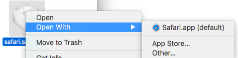

# MAC 软件

说明:15版MacPro13-基于个人习惯,记载需要配置的软件

### windows下: 

#### cmder

终端神器


#### Zeal

等同于Dash

------

### 效率工具

#### Afred

效率启动器,可通过配置达成词典/浏览器搜索,地图,Spotlight等应用


#### Dr. cleaner

清理工具


#### iStat Menus

系统监控


#### AppCleaner

清理工具


#### Betterzip

压缩工具


#### CheatSheet

快捷键显示


#### EuDic

欧陆词典,加载简明英汉词典


#### Foxmail

邮件


------

### 编程工具

#### IDEA

JAVA开发的集成环境,配置插件:

1. Alibaba JAVA Coding Guidelines (阿里巴巴Java开发规约)

2. CheckStyle-IDEA (代码检查)

3. FindBugs-IDEA (潜在Bug检查)

4. Maven Helper (Maven辅助)

5. ANSI Highlighter (log文件高亮支持)

6. GsonFormat (把JSON字符串直接实例化成类)

7. Lombok Plugin (lombok支持插件)

8. JProfiler (性能分析工具)

9. Atom File Icons IDEA(类似vscode适配图标插件)

10. BashSupport(Bash语言支持)

11. ESLint(ES前端代码规范)

12. Quokka(实时观看javascript变量的变化)

13. SvgViewer2(查看SVG矢量图)

    


#### Pycharm

Python开发的集成环境,搭配 Anaconda


#### WebStorm

JavaScript开发工具


#### Visual Studio Code

集成轻量开发工具


#### Navicat

数据库管理工具


#### DataGrip

数据库管理工具


#### Sublime Text

代码编辑器兼文本编辑器,配置插件:

1. Boxy Theme/A File Icon (主题)

2. Alignment (代码对齐)

3. BracketHighlighter (代码匹配)

4. ChineseLocalizations (汉化)

5. Package Control (包管理)

6. Monokai Extended (配色)

7. CSS Format/JsFormat/HTML5/jQuery (适配语言)

  

#### Docker

开源的应用容器引擎


#### TextLab

文本格式化工具


#### RedisManager

可视化工具

[RedisManager](https://redisdesktop.com/)


#### Postman

Http请求模拟工具


#### Wireshark

网络封包分析软件


#### FileZilia

FTP 工具


#### parallels desktop

虚拟机


#### iTerm2

终端,配置ZSH+高亮插件

环境变量优先级: /etc/profile, /etc/paths, ~/.bash_profile, ~/.bash_login, ~/.profile, ~/.bashrc</br>
/etc/profile （建议不修改这个文件 ） 全局（公有）配置,不管是哪个用户,登录时都会读取该文件</br>
/etc/bashrc （一般在这个文件中添加系统级环境变量） 全局（公有）配置,bash shell执行时,不管是何种方式,都会读取此文件</br>
~/.bash_profile （一般在这个文件中添加用户级环境变量） 每个用户都可使用该文件输入专用于自己使用的shell信息,当用户登录时,该文件仅仅执行一次</br>
使用命令 echo $SHELL </br>
如果输出的是: csh或者是tcsh,那么用的就是C Shell</br>
如果输出的是: bash,sh,zsh,那么用的可能就是Bourne Shell的一个变种; Mac OS X 10.2之前默认的是C Shell; Mac OS X 10.3之后默认的是Bourne Shell</br>

host文件位置: command+shift+g → /etc/hosts

ssh 文件位置: 默认为用户名下command+shift+. 开启隐藏文件显示; 控制台使用 → cd ~/.ssh


#### GitHub Desktop

GitHub桌面客户端

------

### 文本工具

#### Dash

API文档管理器


#### CAJViewerMac

论文阅读器


#### Office2016ForMac

微软办公系列


#### Pages/Numbers/keynotes

Apple办公三件套


#### Adobe Acrobat Reader DC

Adobe家的PDF阅读器


#### Typora

Markdown编辑器


#### Clearview

电子书阅读器


#### Evernote

重型笔记软件


#### Pocket

轻型笔记软件

------

### 图形工具

#### Xmind

思维导图


#### EdrawMax

绘图工具


#### omnigraffle

绘图工具


#### Axure RP

交互原型设计软件


#### Adobe Photoshop

图片编辑软件


------

### 网络工具

#### Chrome

谷歌浏览器,配置插件:

1. 谷歌访问助手
2. Wikiwand: Wikipedia Modernized (WIKI界面美化)
3. Tampermonkey (油猴脚本)
4. Octotree (GitHub库树状结构显示)
5. Google Translate (谷歌翻译)
6. Extensions Manager (插件管理)
7. AdBlock (广告屏蔽)
8. EasyReader (仿Safari阅读模式)


#### Safari

Apple 家的浏览器,干净并自带阅读模式,适合阅读大量文本

配置插件:

1. 官方支持插件安装

   打开菜单栏Safari-Preferences-Extensions-右下角more Extensions,在 Apple 官网安装

2. 第三方插件安装

   - 第一种办法(未尝试)

   打开菜单栏Safari-Preferences-Advanced- 底部Show Develop menu in menu bar

   打开菜单栏Develop- Show Extension builder,将*.safariextz的打包文件加入

   - 第二种办法

   如octotree安装,根据说明文档将octotree在 github 上的整份源代码下载下来,找到*.safariextz的打包文件,右键Open With Safari.app

   


插件清单:

1. AdBlock (广告屏蔽)
2. Polyglot (谷歌翻译) 需要手动设置快捷键,联网下选中文本+快捷键一键翻译
3. Evernote Web Clipper (Evernote支持)
4. Tab Lister (管理标签页)
5. Octotree (GitHub库树状结构显示)


#### IINA

万能视频播放器


#### Folx

免费下载管理工具


### 编程环境

#### Slack

[Slack官网](https://slack.com/)

项目沟通协作工具


#### Jenkins

[Jenkins官网](https://jenkins.io/)

项目持续集成部署工具


#### HomeBrew

[HomeBrew官网](https://brew.sh/index_zh-tw.html)

软件包管理工具,launchrocket可用于启动管理,安装路径

```
/usr/bin/ruby -e "$(curl -fsSL https://raw.githubusercontent.com/Homebrew/install/master/install)"
```


#### JAVA

[Orcale官网下载](https://www.oracle.com/technetwork/java/javase/downloads/index.html)


#### Python

[清华镜像站](https://mirrors.tuna.tsinghua.edu.cn/help/anaconda/)

Mac自带2.7,使用Anaconda集成环境


#### Npm

前端包管理工具,安装路径

[Npm中文文档](https://www.npmjs.com.cn/)

```
curl -o- https://raw.githubusercontent.com/creationix/nvm/v0.33.11/install.sh | bash
```


#### Yarn

Yarn和Npm功能类似,各自独立,同样为前端包管理工具

[Yarn中文文档](https://yarn.bootcss.com/)

```
brew install yarn
```


#### Angular

[Angular官网](https://next.angular.io/)

```
npm install -g @angular/cli
```


#### Vue

[Vue官网](https://cn.vuejs.org/)

```
npm install vue
```


#### TypeScript

[TypeScript官网](https://www.tslang.cn/samples/index.html)

```
npm install -g typescript
```


#### Jhipster

集成ORM框架

[Jhipster官网](https://www.jhipster.tech/)


#### WordPress

博客搭建

[WordPress官网](https://wordpress.org/)