# 参考资料

<<计算机网络>>

<<TCP-IP详解卷一>>

<<图解TCP-IP>>

<<图解HTTP>>

<<HTTP权威指南>>


# 计算机网络

## 概述

### 电路交换


### 网络类别

1. 广域网 WAN 
2. 城域网 MAN
3. 局域网 LAN
4. 个人区域网 PAN/WPAN


### 性能指标

#### 1. 速率

指连接在计算机网络上的主机在数字信道上传送数据的速率;

单位为 b/s(bit/second),kb/s(k=10的三次方=千),Mb/s(M=10的六次方=兆),Gb/s(G=10的九次方),Tb/s(T=10的十二次方=太);

#### 2. 带宽

原指某个信号具有的频带宽度,在计算机网络中表示网络通信线路传送数据的能力,即单位时间内从网络中的某一点到另一点能通过的"最高数据率";

#### 3. 吞吐量

表示在单位时间内通过某个网络(信道,接口)的数据量;

#### 4. 时延

重要性能指标,指数据(一个报文或分组,比特)从网络(或链路)的一端传送到另一端所需时间;

总时延 = 发送时延+传播时延+处理时延+排队时延;

时延的组成部分:

A. 发送时延 - 主机或路由器发送数据帧的第一个比特到最后一个比特所需时间;

```latex
发送时延 = 数据帧长度(b)/信道带宽(b/s)
```

B. 传播时延 - 电磁波在信道中传播一定距离需要花费的时间;

```
传播时延 = 信道长度(m)/电磁波在信道上的传播速率(m/s)
```

C. 处理时延 - 主机或路由器对分组的处理时间

D. 排队时延 - 网络传输过程中各个路由器排队等待处理的时间,网络通信量过大导致队列溢出会使分组丢失;

#### 5. 时延带宽积

```
时延带宽积 = 传播时延 * 带宽
```

详见计算机网络;

#### 6. 往返时间 RTT

重要性能指标,表示从发送方发送数据到发送方收到接收方确认的时间(接收方接受即确认);

往返时间与发送的分组长度有关,使用卫星通信时往返时间相对较长;

#### 7. 利用率

信道利用率: 指某信道有百分之几的时间是被利用的(有数据通过);

网络利用率: 指全网络的信道利用率的加权平均值;

详见计算机网络


### 非性能特征

#### 1. 费用

#### 2. 质量

#### 3. 标准化

#### 4. 可靠性

#### 5. 可扩展性和可升级性

#### 6. 易于管理和维护


### 网络体系结构


### TCP/IP体系结构


如图, TCP/IP 协议可以为各式各样的应用提供服务,同时也允许 IP 协议在各式各样的网络构成的互联网上运行;


## 物理层

暂略


## 数据链路层

暂略


## 网络层

网络层向上只提供简单灵活的,无连接的,尽最大努力交付的数据报服务-即网络发送分组时不需要先建立连接,每一个分组( IP 数据报)独立发送,与其前后的分组无关(不进行编号);

网络层不提供服务质量的承诺-即所传输的分组可能出错,丢失,重复和失序,也不保证分组交付时限;

如果主机中的进程之间需要可靠性,那么由运输层负责;


### 网际协议 IP


1. ICMP 网际控制报文协议
2. IGMP 网际组管理协议
3. RARP 逆地址解析协议
4. ARP    地址解析协议

ICMP 和 IGMP 要使用 IP 协议, IP 协议经常使用 ARP 和 RARP;


### Internet

将网络互相连接起来要使用一些中间设备,可以分为:

1. 物理层-转发器
2. 数据链路层-网桥
3. 网络层-路由器
4. 网络层以上-网关

互联网可以由多种异构网络互连组成


### 分类的 IP 地址

IP 地址是给 Internet 上的每一个主机(或路由器)的每一个接口分配一个全世界范围内是唯一的32位标志符;

```
IP 地址 ::= {<网络号>,<主机号>}
```

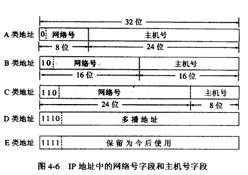

A,B,C类地址都是单播地址(点对点通信),最常用;


### 常用 IP 地址


### Ip地址特点

1. IP 地址管理机构分配 IP 地址只分配网络号(第一级),主机号(第二级)由得到该网络号的单位自行分配;路由器仅根据目的主机所连接的网络号来转发分组;
2. 一个主机同时连到两个网络时,必须同时具有 响应的 IP 地址,网络号必须是不同的;由于一个路由器至少应当连接到两个网络,因此一个路由器至少应当有两个不同的 IP 地址;
3. 用转发器或网桥连接起来的若干个局域网仍为一个网络;
4. IP 地址中,所有分配到网络号的网络都是平等的;


### IP 地址与硬件地址

暂略


### ARP 和 RARP 协议


目前的 DHCP 协议已经包含RARP协议功能,RARP协议作用是知道硬件地址的主机可以通过RARP 协议找出 IP 地址;

ARP 协议在主机 ARP高速缓存中存放一个 IP 地址到硬件地址的映射表,并且动态更新;每一个主机都设有一个 ARP 高速缓存,存放本局域网上各主机和路由器的IP 地址到硬件地址的映射表;

具体流程为:

1. 主机 A 向本局域网上的某个主机 B 发送 IP 数据报时,先在 ARP 高速缓存查看有无主机 B 地址;有则查出对应硬件地址,再把硬件地址写入 MAC 帧,通过局域网发送 MAC 帧到此硬件地址;
2. 如果查不到主机 B 的 IP 地址项目,主机 A 自动运行 ARP, ARP 进程在本局域网上广播发送一个 ARP 请求分组,本局域网上所有主机运行的 ARP 进程都 收到此 ARP 请求分组,主机 B 在这个请求中看到自己的 IP 地址,向主机 A 发送 ARP 响应分组,主机 A收到响应分组后在 ARP 高速缓存中写入主机 B 的 IP 地址到硬件地址的映射;

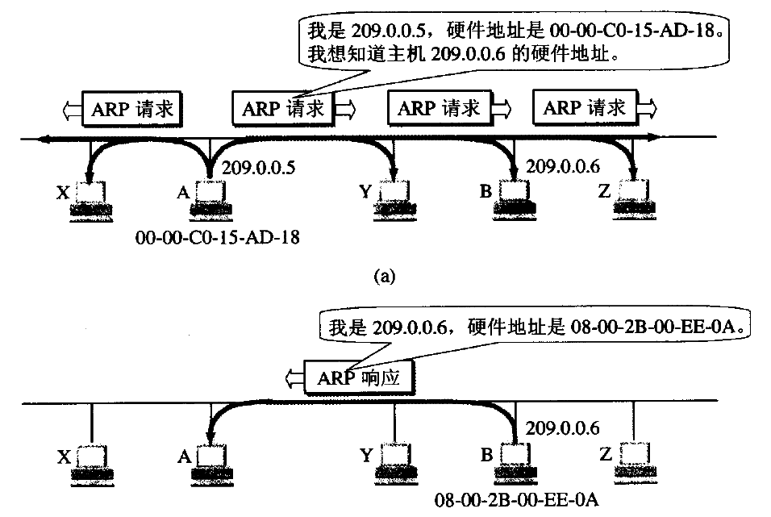


### IP数据报格式


一个 IP 数据报由首部和数据组成;

首部前一部分是固定长度20字节,固定部分后面是可选字段,详解如下:

1. 版本 占4位

   IP 协议版本,分 IPv4和 IPv6,通信双方版本必须一致

2. 首部长度 占4位

   可表示的最大十进制数字为15,该字段单位为32位字(1个32位字长为4字节);

   IP分组的首部长度不是4字节整数倍时必须用最后的填充字段加以填充,因此数据部分永远是4字节的整数倍时开始,这样实现 IP 协议比较方便;

   最常用的首部长度是20字节即0101;

3. 区分服务 占8位

   一般情况不使用

4. 总长度 占16位

   指首部和数据之和的长度.单位为字节,总长度字段为16位,因此最大长度为

   ```
   2的16次方-1 = 65535字节  
   ```

5. 标识 占16位

   此字段用于数据报分片,相同的标识字段值使分片后的各数据报片能够重新组装;

6. 标志 占3位

   目前只有两位有意义;

   字段最低位记为 MF, MF=1表示后面还有分片, MF=0表示是若干数据报片的最后一个;

   字段中间一位记为 DF, DF表示不能分片, DF=0才允许分片;

7. 片偏移 占13位

   指较长的分组分片后在原分组的相对位置,每个分片的长度一定是8字节(64位)的整数倍;

8. 生存时间 占8位

   表明数据报在网络中的寿命,常用英文缩写 TTL, 路由器在转发数据报之前就把 TTL 值减1, 若 TTL 值为0就丢弃数据报不再转发,现在 TTL 的单位是跳数;

   数据报在因特网中经过的路由器最大数值是255,若把 TTL 的初始值设置为1,表示这个数据报只能在本局域网中传送,因为送出到任何一个路由 TTL 已经为0;

9. 协议 占8位

   指出数据报携带的数据是使用何种协议;

   

10. 首部检验和 占16位

   只检验数据报的首部,不包括数据部分;数据报每经过一个路由器,都要重新计算首部检验和;

   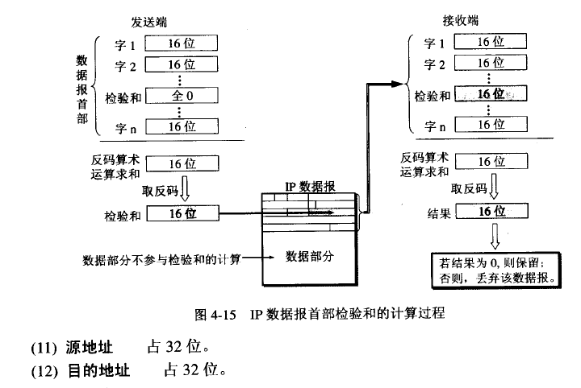

   

     

   IPv6把 IP 数据报的首部长度做成固定的,可变部分参阅 RFC791;


### IP 转发分组流程

暂略


### 划分子网

```
IP 地址 ::= {<网络号>,<子网号>,<主机号>}
```

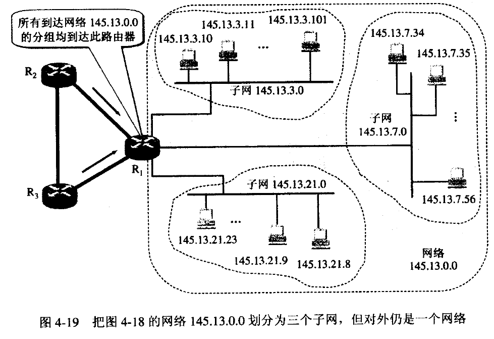

32位 IP 地址本身以及数据报首部没有包含任何子网相关划分信息,因此有了子网掩码;

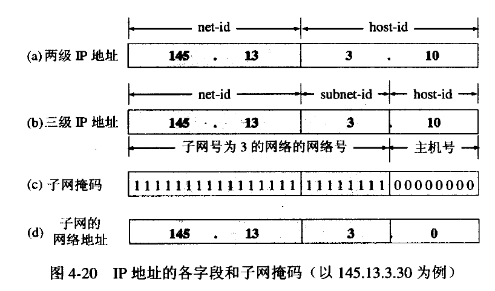

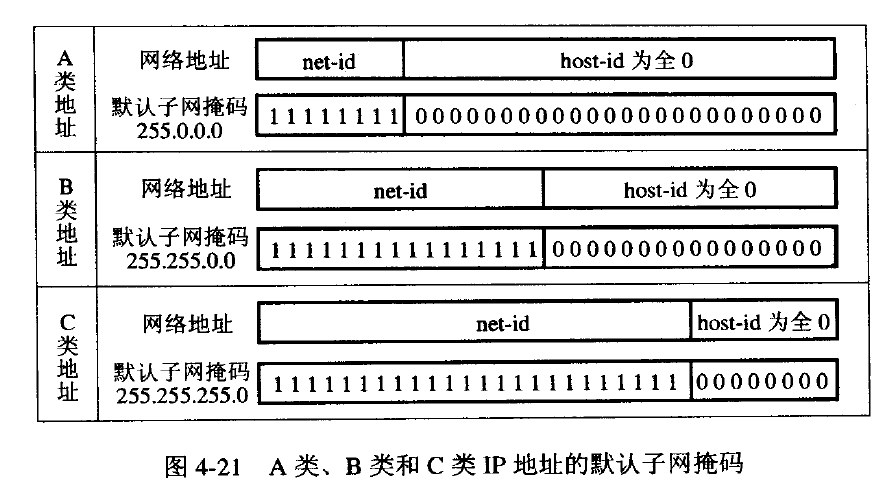

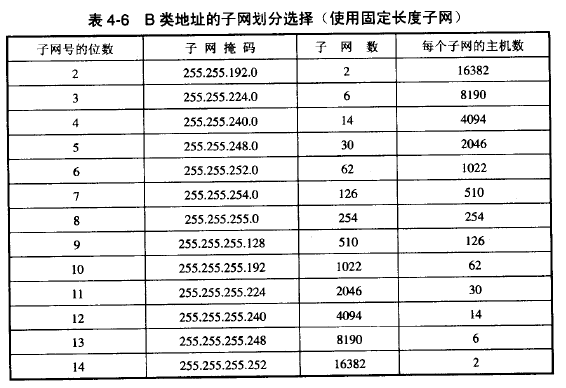


### 无分类编址CIDR

```
IP地址 ::={<网络前缀>,<主机号>}
```


### 网际控制报文协议ICMP

暂略


### 路由协议

暂略


### VPN和NAT

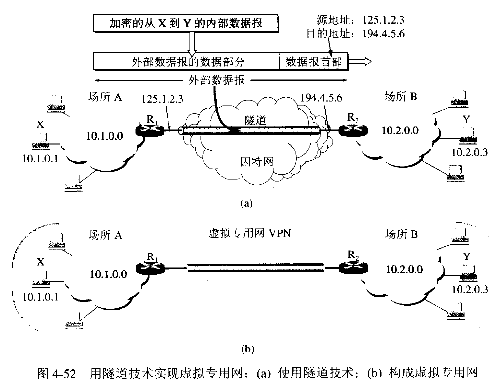

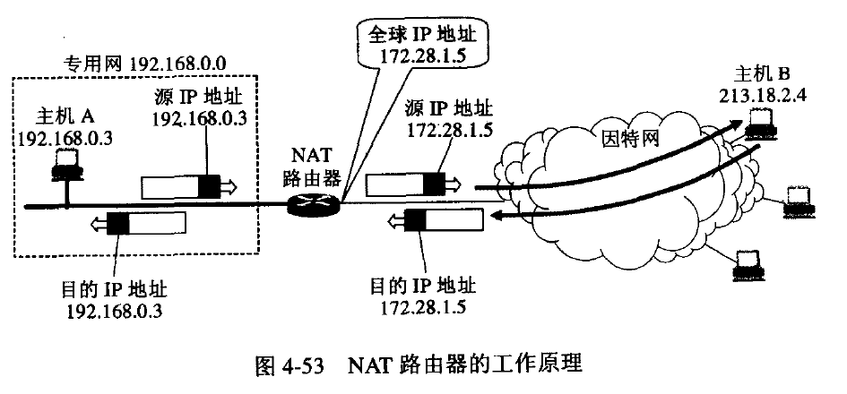


## 运输层

### 进程间通信

通信的两端是两个主机, IP数据报的首部明确标识了这两个主机的IP地址, 实际上通信的真正端点是主机中的进程即端对端通信指的是应用进程之间的通信;

网络层是为主机之间提供逻辑通信, 运输层是为应用进程之间提供端到端的逻辑通信;


### 运输层协议

主要协议为:

1. TCP 传输控制协议
2. UDP 用户数据报协议

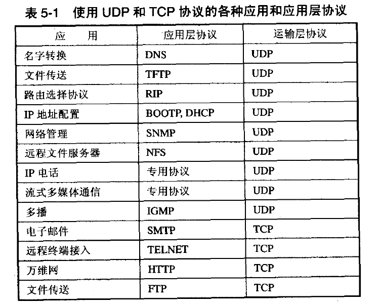


### 运输层端口

1. 服务端口号

服务端常用熟知端口号


服务端登记端口号数值 1024~49151,为没有熟知端口号的应用程序使用;


2. 客户端端口号

数值为 49152~65535, 这类端口号是留给客户进程选择暂时使用;


### UDP

用户数据报协议UDP只在IP数据报服务上增加了复用/分用和差错检测的功能,特点:

1. UDP是无连接的 即发送数据前不需要建立连接

2. UDP为非可靠交付

3. UDP是面向报文的 即一次交付一个完整的报文 

    a. UDP没有拥塞控制,因此网络出现拥塞不会使源主机的发送速率降低,对某些实时应用非常重要;

   b. UDP支持一对一,一对多和多对多的交互通信;

   c. UDP的首部开销小,只有8个字节;

在实际环境下,UDP需要考虑并发情况下网络拥塞和可靠性改进等情况;


UDP字段: 数据字段和首部字段

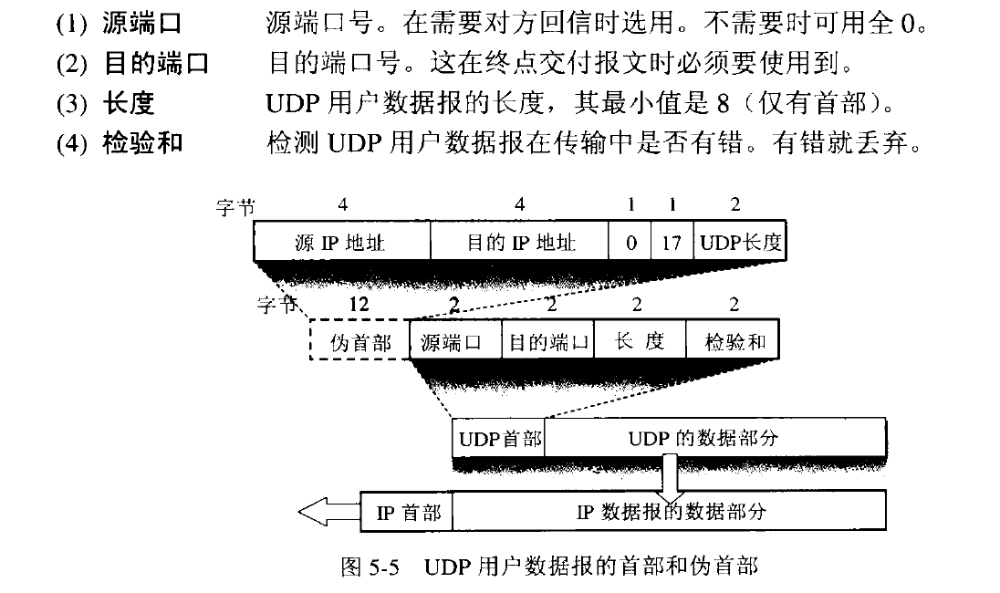

