# 参考资料

<<计算机网络>>

<<TCP-IP详解卷一>>

<<图解TCP-IP>>

<<图解HTTP>>

<<HTTP权威指南>>


# 计算机网络

## 概述

### 电路交换


### 网络类别

1. 广域网 WAN 
2. 城域网 MAN
3. 局域网 LAN
4. 个人区域网 PAN/WPAN


### 性能指标

#### 1. 速率

指连接在计算机网络上的主机在数字信道上传送数据的速率;

单位为 b/s(bit/second),kb/s(k=10的三次方=千),Mb/s(M=10的六次方=兆),Gb/s(G=10的九次方),Tb/s(T=10的十二次方=太);

#### 2. 带宽

原指某个信号具有的频带宽度,在计算机网络中表示网络通信线路传送数据的能力,即单位时间内从网络中的某一点到另一点能通过的"最高数据率";

#### 3. 吞吐量

表示在单位时间内通过某个网络(信道,接口)的数据量;

#### 4. 时延

重要性能指标,指数据(一个报文或分组,比特)从网络(或链路)的一端传送到另一端所需时间;

总时延 = 发送时延+传播时延+处理时延+排队时延;

时延的组成部分:

A. 发送时延 - 主机或路由器发送数据帧的第一个比特到最后一个比特所需时间;

```latex
发送时延 = 数据帧长度(b)/信道带宽(b/s)
```

B. 传播时延 - 电磁波在信道中传播一定距离需要花费的时间;

```
传播时延 = 信道长度(m)/电磁波在信道上的传播速率(m/s)
```

C. 处理时延 - 主机或路由器对分组的处理时间

D. 排队时延 - 网络传输过程中各个路由器排队等待处理的时间,网络通信量过大导致队列溢出会使分组丢失;

#### 5. 时延带宽积

```
时延带宽积 = 传播时延 * 带宽
```

详见计算机网络;

#### 6. 往返时间 RTT

重要性能指标,表示从发送方发送数据到发送方收到接收方确认的时间(接收方接受即确认);

往返时间与发送的分组长度有关,使用卫星通信时往返时间相对较长;

#### 7. 利用率

信道利用率: 指某信道有百分之几的时间是被利用的(有数据通过);

网络利用率: 指全网络的信道利用率的加权平均值;

详见计算机网络


### 非性能特征

#### 1. 费用

#### 2. 质量

#### 3. 标准化

#### 4. 可靠性

#### 5. 可扩展性和可升级性

#### 6. 易于管理和维护


### 网络体系结构


### TCP/IP体系结构


如图, TCP/IP 协议可以为各式各样的应用提供服务,同时也允许 IP 协议在各式各样的网络构成的互联网上运行;


## 物理层

暂略


## 数据链路层

暂略


## 网络层

网络层向上只提供简单灵活的,无连接的,尽最大努力交付的数据报服务-即网络发送分组时不需要先建立连接,每一个分组( IP 数据报)独立发送,与其前后的分组无关(不进行编号);

网络层不提供服务质量的承诺-即所传输的分组可能出错,丢失,重复和失序,也不保证分组交付时限;

如果主机中的进程之间需要可靠性,那么由运输层负责;


### 网际协议 IP


1. ICMP 网际控制报文协议
2. IGMP 网际组管理协议
3. RARP 逆地址解析协议
4. ARP    地址解析协议

ICMP 和 IGMP 要使用 IP 协议, IP 协议经常使用 ARP 和 RARP;


### Internet

将网络互相连接起来要使用一些中间设备,可以分为:

1. 物理层-转发器
2. 数据链路层-网桥
3. 网络层-路由器
4. 网络层以上-网关

互联网可以由多种异构网络互连组成


### 分类的 IP 地址

IP 地址是给 Internet 上的每一个主机(或路由器)的每一个接口分配一个全世界范围内是唯一的32位标志符;

```
IP 地址 ::= {<网络号>,<主机号>}
```


A,B,C类地址都是单播地址(点对点通信),最常用;


### 常用 IP 地址


### Ip地址特点

1. IP 地址管理机构分配 IP 地址只分配网络号(第一级),主机号(第二级)由得到该网络号的单位自行分配;路由器仅根据目的主机所连接的网络号来转发分组;
2. 一个主机同时连到两个网络时,必须同时具有 响应的 IP 地址,网络号必须是不同的;由于一个路由器至少应当连接到两个网络,因此一个路由器至少应当有两个不同的 IP 地址;
3. 用转发器或网桥连接起来的若干个局域网仍为一个网络;
4. IP 地址中,所有分配到网络号的网络都是平等的;


### IP 地址与硬件地址

暂略


### ARP 和 RARP 协议


目前的 DHCP 协议已经包含RARP协议功能,RARP协议作用是知道硬件地址的主机可以通过RARP 协议找出 IP 地址;

ARP 协议在主机 ARP高速缓存中存放一个 IP 地址到硬件地址的映射表,并且动态更新;每一个主机都设有一个 ARP 高速缓存,存放本局域网上各主机和路由器的IP 地址到硬件地址的映射表;

具体流程为:

1. 主机 A 向本局域网上的某个主机 B 发送 IP 数据报时,先在 ARP 高速缓存查看有无主机 B 地址;有则查出对应硬件地址,再把硬件地址写入 MAC 帧,通过局域网发送 MAC 帧到此硬件地址;
2. 如果查不到主机 B 的 IP 地址项目,主机 A 自动运行 ARP, ARP 进程在本局域网上广播发送一个 ARP 请求分组,本局域网上所有主机运行的 ARP 进程都 收到此 ARP 请求分组,主机 B 在这个请求中看到自己的 IP 地址,向主机 A 发送 ARP 响应分组,主机 A收到响应分组后在 ARP 高速缓存中写入主机 B 的 IP 地址到硬件地址的映射;

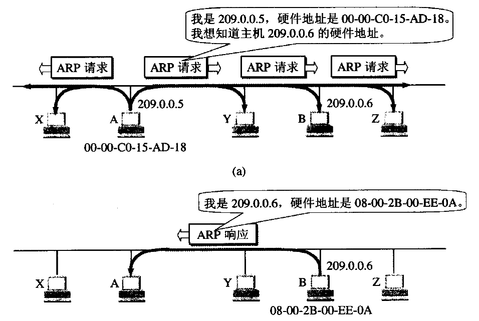


### IP数据报格式

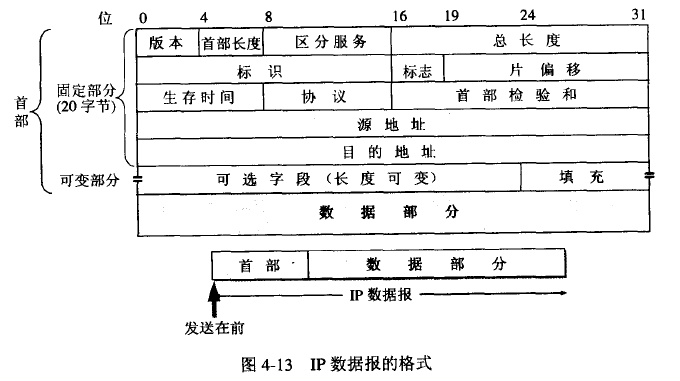

一个 IP 数据报由首部和数据组成;

首部前一部分是固定长度20字节,固定部分后面是可选字段,详解如下:

1. 版本 占4位

   IP 协议版本,分 IPv4和 IPv6,通信双方版本必须一致

2. 首部长度 占4位

   可表示的最大十进制数字为15,该字段单位为32位字(1个32位字长为4字节);

   IP分组的首部长度不是4字节整数倍时必须用最后的填充字段加以填充,因此数据部分永远是4字节的整数倍时开始,这样实现 IP 协议比较方便;

   最常用的首部长度是20字节即0101;

3. 区分服务 占8位

   一般情况不使用

4. 总长度 占16位

   指首部和数据之和的长度.单位为字节,总长度字段为16位,因此最大长度为

   ```
   2的16次方-1 = 65535字节  
   ```

5. 标识 占16位

   此字段用于数据报分片,相同的标识字段值使分片后的各数据报片能够重新组装;

6. 标志 占3位

   目前只有两位有意义;

   字段最低位记为 MF, MF=1表示后面还有分片, MF=0表示是若干数据报片的最后一个;

   字段中间一位记为 DF, DF表示不能分片, DF=0才允许分片;

7. 片偏移 占13位

   指较长的分组分片后在原分组的相对位置,每个分片的长度一定是8字节(64位)的整数倍;

8. 生存时间 占8位

   表明数据报在网络中的寿命,常用英文缩写 TTL, 路由器在转发数据报之前就把 TTL 值减1, 若 TTL 值为0就丢弃数据报不再转发,现在 TTL 的单位是跳数;

   数据报在因特网中经过的路由器最大数值是255,若把 TTL 的初始值设置为1,表示这个数据报只能在本局域网中传送,因为送出到任何一个路由 TTL 已经为0;

9. 协议 占8位

   指出数据报携带的数据是使用何种协议;

   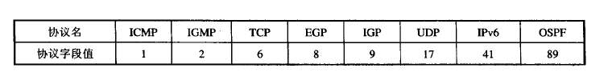

10. 首部检验和 占16位

   只检验数据报的首部,不包括数据部分;数据报每经过一个路由器,都要重新计算首部检验和;

   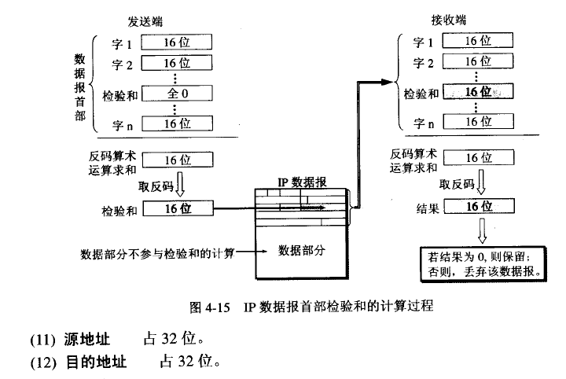

   

     

   IPv6把 IP 数据报的首部长度做成固定的,可变部分参阅 RFC791;


### IP 转发分组流程

暂略


### 划分子网

```
IP 地址 ::= {<网络号>,<子网号>,<主机号>}
```

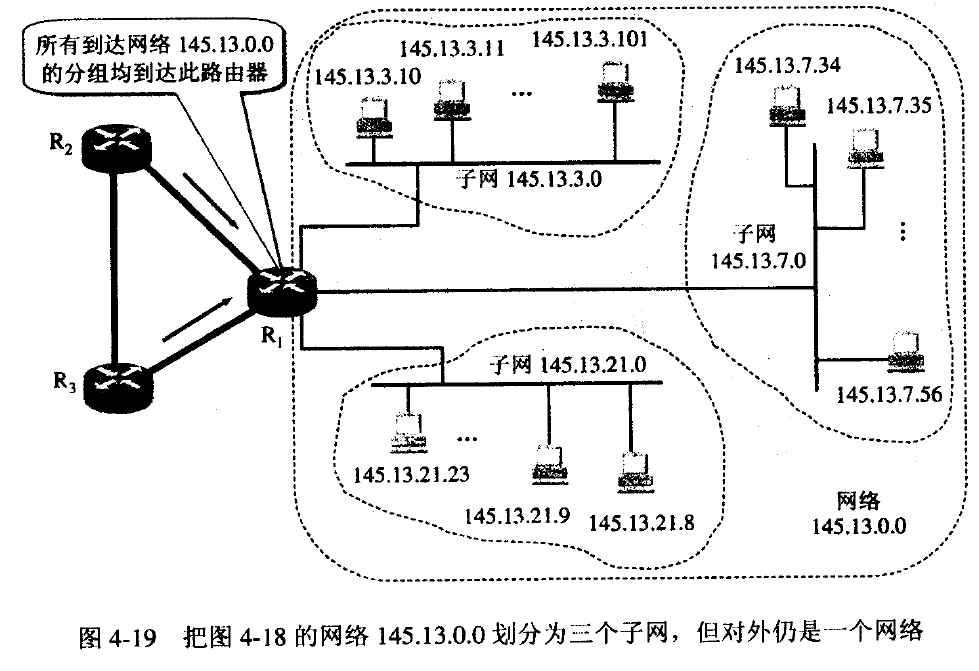

32位 IP 地址本身以及数据报首部没有包含任何子网相关划分信息,因此有了子网掩码;

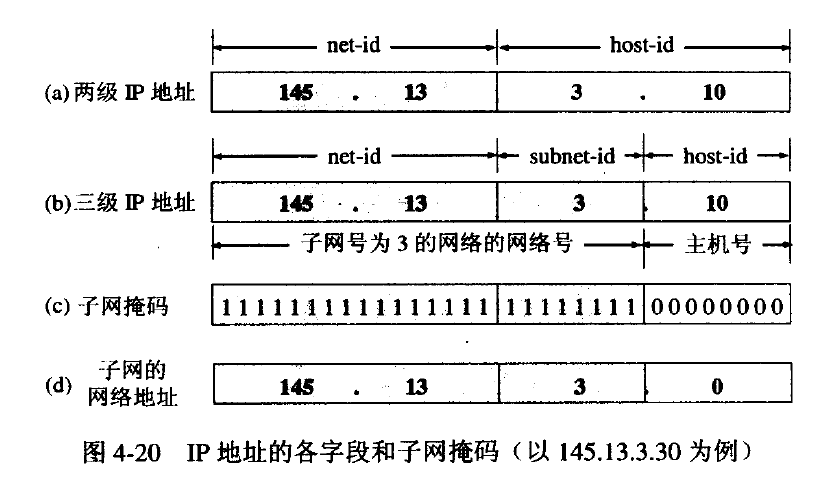

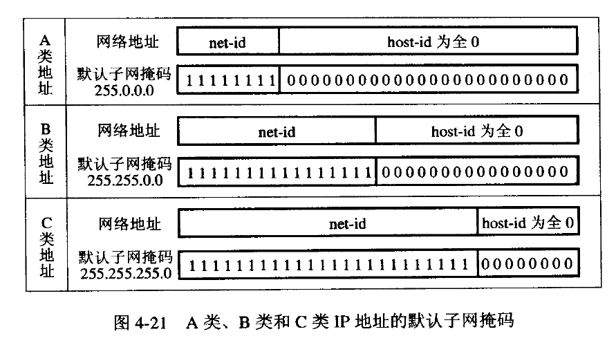

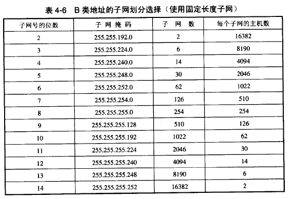


### 无分类编址CIDR

```
IP地址 ::={<网络前缀>,<主机号>}
```

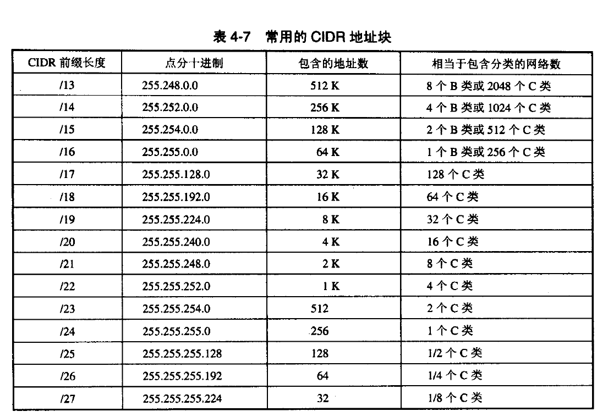


### 网际控制报文协议ICMP

暂略


### 路由协议

暂略


### VPN和NAT

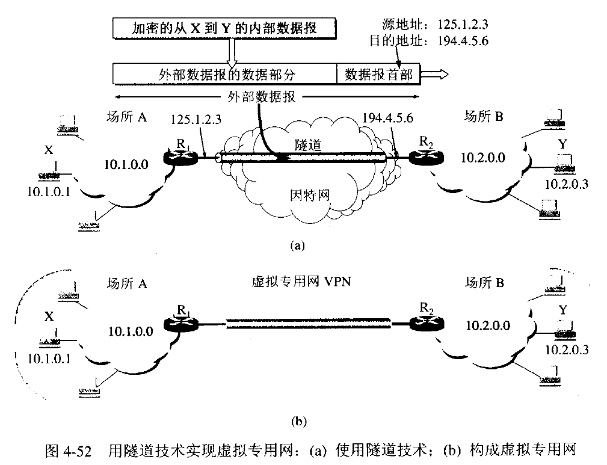

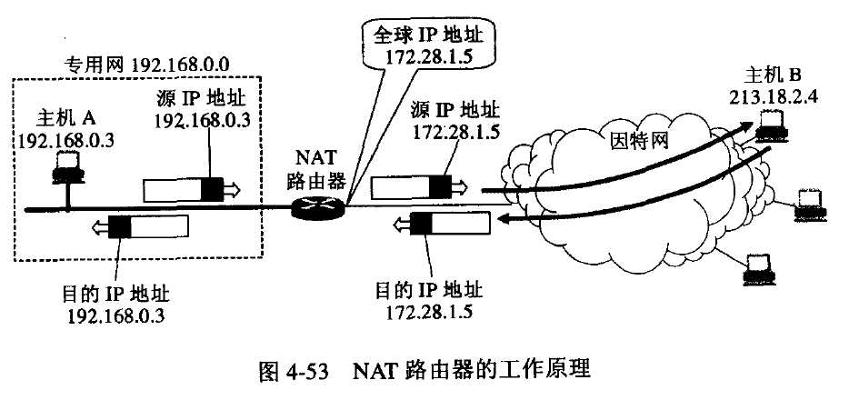


## 运输层

