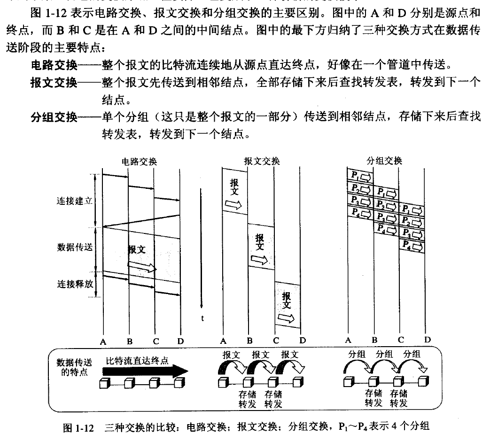
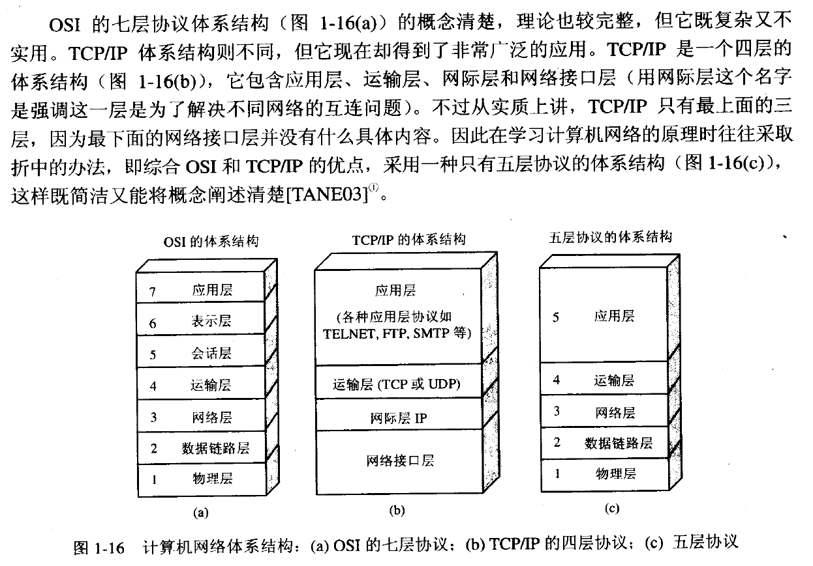
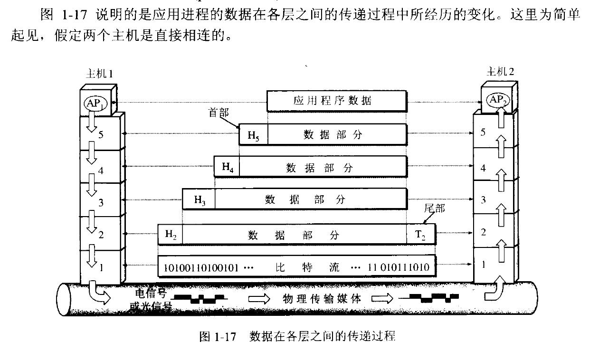
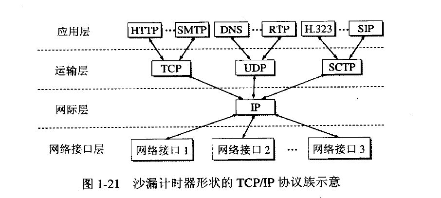
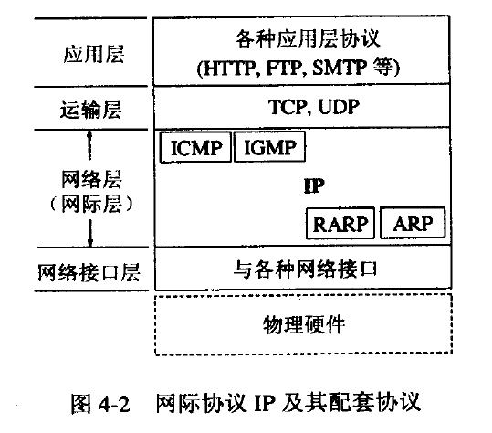
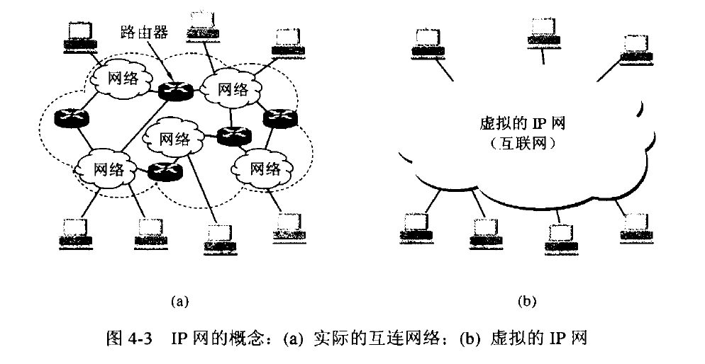
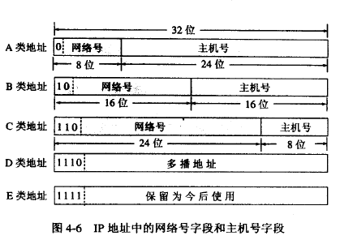
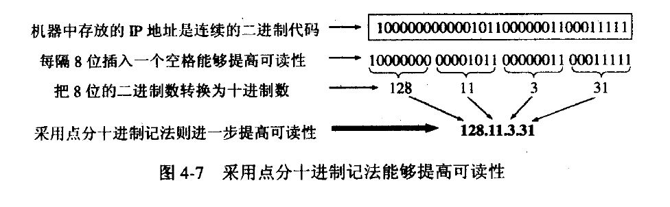
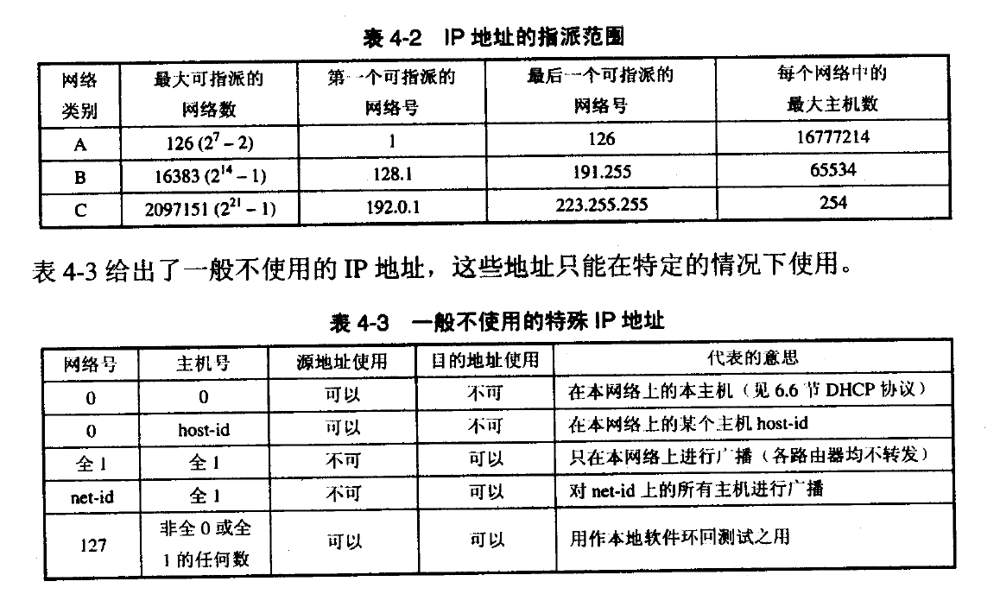

# 参考资料

<<计算机网络>>

<<TCP-IP详解卷一>>

<<图解TCP-IP>>

<<图解HTTP>>

<<HTTP权威指南>>


# 计算机网络

## 概述

### 电路交换




### 网络类别

1. 广域网 WAN 
2. 城域网 MAN
3. 局域网 LAN
4. 个人区域网 PAN/WPAN


### 性能指标

#### 1. 速率

指连接在计算机网络上的主机在数字信道上传送数据的速率;

单位为 b/s(bit/second),kb/s(k=10的三次方=千),Mb/s(M=10的六次方=兆),Gb/s(G=10的九次方),Tb/s(T=10的十二次方=太);

#### 2. 带宽

原指某个信号具有的频带宽度,在计算机网络中表示网络通信线路传送数据的能力,即单位时间内从网络中的某一点到另一点能通过的"最高数据率";

#### 3. 吞吐量

表示在单位时间内通过某个网络(信道,接口)的数据量;

#### 4. 时延

重要性能指标,指数据(一个报文或分组,比特)从网络(或链路)的一端传送到另一端所需时间;

总时延 = 发送时延+传播时延+处理时延+排队时延;

时延的组成部分:

A. 发送时延 - 主机或路由器发送数据帧的第一个比特到最后一个比特所需时间;

```latex
发送时延 = 数据帧长度(b)/信道带宽(b/s)
```

B. 传播时延 - 电磁波在信道中传播一定距离需要花费的时间;

```
传播时延 = 信道长度(m)/电磁波在信道上的传播速率(m/s)
```

C. 处理时延 - 主机或路由器对分组的处理时间

D. 排队时延 - 网络传输过程中各个路由器排队等待处理的时间,网络通信量过大导致队列溢出会使分组丢失;

#### 5. 时延带宽积

```
时延带宽积 = 传播时延 * 带宽
```

详见计算机网络;

#### 6. 往返时间 RTT

重要性能指标,表示从发送方发送数据到发送方收到接收方确认的时间(接收方接受即确认);

往返时间与发送的分组长度有关,使用卫星通信时往返时间相对较长;

#### 7. 利用率

信道利用率: 指某信道有百分之几的时间是被利用的(有数据通过);

网络利用率: 指全网络的信道利用率的加权平均值;

详见计算机网络


### 非性能特征

#### 1. 费用

#### 2. 质量

#### 3. 标准化

#### 4. 可靠性

#### 5. 可扩展性和可升级性

#### 6. 易于管理和维护


### 网络体系结构






### TCP/IP体系结构



如图, TCP/IP 协议可以为各式各样的应用提供服务,同时也允许 IP 协议在各式各样的网络构成的互联网上运行;


## 物理层

暂略


## 数据链路层

暂略


## 网络层

网络层向上只提供简单灵活的,无连接的,尽最大努力交付的数据报服务-即网络发送分组时不需要先建立连接,每一个分组( IP 数据报)独立发送,与其前后的分组无关(不进行编号);

网络层不提供服务质量的承诺-即所传输的分组可能出错,丢失,重复和失序,也不保证分组交付时限;

如果主机中的进程之间需要可靠性,那么由运输层负责;


### 网际协议 IP



1. ICMP 网际控制报文协议
2. IGMP 网际组管理协议
3. RARP 逆地址解析协议
4. ARP    地址解析协议

ICMP 和 IGMP 要使用 IP 协议, IP 协议经常使用 ARP 和 RARP;


### Internet

将网络互相连接起来要使用一些中间设备,可以分为:

1. 物理层-转发器
2. 数据链路层-网桥
3. 网络层-路由器
4. 网络层以上-网关

互联网可以由多种异构网络互连组成



### 分类的 IP 地址

IP 地址是给 Internet 上的每一个主机(或路由器)的每一个接口分配一个全世界范围内是唯一的32位标志符;

```
IP 地址 ::= {<网络号>,<主机号>}
```



A,B,C类地址都是单播地址(点对点通信),最常用;


### 常用 IP 地址





